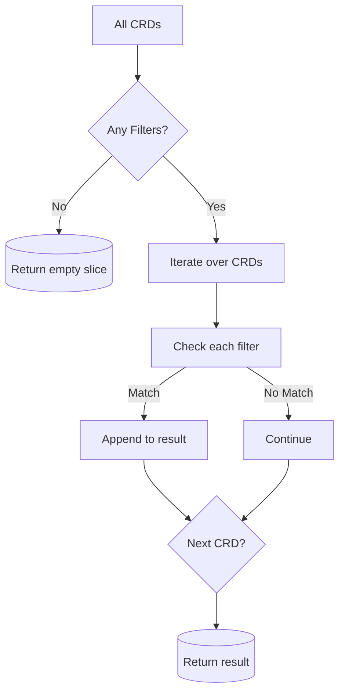

FindTestCrdNames`

```go
func FindTestCrdNames(
    crds []*apiextv1.CustomResourceDefinition,
    filters []configuration.CrdFilter,
) []*apiextv1.CustomResourceDefinition
```

### Purpose  
`FindTestCrdNames` selects the subset of **Custom Resource Definitions (CRDs)** that should be considered “test CRDs” for the certsuite discovery process.  
The selection is driven by a list of *filter rules* (`configuration.CrdFilter`) supplied in the configuration.

A filter rule can specify:

| Field | Meaning |
|-------|---------|
| `Group` | The API group name (e.g., `"network.openshift.io"`) |
| `Suffix` | Optional suffix that the CRD’s plural name must end with |

Only CRDs whose *plural* form matches **any** filter are returned.

### Inputs

| Parameter | Type | Description |
|-----------|------|-------------|
| `crds` | `[]*apiextv1.CustomResourceDefinition` | All CRDs available in the cluster. |
| `filters` | `[]configuration.CrdFilter` | List of rules that define which groups/suffixes are relevant for testing. |

### Output

- Returns a slice containing pointers to the CRDs that match at least one filter rule.

### Algorithm (high‑level)

1. **Early exit** – If no filters are defined, return an empty slice immediately.
2. Iterate over each `crd` in `crds`.
3. For each `filter`, check:
   - The CRD’s group matches `filter.Group`.  
   - If `filter.Suffix` is non‑empty, the CRD’s plural name must end with that suffix (`strings.HasSuffix`).
4. When a match is found, append the CRD to the result slice and stop checking further filters for that CRD.
5. Return the collected list.

### Key Dependencies

| Dependency | Role |
|------------|------|
| `len` | Determines whether any filters are supplied. |
| `Error` | Used in logging when a filter’s group is empty (ensures diagnostic output). |
| `HasSuffix` (`strings.HasSuffix`) | Checks plural suffixes for CRDs. |
| `append` | Builds the result slice incrementally. |

### Side Effects

- No global state is mutated.
- Only local variables and the returned slice are affected.
- The function may log errors via the package’s logger when encountering malformed filter definitions.

### Integration in `autodiscover`

`FindTestCrdNames` is called by higher‑level discovery logic that needs to know which CRDs should be validated against certificates.  
By filtering on groups and optional suffixes, certsuite can focus on the relevant CRDs for a given test scenario, reducing noise and improving performance.



---
