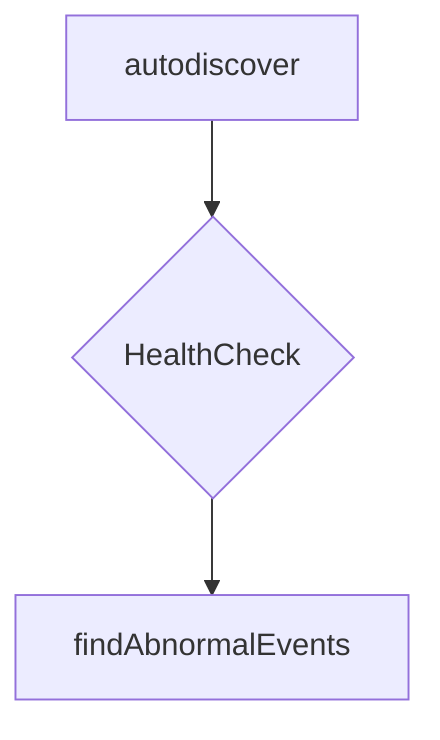

findAbnormalEvents`

```go
func findAbnormalEvents(corev1client.CoreV1Interface, []string) ([]corev1.Event)
```

### Purpose  
Collects **abnormal** Kubernetes events that may indicate mis‑configuration or runtime problems in the cluster.  
The function is used by the *autodiscover* package when it needs to surface diagnostics to the user – for example during a health check or when generating a report.

> **Abnormal** is loosely defined as any event whose `Type` is `"Warning"` or `"Error"`. The implementation currently contains a `TODO`, so the exact filtering logic may evolve in future releases.

### Parameters

| Name | Type | Description |
|------|------|-------------|
| `client` | `corev1.CoreV1Interface` | A typed Kubernetes client capable of listing events from any namespace.  This interface is provided by `k8s.io/client-go/kubernetes/typed/core/v1`. |
| `namespaces` | `[]string` | The list of namespaces to search for events.  If empty, the function may default to all namespaces (implementation detail – see code). |

### Return value

| Type | Description |
|------|-------------|
| `[]corev1.Event` | A slice containing every event that matched the abnormal criteria.  The caller receives a copy of the objects; no mutation is performed on the originals. |

### Key dependencies & side‑effects

* **Kubernetes API** – uses `client.Events("").List(...)` to fetch events from each namespace.
* **Logging / error handling** – currently contains a `TODO` placeholder and logs errors with `log.Error`.  No other external side‑effects (e.g., network traffic) are performed beyond the API calls.
* **Global state** – none. The function is pure with respect to package globals.

### How it fits into the package



`findAbnormalEvents` is called from higher‑level diagnostics logic that aggregates cluster health data.  By isolating event collection in its own helper, the package keeps concerns separated:

1. **Event retrieval** – `findAbnormalEvents`
2. **Event filtering / interpretation** – other helpers (e.g., `filterBySeverity`)
3. **Reporting** – formatting the collected events for output.

### Caveats

* The function currently ignores the passed namespace list if it is empty; the exact default behavior depends on the unimplemented logic in the TODO block.
* No retry/back‑off logic is implemented; a single API call failure will result in an error log and an empty slice.

---
