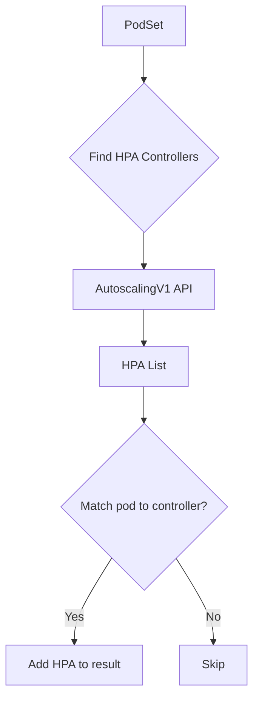

findHpaControllers`

### Purpose
`findHpaControllers` locates all **HorizontalPodAutoscaler (HPA)** objects that control the set of pod names passed to it.  
The function is used during *auto‑discovery* to identify which HPAs should be considered when generating or validating certificates for a workload.

### Signature
```go
func findHpaControllers(kube kubernetes.Interface, podNames []string) []*scalingv1.HorizontalPodAutoscaler
```

| Parameter | Type                            | Description |
|-----------|---------------------------------|-------------|
| `kube`    | `kubernetes.Interface`         | A client capable of talking to the Kubernetes API. |
| `podNames`| `[]string`                      | Names of pods that belong to the workload being inspected. |

| Return value | Type | Description |
|--------------|------|-------------|
| `[]*scalingv1.HorizontalPodAutoscaler` | Slice of pointers to HPA objects | All HPAs whose **scaleTargetRef** points at one or more of the supplied pod names. The slice is empty if none are found.

### Workflow
1. **List all HPAs in every namespace**  
   ```go
   kube.AutoscalingV1().HorizontalPodAutoscalers("").List(...)
   ```
2. **Iterate over each HPA** and examine its `Spec.ScaleTargetRef`.  
   * If the reference type is `"Deployment"` or `"StatefulSet"` (the only two types that can own pods in this context), the function checks whether any pod in `podNames` belongs to that controller.
3. **Match pods to controllers** – A helper (`matchPodToController`) determines if a pod name matches the controller’s name (using naming conventions).  
   If at least one pod matches, the HPA is considered relevant and added to the result slice.
4. **Return the list** of matching HPAs.

### Key Dependencies
| Dependency | Role |
|------------|------|
| `kubernetes.Interface` | Provides access to the Kubernetes API (`AutoscalingV1`, `HorizontalPodAutoscalers`) |
| `scalingv1.HorizontalPodAutoscaler` | The type returned for each relevant HPA |
| `matchPodToController` (internal helper) | Determines pod‑to‑controller association |

### Side Effects
* No mutation of global state.
* Emits informational logs (`log.Info`) when no HPAs are found or when the list is empty.

### Package Context
The function lives in **pkg/autodiscover/autodiscover_podset.go** and is part of the `autodiscover` package, which automatically discovers resources that need certificate handling.  
`findHpaControllers` feeds into higher‑level logic that aggregates podsets, determines their owners, and ultimately decides whether a workload requires TLS certificates.

---

#### Suggested Mermaid diagram (optional)



This diagram visualises the decision flow from a set of pods to the collection of relevant HPAs.
