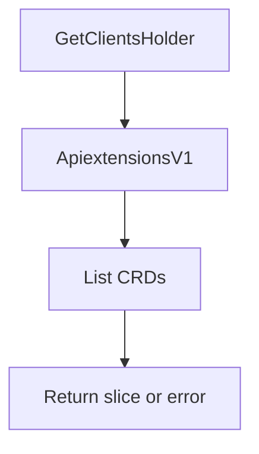

getClusterCrdNames`

| Aspect | Details |
|--------|---------|
| **Purpose** | Retrieve all CustomResourceDefinition (CRD) objects that currently exist in the cluster and return them as a slice of pointers to `apiextv1.CustomResourceDefinition`. This is used by autodiscover logic to know which CRDs are present so that it can decide what resources should be inspected for certificate usage. |
| **Signature** | `func() ([]*apiextv1.CustomResourceDefinition, error)` |
| **Inputs / Outputs** | - No arguments.  - Returns:    * A slice of pointers to `CustomResourceDefinition` objects (`[]*apiextv1.CustomResourceDefinition`).   * An `error` if the list operation fails. |
| **Key dependencies** | - `GetClientsHolder()` – obtains a holder that provides Kubernetes API clients. - `ApiextensionsV1()` – gives access to the apiextensions client for CRDs. - `CustomResourceDefinitions().List(ctx, opts)` – performs the actual list call. All these are part of the internal test‑suite client abstractions. |
| **Side effects** | None beyond the API call; it only reads from the cluster. The returned slice is a shallow copy of the objects retrieved by the client. |
| **How it fits the package** | `autodiscover` scans various Kubernetes resources to determine where certificates are used. Knowing which CRDs exist allows the scanner to discover custom resource types that may reference TLS secrets or keys. This helper centralises the logic for fetching those definitions so other parts of the package can simply call it without duplicating client‑initialisation code. |

### Simplified Flow

> **Note:** The function uses a `TODO` placeholder for potential future filtering logic. Currently it returns *all* CRDs present in the cluster.

---
