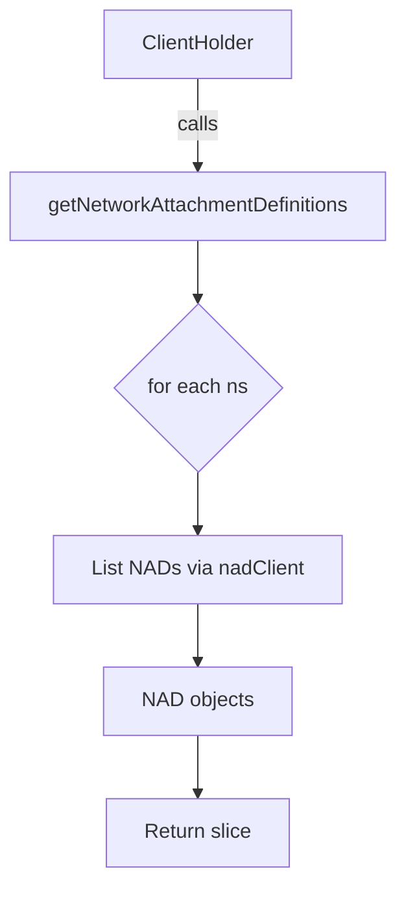

getNetworkAttachmentDefinitions`

```go
func getNetworkAttachmentDefinitions(
    ch *clientsholder.ClientsHolder,
    namespaces []string,
) ([]nadClient.NetworkAttachmentDefinition, error)
```

### Purpose  
Collect all **Network Attachment Definitions (NAD)** that exist in the supplied Kubernetes namespaces.  
The function is used by the autodiscover logic to understand which network attachments are
available for pods and deployments when evaluating connectivity and security policies.

---

### Inputs  

| Parameter | Type | Description |
|-----------|------|-------------|
| `ch` | `*clientsholder.ClientsHolder` | Holds a client that can list NAD objects via the *K8s CNI CNF* API (`nadClient`). The caller must have already initialized this holder. |
| `namespaces` | `[]string` | List of namespace names to search for NAD objects. If empty, no namespaces are queried and an empty slice is returned. |

### Outputs  

| Return value | Type | Description |
|--------------|------|-------------|
| `[]nadClient.NetworkAttachmentDefinition` | Slice of NAD structs | All NADs found across the supplied namespaces. The order is not guaranteed. |
| `error` | `error` | Non‑nil if any list operation fails (e.g., API error, context timeout). A *NotFound* result from the API is treated as “no objects” and does **not** return an error. |

---

### Key Dependencies  

1. **K8s CNI CNF API (`nadClient`)**  
   - `NetworkAttachmentDefinitions()` – returns a client interface that can list NAD resources.  
   - `List(ctx, opts)` – performs the actual API call.
2. **Error helpers**  
   - `errors.IsNotFound(err)` – used to ignore “resource not found” errors and treat them as empty results.
3. **Logging / TODO**  
   - A placeholder `TODO` indicates that future error handling or metrics might be added.

---

### Side‑Effects  

- No state is modified; the function only performs read operations against the Kubernetes API.
- It may generate logs if the surrounding package uses a logger (not shown here).

---

### How it Fits in the Package

```
autodiscover/
├─ autodiscover.go          // Core discovery logic
├─ autodiscover_nads.go     // This file – retrieves NADs
└─ autodiscover_sriov.go    // Retrieves SR‑IOV resources
```

`getNetworkAttachmentDefinitions` is invoked by higher‑level functions that build the network topology used for certificate discovery and validation. By isolating NAD retrieval, the package can easily swap or mock the client in tests without touching business logic.

---

### Suggested Mermaid Diagram



This diagram visualizes the linear flow: the caller passes a client and namespaces → function iterates, lists, collects, returns.
