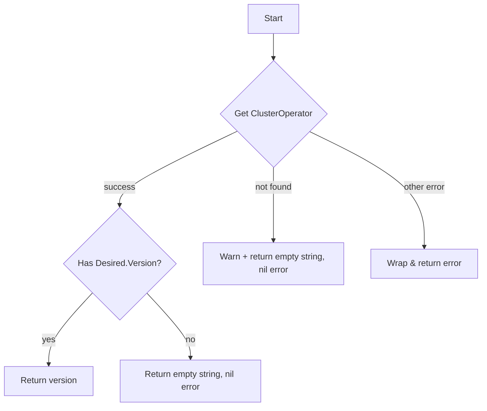

getOpenshiftVersion`

```go
func getOpenshiftVersion(client configv1.ConfigV1Interface) (string, error)
```

### Purpose  
`getOpenshiftVersion` retrieves the **OpenShift cluster version** by querying the Cluster Operator resource named `"openshift-cluster-version"`. The returned string is the `status.desired.version` field of that operator, which indicates the target OpenShift release. This helper is used during auto‑discovery to determine if the cluster meets a minimum supported OpenShift version.

### Inputs  
| Parameter | Type | Description |
|-----------|------|-------------|
| `client`  | `configv1.ConfigV1Interface` | A client for the `operator.openshift.io/v1` API group. The function uses it to read ClusterOperator objects.

### Outputs  
| Return value | Type   | Meaning |
|--------------|--------|---------|
| `string`     | The desired OpenShift version (e.g., `"4.11"`). Returns an empty string if the operator is not found or has no status. |
| `error`      | Error describing why the lookup failed, or `nil` on success. |

### Key Steps & Dependencies  

1. **Lookup**  
   ```go
   op := client.ClusterOperators().Get(context.TODO(), "openshift-cluster-version", metav1.GetOptions{})
   ```
   - Uses `client.ClusterOperators()` to access the ClusterOperator API.
   - Calls `.Get` with the operator name.

2. **Error handling**  
   * If the call fails with a “not found” error (`errors.IsNotFound(err)`), the function logs a warning and returns an empty string without an error.
   * Any other error is wrapped using `fmt.Errorf("error retrieving cluster version: %w", err)`.

3. **Extracting the version**  
   ```go
   if op != nil && op.Status.Desired.Version != "" {
       return op.Status.Desired.Version, nil
   }
   ```
   - The function pulls the desired version from `op.Status.Desired`.

4. **Logging**  
   * `Warn` and `Info` helpers are used to emit runtime information (e.g., “Cluster operator not found”).

### Side Effects  
- **No state changes**: The function only performs a read operation.
- **Logging**: Emits warning/info logs depending on success/failure.

### Integration in the Package  

`getOpenshiftVersion` is part of the `autodiscover` package’s internal utilities. It is called by higher‑level discovery routines that need to know which OpenShift release the cluster is running (e.g., to enable or disable certain features). Because it operates on a low‑level operator resource, it must be used carefully: if the operator is missing, the function gracefully returns an empty string rather than panicking.

---

#### Mermaid Flowchart (optional)


