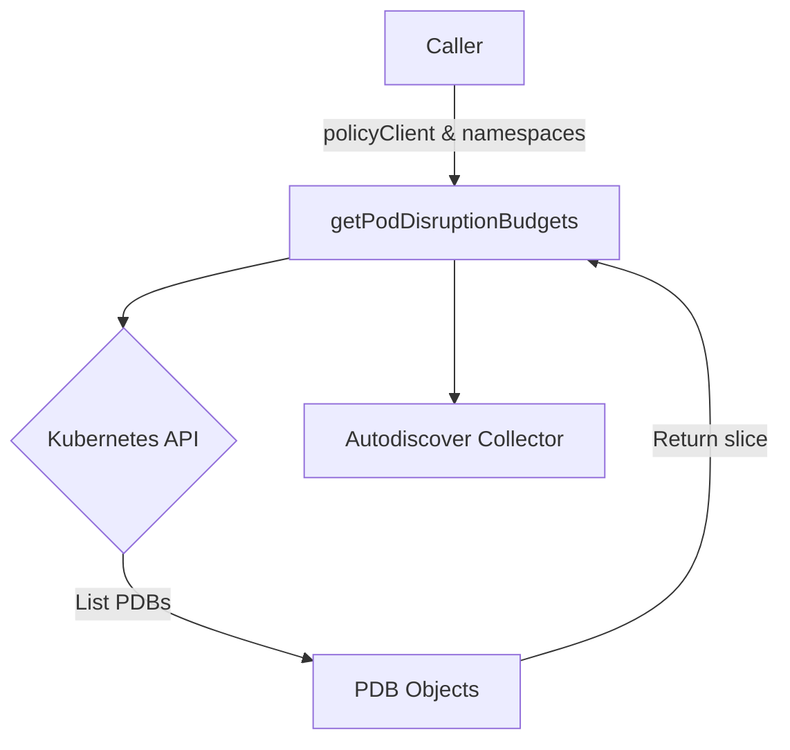

getPodDisruptionBudgets`

```go
func getPodDisruptionBudgets(
    policyClient policyv1client.PolicyV1Interface,
    namespaces []string) ([]policyv1.PodDisruptionBudget, error)
```

### Purpose  
Collects **all Pod Disruption Budgets (PDBs)** that exist in the provided list of Kubernetes namespaces.  
The function is a helper used by the autodiscover package to discover the state of workloads that are protected from voluntary node disruptions.

> **Why it matters** – The rest of the autodiscover logic relies on knowing which PDBs are present so that it can correlate them with other resources (e.g., deployments, services) and report on the resilience of the cluster.

### Parameters  

| Parameter | Type | Description |
|-----------|------|-------------|
| `policyClient` | `policyv1client.PolicyV1Interface` | A client for the Kubernetes **policy/v1** API group. It is used to call `PodDisruptionBudgets()` on each namespace. |
| `namespaces`   | `[]string` | Slice of namespace names that should be searched for PDBs. The caller decides which namespaces are relevant (e.g., all or a subset). |

### Return Values  

| Value | Type | Description |
|-------|------|-------------|
| first | `[]policyv1.PodDisruptionBudget` | A slice containing every PDB discovered across the supplied namespaces. |
| second | `error` | Non‑nil if any API call fails; otherwise `nil`. The error is returned directly from the Kubernetes client. |

### Key Dependencies  

* **Kubernetes Policy Client** – `policyClient.PodDisruptionBudgets(ns).List(ctx, opts)`  
  * Calls the API to list PDBs in a namespace.
* **Context** – The function uses `context.TODO()` for simplicity; this is a placeholder that can be replaced with a real context by callers.  
* **Append** – Standard Go slice append used to accumulate results.

### Side‑Effects  

* No state is mutated outside the local scope; it only reads from the Kubernetes API and builds an in‑memory slice.
* The function logs nothing and performs no I/O other than the API calls.

### How It Fits Into `autodiscover`

The autodiscover package orchestrates discovery of many resource types (deployments, services, custom resources, etc.).  
`getPodDisruptionBudgets` is one small piece that fetches PDBs, which are then combined with other data structures to build a comprehensive view of the cluster’s resilience.  
Because it operates purely on input parameters and returns results or errors, it can be unit‑tested in isolation.

---

#### Suggested Mermaid Diagram (resource flow)



This diagram illustrates the function’s role as a thin wrapper around the Kubernetes API, feeding discovered PDB objects into the larger autodiscover pipeline.
