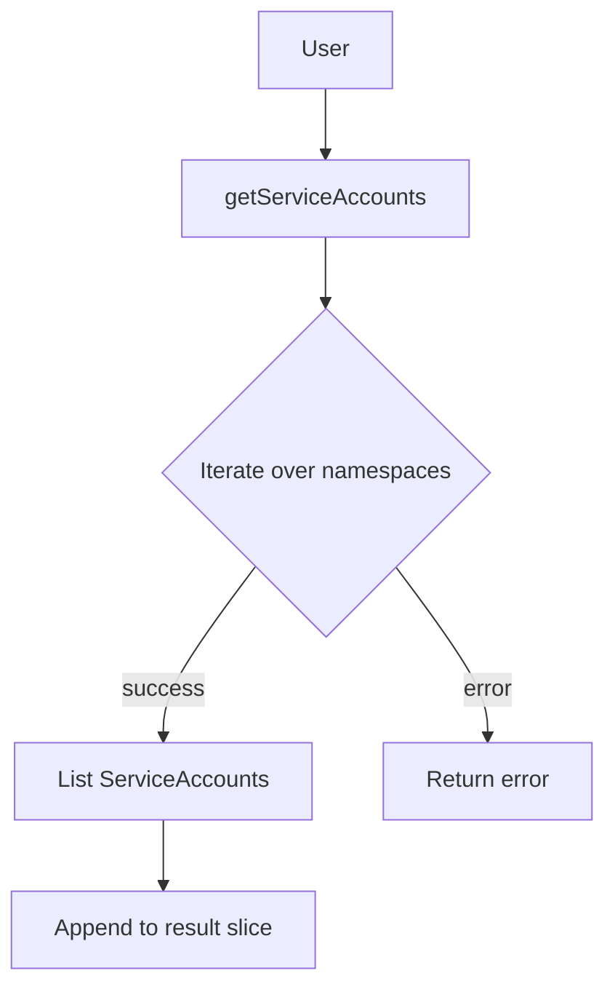

getServiceAccounts`

```go
func getServiceAccounts(client corev1client.CoreV1Interface, namespaces []string) ([]*corev1.ServiceAccount, error)
```

## Purpose

`getServiceAccounts` retrieves all ServiceAccounts that exist in a set of Kubernetes namespaces.  
The function is used by the autodiscover package to discover which service accounts are
present on the cluster so that certificates can be requested or validated for them.

## Parameters

| Name        | Type                          | Description |
|-------------|-------------------------------|-------------|
| `client`    | `corev1client.CoreV1Interface`| A typed client for the CoreV1 API, used to perform list operations. |
| `namespaces`| `[]string`                    | Slice of namespace names in which to look for ServiceAccounts. An empty slice means “look in all namespaces” (the code treats it as a single entry with an empty string). |

## Return Values

| Name     | Type                       | Description |
|----------|----------------------------|-------------|
| `[]*corev1.ServiceAccount` | Slice of pointers to the ServiceAccounts found. The slice may be empty if no accounts are present or if the list operation fails for all namespaces. |
| `error`  | `error`                    | Non‑nil if any API call fails. The error is returned immediately; partial results from earlier calls are **not** discarded. |

## Key Dependencies

- **Kubernetes CoreV1 client (`corev1client.CoreV1Interface`)** – used to access the ServiceAccount resource via `ServiceAccounts(namespace).List(...)`.
- **`metav1.ListOptions{}`** – empty list options are passed; no label/field selectors are applied.
- **`append`** – accumulates results from multiple namespace calls into a single slice.

## Behaviour & Side‑Effects

1. **Iterates over the supplied namespaces.**  
   For each namespace, it performs `client.ServiceAccounts(ns).List(ctx, metav1.ListOptions{})`.  
2. **Collects all ServiceAccount objects.**  
   The returned list items are appended to a slice that will be returned.
3. **Immediate error propagation.**  
   If any List call fails, the function returns the error and the partial result set is discarded. No retry logic or fallback occurs.
4. **No state mutation outside of the return values.**  
   The function only reads from the API; it does not modify cluster objects.

## How It Fits the Package

`autodiscover` is responsible for inspecting a Kubernetes cluster to determine which resources
(operators, certificates, etc.) are present so that the Certsuite tool can act accordingly.
ServiceAccounts are one of the resource types that need to be discovered.  
`getServiceAccounts` is a low‑level helper used by higher‑level discovery functions such as:

```go
func discoverCerts(...) {
    // …
    sas, err := getServiceAccounts(k8sClient.CoreV1(), namespaces)
    // process sas …
}
```

By keeping the function small and focused on listing resources, it can be unit‑tested easily
and reused wherever a list of ServiceAccounts is required.

---

### Suggested Mermaid diagram (optional)



---
