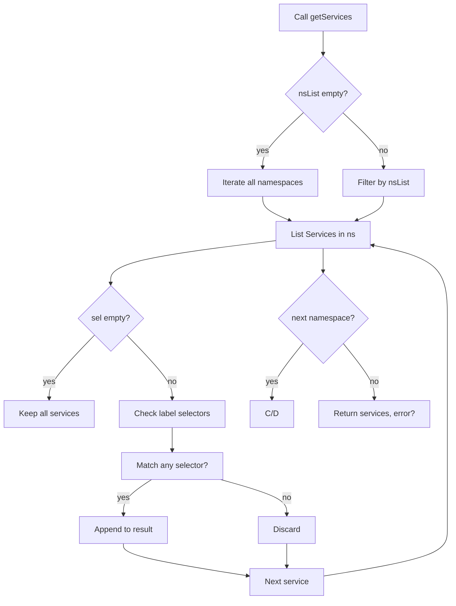

getServices` – Service Discovery Helper

## Purpose
`getServices` retrieves a filtered list of Kubernetes **Service** objects from the cluster.
It is used by the autodiscover package to gather all services that belong to a set of target namespaces or have specific label selectors.

---

## Signature
```go
func getServices(
    client corev1client.CoreV1Interface,
    nsList []string,
    sel []string,
) ([]*corev1.Service, error)
```

| Parameter | Type                                   | Description |
|-----------|----------------------------------------|-------------|
| `client`  | `corev1client.CoreV1Interface`         | Kubernetes core‑v1 client used to call the API. |
| `nsList`  | `[]string`                             | List of namespace names to search in. If empty, all namespaces are considered. |
| `sel`     | `[]string` (label selectors)           | Optional list of label selector strings; a service must match **any** of them to be returned. |

## Returns
* `[]*corev1.Service` – slice containing pointers to the matching Service objects.
* `error` – non‑nil if any API call fails or an unexpected error occurs.

---

## Key Dependencies

| Dependency | Role |
|------------|------|
| `client.Services(ns).List(...)` | Makes a list request for Services in a namespace. |
| `StringInSlice` | Helper that checks whether a string exists in a slice; used to decide if the current namespace is part of `nsList`. |
| `TODO` (placeholder) | Indicates future or missing logic – currently unused but suggests an intended extension point. |

---

## Algorithm Overview

1. **Iterate over all namespaces** (or only those in `nsList` if provided).  
2. For each namespace, call the Kubernetes API to list all Services (`client.Services(ns).List`).  
3. **Filter by selectors**:  
   * If `sel` is empty, keep every service from that namespace.  
   * Otherwise, keep a service only if its labels match at least one selector in `sel`.  
4. Append each qualifying Service to the result slice.  
5. Return the accumulated slice or an error if any API call fails.

---

## Side Effects & Notes

* **No state mutation** – The function is pure with respect to package variables; it only reads from the Kubernetes API.
* **Network latency** – Each namespace results in a separate API round‑trip; performance can degrade on clusters with many namespaces.
* **Error handling** – Any error from `List` propagates up immediately; partial results are not returned.

---

## Package Context

Within the `autodiscover` package, this helper is part of the discovery logic that aggregates Kubernetes objects (services, deployments, etc.) to determine which components should be monitored or have certificates issued.  
It complements other helpers such as `getDeployments`, `getIngresses`, and SR‑IOV resource discovery.

---

## Suggested Mermaid Diagram



This diagram visualizes the decision flow for filtering services based on namespaces and label selectors.
