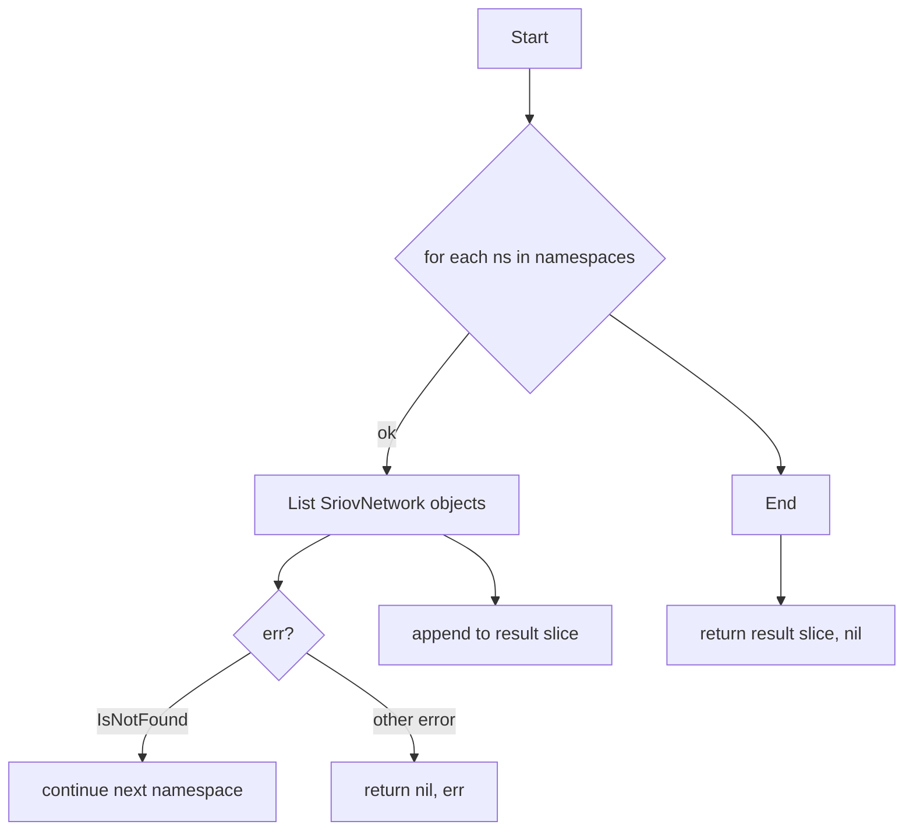

getSriovNetworks`

| | |
|---|---|
| **Package** | `autodiscover` |
| **Exported** | No – internal helper used by the autodiscover logic |
| **Signature** | `func getSriovNetworks(clients *clientsholder.ClientsHolder, namespaces []string) ([]unstructured.Unstructured, error)` |

---

#### Purpose
Collect all **SriovNetwork** custom resources that exist in a set of Kubernetes namespaces.  
These objects represent SR‑IOV network configurations used by workloads; the autodiscover logic needs them to determine which certificates must be issued for the associated interfaces.

---

#### Parameters

| Name | Type | Description |
|------|------|-------------|
| `clients` | `*clientsholder.ClientsHolder` | Holds a shared dynamic Kubernetes client (`DynamicInterface`). The function uses it to perform resource list operations. |
| `namespaces` | `[]string` | List of namespace names in which the search should be performed. If empty, the function will treat this as “search all namespaces” (the implementation currently iterates over whatever slice is supplied). |

---

#### Return Values

| Value | Type | Meaning |
|-------|------|---------|
| first return | `[]unstructured.Unstructured` | Slice of SR‑IOV network objects found. Each element contains the raw JSON representation of a `SriovNetwork`. |
| second return | `error` | Non‑nil if any list operation fails (e.g., API error, namespace not found). A *not‑found* status is treated as an empty result rather than an error. |

---

#### Key Dependencies & Side Effects

1. **Dynamic Client**  
   Uses `clients.DynamicClient.Resource(SriovNetworkGVR)` to build a request scoped to the resource type.

2. **Namespace Scoping**  
   Calls `.Namespace(ns).List(ctx, opts)` for each namespace in `namespaces`. The context is `context.TODO()` – no cancellation or timeout is applied, which could block if the API server hangs.

3. **Error Handling**  
   - If the list call returns an *IsNotFound* error (i.e., the resource type isn’t present in that namespace), it’s silently ignored and the function continues with other namespaces.
   - Any other error propagates back to the caller.

4. **Result Accumulation**  
   Uses `append` to accumulate all returned objects into a single slice, preserving order of namespaces as supplied.

5. **No Global State Mutation**  
   The function only reads from `clients`; it does not modify any package‑level variables or global state.

---

#### Flow (Pseudo‑Mermaid)

---

#### Integration into the Package

`getSriovNetworks` is invoked by higher‑level autodiscover routines that need to know which SR‑IOV networks exist in order to:

- Determine if the node’s SR‑IOV devices are reachable.
- Generate appropriate certificate requests for network interfaces.

Because it operates purely on the dynamic client and a list of namespaces, it can be reused wherever SR‑IOV network discovery is required without pulling in any other package logic.
