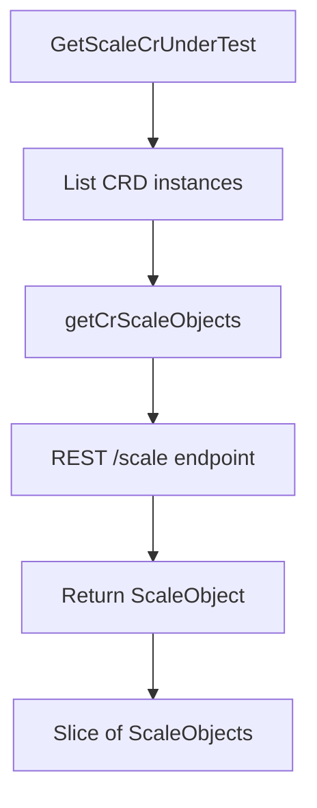

ScaleObject`

| Aspect | Details |
|--------|---------|
| **Package** | `github.com/redhat-best-practices-for-k8s/certsuite/pkg/autodiscover` |
| **File** | `pkg/autodiscover/autodiscover_scales.go` (line 15) |
| **Exported?** | ✅ Yes – can be used by other packages. |

### Purpose
A `ScaleObject` bundles together two pieces of information that are needed when a client wants to query or modify the *scale* sub‑resource of a Kubernetes custom resource:

1. **Resource identity** – encoded in a `schema.GroupResource`.  
   This is the fully qualified group and resource name (e.g., `"apps/v1:deployments"`).  
2. **Scale instance** – a pointer to a `scalingv1.Scale` object, which holds the desired/observed replicas for that resource.

The struct acts as an intermediate representation returned by helper functions (`GetScaleCrUnderTest`, `getCrScaleObjects`) so callers can iterate over scale objects without dealing with raw `unstructured.Unstructured` values or client calls repeatedly.

### Fields

| Field | Type | Role |
|-------|------|------|
| `GroupResourceSchema` | `schema.GroupResource` | Identifies the CRD group and resource name. Used by the Kubernetes REST client to locate the scale endpoint (`/scale`). |
| `Scale` | `*scalingv1.Scale` | The actual scale object returned from the cluster, containing fields such as `spec.replicas`, `status.replicas`, etc. |

### How It’s Created
- **`GetScaleCrUnderTest`**  
  * Input: list of namespace names and CRD objects.  
  * Process: for each namespace it lists all instances of the given CRDs (via the client set), then calls `getCrScaleObjects`.  
  * Output: a slice of `ScaleObject`s, one per instance.

- **`getCrScaleObjects`**  
  * Input: list of `unstructured.Unstructured` objects that represent actual CRD instances.  
  * Process: for each object it uses the Kubernetes client to fetch the corresponding `/scale` sub‑resource (`clientset.RESTClient().Get().Namespace(...).Resource("scales").Name(name)...`).  
  * Output: a slice of `ScaleObject`s with the resource identity and fetched scale.

Both functions rely on global helpers such as `GetClientsHolder`, `Warn/Info/Fatal`, and Kubernetes helper functions (`GetName`, `GetNamespace`).

### Side‑Effects & Dependencies
- Requires an initialized **Kubernetes client** (via `GetClientsHolder`).  
- Makes **REST API calls** to the cluster for each CRD instance.  
- Logs warnings or fatal errors if any request fails.  
- No state is mutated beyond returning new slices; the struct itself is immutable after creation.

### Usage Example

```go
// Assume we have a list of CRDs and namespaces.
crds := []*apiextv1.CustomResourceDefinition{ /* ... */ }
ns   := []string{"default", "testing"}

scaleObjs, err := autodiscover.GetScaleCrUnderTest(ns, crds)
if err != nil {
    log.Fatalf("failed to discover scale objects: %v", err)
}

for _, so := range scaleObjs {
    fmt.Printf("%s/%s has %d replicas\n",
        so.GroupResourceSchema.Group,
        so.GroupResourceSchema.Resource,
        *so.Scale.Spec.Replicas)
}
```

### Diagram (Mermaid)



### Summary
`autodiscover.ScaleObject` is a lightweight DTO that pairs the *identity* of a custom resource (group/resource) with its current scale state. It simplifies downstream logic that needs to inspect or modify replica counts across multiple CRDs and namespaces.
