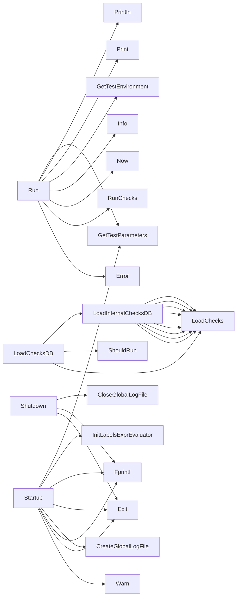

## Package certsuite (github.com/redhat-best-practices-for-k8s/certsuite/pkg/certsuite)

### Functions

- **LoadChecksDB** — func(string)()
- **LoadInternalChecksDB** — func()()
- **Run** — func(string, string)(error)
- **Shutdown** — func()()
- **Startup** — func()()

### Call graph (exported symbols, partial)

### Symbol docs

- [function LoadChecksDB](symbols/function_LoadChecksDB.md)
- [function LoadInternalChecksDB](symbols/function_LoadInternalChecksDB.md)
- [function Run](symbols/function_Run.md)
- [function Shutdown](symbols/function_Shutdown.md)
- [function Startup](symbols/function_Startup.md)
