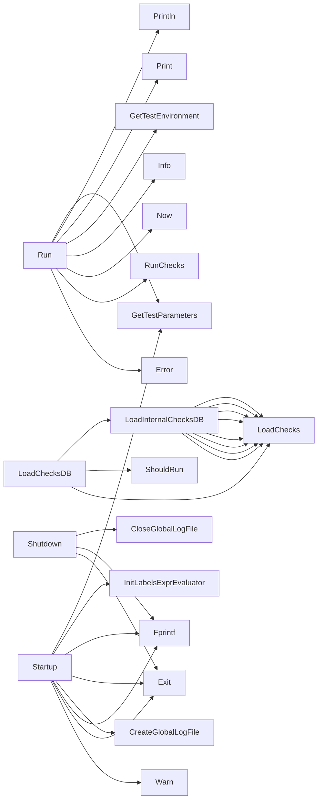

## Package certsuite (github.com/redhat-best-practices-for-k8s/certsuite/pkg/certsuite)

# certsuite – high‑level design overview

`github.com/redhat-best-practices-for-k8s/certsuite/pkg/certsuite` is the **entry point** of the CertSuite test runner.  
It wires together configuration, logging, Kubernetes client creation, test discovery and execution, result reporting, and shutdown handling.

---

## 1. Core data flow

```
┌─────────────────────┐
│   Startup()          │
├───────────────▲───────┤
│               │      │
│               ▼      │
│    LoadChecksDB()     │
│                       │
│   Run(testEnv, claim) │
│        └────────────►│
│   RunChecks()         │
│                       │
│   Result handling &   │
│   reporting (JUnit /  │
│   web UI)             │
└─────────────────────┘
```

1. **Startup** – initializes global state: log file, Kubernetes client config files, labels evaluator and loads the checks database.
2. **LoadChecksDB** – pulls the test definitions from all registered test packages (`accesscontrol`, `certification`, …).  
   The function returns a *check loader* that is used by `Run`.
3. **Run** – orchestrates a single execution cycle:
   - Parse command‑line / env parameters.
   - Determine which tests to run (filtering by labels, environments, etc.).
   - Create Kubernetes clients, discover pods, and collect metadata for the claim file.
   - Execute each check via `RunChecks`.
   - Build an aggregated claim JSON, send it to the collector service, and write local result artifacts (`junit.xml`, web UI files).
4. **Shutdown** – cleans up resources (closes log file).

---

## 2. Global constants

| Constant | Purpose |
|----------|---------|
| `claimFileName` | Output filename for the JSON claim (`claims.json`). |
| `collectorAppURL` | URL of the external collector service that receives the claim. |
| `junitXMLOutputFileName` | Filename for JUnit‑compatible XML results. |
| `noLabelsFilterExpr` | Default label filter expression (matches everything). |
| `timeoutDefaultvalue` | Default timeout value used when no explicit timeout is supplied. |

These are used throughout the package to keep filenames and defaults consistent.

---

## 3. Key functions

### Startup
```go
func Startup() func()
```
*Initialisation routine that returns a cleanup function.*

1. Reads test parameters via `GetTestParameters`.
2. Sets up a global label evaluator (`InitLabelsExprEvaluator`).
3. Creates a log file (`CreateGlobalLogFile`) and prints the banner.
4. Loads the checks database: `LoadChecksDB()` (which internally calls `LoadInternalChecksDB` for each test package).
5. Logs git version, OS/arch, Go version, etc.

**Return value** – a closure that should be called during shutdown to flush logs.

### Shutdown
```go
func Shutdown() func()
```
Closes the global log file and exits with status 1 on error.

### LoadInternalChecksDB / LoadChecksDB
Both return a `func()` loader (closure) that, when invoked, loads checks from a specific test package into the shared database (`checksdb`).  
`LoadChecksDB` orchestrates loading all internal packages by calling `LoadInternalChecksDB` repeatedly. The loaders are stored in a slice and executed later.

### Run
```go
func Run(testEnv string, claimFile string) error
```
Primary execution path for CertSuite.

*Steps:*
1. **Parameter handling** – fetches parameters (`GetTestParameters`) again to keep local copies.
2. **Environment discovery** – determines target namespace, labels, etc., using Kubernetes client helpers (`FindPodsByLabels`, `CountPodsByStatus`).
3. **Claim building** – collects metadata (pods, nodes) into a claim builder and writes the JSON file.
4. **Check execution** – iterates over all loaded checks, runs them, collects results.
5. **Reporting** – converts results to JUnit XML (`ToJUnitXML`) and writes local files via `CreateResultsWebFiles`.
6. **Collector integration** – sends the claim JSON to the collector endpoint (`SendClaimFileToCollector`).
7. **Cleanup** – calls shutdown functions.

The function is intentionally *long* (hence the linter comment) because it coordinates many moving parts: Kubernetes API, file I/O, network communication, and result aggregation.

### getK8sClientsConfigFileNames
```go
func getK8sClientsConfigFileNames() []string
```
Helper that inspects environment variables for kubeconfig locations (`KUBECONFIG`, `HOME/.kube/config`, etc.) and returns a slice of file paths that exist. It is used during startup to inform the client holder about available configs.

---

## 4. Inter‑package interactions

| Package | Role |
|---------|------|
| **internal/cli** | Parses command line flags into `GetTestParameters`. |
| **internal/clientsholder** | Provides Kubernetes clients for various API groups; initialized during startup. |
| **internal/log** | Global logging facility (file + stdout). |
| **internal/results** | Holds and formats test results; used by `RunChecks` and JUnit conversion. |
| **pkg/autodiscover** | Determines what components are present in the cluster for claim generation. |
| **pkg/checksdb** | In‑memory database of all checks; populated by `LoadChecksDB`. |
| **pkg/claimhelper** | Builds the JSON claim structure from Kubernetes metadata. |
| **pkg/collector** | Handles HTTP upload of the claim to an external service. |
| **pkg/configuration** | Provides static configuration (e.g., label filters). |
| **pkg/provider** | Abstracts different cloud providers; used in claim generation. |
| **pkg/versions** | Supplies Git and Go version strings for logging. |
| **tests/** packages | Each test package (`accesscontrol`, `networking`, …) registers its own checks via the database loader. |

The flow is: **CLI → Startup → LoadChecksDB (test packages) → Run → RunChecks → Results → Collector**.

---

## 5. Suggested Mermaid diagram

```mermaid
flowchart TD
    subgraph Init[Startup]
        A1(Load parameters)
        A2(Set label evaluator)
        A3(Create log file)
        A4(Print banner & env info)
        A5(LoadChecksDB → LoadInternalChecksDB for each test pkg)
    end

    B(Run) --> C{Determine env}
    C --> D[Discover pods / labels]
    D --> E[Build claim JSON]
    E --> F[Run checks (for loop over db)]
    F --> G[Collect results]
    G --> H[Write JUnit XML]
    H --> I[Send to collector]
    I --> J[Create web UI files]

    subgraph Cleanup[Shutdown]
        K(Close log file)
    end
```

---

## 6. Summary

* `certsuite` is the glue layer that turns a set of test packages into an orchestrated run against a Kubernetes cluster, producing both local artifacts and an external claim.
* It relies heavily on *closures* (`func()`) to defer loading of checks until execution time.
* Global constants keep filenames and defaults consistent across the package.
* The code is intentionally procedural; each function plays a distinct role in the lifecycle: **initialisation → execution → reporting → shutdown**.

### Functions

- **LoadChecksDB** — func(string)()
- **LoadInternalChecksDB** — func()()
- **Run** — func(string, string)(error)
- **Shutdown** — func()()
- **Startup** — func()()

### Call graph (exported symbols, partial)



### Symbol docs

- [function LoadChecksDB](symbols/function_LoadChecksDB.md)
- [function LoadInternalChecksDB](symbols/function_LoadInternalChecksDB.md)
- [function Run](symbols/function_Run.md)
- [function Shutdown](symbols/function_Shutdown.md)
- [function Startup](symbols/function_Startup.md)
