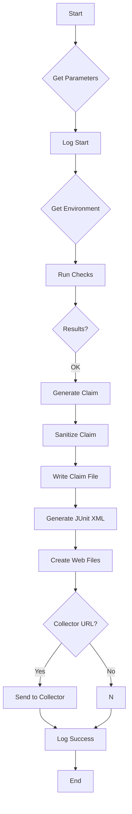

Run` – Main orchestrator of the CertSuite test workflow

```go
func Run(project string, version string) error
```

### Purpose  
`Run` is the entry point for executing a full CertSuite run. It performs the following high‑level steps:

1. **Collect runtime parameters** – reads configuration (e.g., timeouts, labels) from `GetTestParameters`.
2. **Environment discovery** – obtains Kubernetes client information via `GetTestEnvironment`.
3. **Execute checks** – runs all test checks with `RunChecks` and collects results.
4. **Generate artifacts** – creates a claim file, JUnit XML report, and web‑viewable result files.
5. **Optional reporting** – sends the claim file to an external collector if configured.

The function returns any error that occurs during these phases; otherwise it returns `nil`.

### Parameters

| Name   | Type   | Description |
|--------|--------|-------------|
| `project` | `string` | Identifier for the current project (used in log output and claim file naming). |
| `version` | `string` | Semantic version of the test run, included in artifacts. |

### Return Value

- `error` – non‑nil if any step fails; otherwise `nil`.

### Key Dependencies & Flow

1. **Parameter Retrieval**  
   ```go
   params := GetTestParameters()
   ```
   Retrieves timeout values, label filters, and other options.

2. **Logging Start**  
   Prints a timestamped “Running CertSuite” message using the standard log package.

3. **Environment Setup**  
   ```go
   env := GetTestEnvironment()
   ```
   Obtains Kubernetes client set (`clientset`) and namespace information.

4. **Run Checks**  
   ```go
   results, err := RunChecks(params, env)
   ```
   Executes all checks defined in the test suite; `results` holds pass/fail data.

5. **Artifact Generation**  
   * **Claim File** – built with `NewClaimBuilder().Build()`, then sanitized by `SanitizeClaimFile`.  
   * **JUnit XML** – produced via `ToJUnitXML(results)`.  
   * **Web Files** – created with `CreateResultsWebFiles()`.

6. **Optional Collector Upload**  
   If a collector URL is set in the parameters, the claim file is sent using `SendClaimFileToCollector`.

7. **Logging End**  
   Prints a completion timestamp and the location of generated files.

### Side Effects

- Writes several files to disk:
  - Claim JSON (`claimFileName`)
  - JUnit XML (`junitXMLOutputFileName`)
  - Web result directory
- Emits logs at various levels (`Info`, `Warn`, `Error`, `Fatal`).
- May contact an external collector service (HTTP POST) if configured.

### Interaction with Other Package Components

| Component | Role in `Run` |
|-----------|---------------|
| `GetTestParameters` | Provides configuration options. |
| `GetTestEnvironment` | Supplies Kubernetes client and namespace. |
| `RunChecks` | Executes all checks, returns results. |
| `NewClaimBuilder`, `Build`, `SanitizeClaimFile` | Constructs the claim JSON file. |
| `ToJUnitXML` | Serialises results to JUnit XML format. |
| `CreateResultsWebFiles` | Generates human‑readable web view of results. |
| `SendClaimFileToCollector` | Sends claim file to external system if URL present. |

### Typical Usage

```go
if err := certsuite.Run("myproject", "v1.2.3"); err != nil {
    log.Fatalf("CertSuite run failed: %v", err)
}
```

The function is intentionally **read‑only** with respect to the package state; it only writes output files and logs, never mutating global variables.

### Mermaid Diagram (suggested)



This diagram illustrates the linear flow of `Run` and its branching for optional collector integration.
