## Package checksdb (github.com/redhat-best-practices-for-k8s/certsuite/pkg/checksdb)

# checksdb – the CertSuite test‑execution engine

`checksdb` is the core of CertSuite’s execution layer.  
It holds a *database* of **check groups** (each group represents one
CNF‑specific test suite) and coordinates the life‑cycle of individual
checks: pre‑/post‑processing, logging, abort handling, result recording,
and finally reporting.

> **Key concepts**

| Concept | What it is | Where it lives |
|--------|------------|----------------|
| **Check** | A single test that may be run, skipped or aborted. | `pkg/checksdb/check.go` |
| **ChecksGroup** | A collection of checks belonging to the same CNF test suite.<br>Implements group‑level hooks (`BeforeAll`, `AfterEach`, …). | `pkg/checksdb/checksgroup.go` |
| **Result DB** | In‑memory map `resultsDB` that stores the final outcome of each check (by ID) for reporting and reconciliation with a Claim. | global in `checksdb.go` |

Below we walk through the most important data structures, globals and
functions, and show how they fit together.

--------------------------------------------------------------------

## 1. Data structures

### 1.1 `Check`

```go
type Check struct {
    // life‑cycle hooks
    BeforeCheckFn func(*Check) error
    CheckFn       func(*Check) error   // the real test body
    AfterCheckFn  func(*Check) error

    // skip logic
    SkipCheckFns []func() (bool, string)
    SkipMode     skipMode          // All / Any

    // configuration
    ID      string
    Labels  []string
    Timeout time.Duration

    // runtime state
    StartTime       time.Time
    EndTime         time.Time
    Error           error
    Result          CheckResult
    abortChan       chan string
    skipReason      string
    details         string
    logArchive      *strings.Builder
    logger          *log.Logger
    mutex           sync.Mutex
}
```

* **Hooks** – `BeforeCheckFn`, `AfterCheckFn` let a caller inject behaviour around the test body.
* **Skip logic** – multiple skip functions may be chained; `skipModeAll` requires all to return true, `skipModeAny` (default) needs just one.
* **Runtime** – timestamps, result enum (`CheckResultFailed`, …), and a logger that writes to an in‑memory buffer.

### 1.2 `ChecksGroup`

```go
type ChecksGroup struct {
    name string

    // group hooks
    beforeAllFn   func([]*Check) error
    afterAllFn    func([]*Check) error
    beforeEachFn  func(*Check) error
    afterEachFn   func(*Check) error

    // contained checks
    checks []*Check
}
```

The group owns the checks and provides a **pipeline**:

1. `beforeAll` → run for every check  
2. For each check: `beforeEach`, maybe skip, `run`, `afterEach`  
3. `afterAll` after the last check

The group also keeps an index (`currentRunningCheckIdx`) used during
execution to report progress.

--------------------------------------------------------------------

## 2. Global state (package‑level)

| Name | Type | Purpose |
|------|------|---------|
| `dbLock` | `sync.Mutex` | Serialises access to the DB maps. |
| `dbByGroup` | `map[string]*ChecksGroup` | Maps a group name to its `ChecksGroup`. |
| `resultsDB` | `map[string]claim.Result` (actual type hidden) | Stores final results per check ID for external consumption. |
| `labelsExprEvaluator` | `labels.LabelsExprEvaluator` | Parses label expressions used in filters (`FilterCheckIDs`). |

These globals are **read‑only** after initialisation – the package is
designed as a singleton test runner.

--------------------------------------------------------------------

## 3. Key functions & how they connect

### 3.1 Creating checks and groups

```go
func NewCheck(id string, labels []string) *Check {
    return &Check{ID: id, Labels: labels}.With(...)
}

func NewChecksGroup(name string) *ChecksGroup {
    group := &ChecksGroup{name: name}
    // register in the global DB
    dbLock.Lock()
    defer dbLock.Unlock()
    dbByGroup[name] = group
    return group
}
```

* `NewCheck` returns a new `Check`; callers chain `.With…()` methods to
  set hooks, skip logic, timeout, etc.
* `NewChecksGroup` creates a group and stores it in the global map.

### 3.2 Running all checks

```go
func RunChecks(timeout time.Duration) (int, error) {
    // initialise cancellation channel for aborts
    abortCh := make(chan string)
    defer close(abortCh)

    // iterate over every group
    for _, grp := range dbByGroup {
        errCh, errCount := grp.RunChecks(abortCh, timeout)
        // collect results and report
    }
}
```

`RunChecks` is the public entry point. It creates a **single abort channel**
shared by all groups so that any group can signal an overall failure.

### 3.3 Group execution flow (`ChecksGroup.RunChecks`)

```go
func (g *ChecksGroup) RunChecks(abortCh <-chan bool, abortMsg chan string)
    ([]error, int) {
    // 1. beforeAll()
    if err := runBeforeAllFn(g); err != nil { /* handle error */ }

    for _, chk := range g.checks {
        // 2. beforeEach()
        if err := runBeforeEachFn(g, chk); err != nil { skip all }
        // 3. skip?
        if shouldSkipCheck(chk) { skipAll(); continue }
        // 4. run check
        if err := runCheck(chk, g, g.checks); err != nil { /* handle */ }
        // 5. afterEach()
    }

    // 6. afterAll()
    if err := runAfterAllFn(g, g.checks); err != nil { /* handle */ }
}
```

* **Error handling** – every stage is wrapped with `recover()` to catch
  panics and record them as `CheckResultFailed`.
* **Abort handling** – any check may call its `abortChan` (via
  `Check.Abort`) which triggers the group’s abort logic (`OnAbort`).

### 3.4 Individual check execution (`Check.Run`)

```go
func (c *Check) Run() error {
    c.StartTime = time.Now()
    if err := c.BeforeCheckFn(c); err != nil { /* record */ }
    if err := c.CheckFn(c); err != nil { /* record */ }
    if err := c.AfterCheckFn(c); err != nil { /* record */ }
    c.EndTime = time.Now()
}
```

* The hooks are executed in order; any error stops the chain.
* The result enum is set via `SetResult…` helpers.

### 3.5 Logging

All logs are captured per‑check into a `strings.Builder`.  
Convenience methods (`LogDebug`, `LogInfo`, …) prepend level markers and
write to the buffer. After execution, `GetLogs()` returns the accumulated
string for reporting or debugging.

--------------------------------------------------------------------

## 4. Result aggregation & reporting

After all groups finish:

1. **`RecordChecksResults`** – called per group; it writes each check’s
   outcome into the global `resultsDB`.  
2. **`GetReconciledResults()`** – used by the claim subsystem to turn the
   raw map into a format suitable for `certsuite-claim`.
3. **Print helpers** (`printCheckResult`, `PrintResultsTable`) render a
   table of passed/failed/skipped tests, and optionally dump logs for
   failed checks.

--------------------------------------------------------------------

## 5. Mermaid diagram (optional)

```mermaid
flowchart TD
    subgraph Global[Global State]
        dbLock --> dbByGroup
        dbLock --> resultsDB
        dbLock --> labelsExprEvaluator
    end

    subgraph Group[ChecksGroup]
        name
        beforeAllFn -->|run| checkList
        afterAllFn <--|post| checkList
        beforeEachFn -->|run per check| Check
        afterEachFn <--|post per check| Check
    end

    subgraph Check[Check]
        BeforeCheckFn --> RunCheckFn --> AfterCheckFn
        skipFns --> SkipLogic
        logger --> logBuffer
    end

    Global --> Group
    Group --> Check
```

--------------------------------------------------------------------

## 6. Take‑away

* `checksdb` is a **singleton test runner** that manages groups of checks,
  each with rich lifecycle hooks, skip logic and per‑check logging.
* The package keeps *all state in memory*, guarded by a single mutex
  (`dbLock`).  
  This design makes it simple to use from a CLI or as an embedded library.
* Result reporting is decoupled: `resultsDB` can be consumed by external
  claim services, while the CLI prints user‑friendly tables and logs.

Feel free to dive into any of the helper functions (e.g. `runBeforeAllFn`,
`shouldSkipCheck`, etc.) – they are thin wrappers that centralise error
handling and panic recovery across the whole execution pipeline.

### Structs

- **Check** (exported) — 19 fields, 21 methods
- **ChecksGroup** (exported) — 7 fields, 8 methods

### Functions

- **Check.Abort** — func(string)()
- **Check.GetLogger** — func()(*log.Logger)
- **Check.GetLogs** — func()(string)
- **Check.LogDebug** — func(string, ...any)()
- **Check.LogError** — func(string, ...any)()
- **Check.LogFatal** — func(string, ...any)()
- **Check.LogInfo** — func(string, ...any)()
- **Check.LogWarn** — func(string, ...any)()
- **Check.Run** — func()(error)
- **Check.SetAbortChan** — func(chan string)()
- **Check.SetResult** — func([]*testhelper.ReportObject, []*testhelper.ReportObject)()
- **Check.SetResultAborted** — func(string)()
- **Check.SetResultError** — func(string)()
- **Check.SetResultSkipped** — func(string)()
- **Check.WithAfterCheckFn** — func(func(check *Check) error)(*Check)
- **Check.WithBeforeCheckFn** — func(func(check *Check) error)(*Check)
- **Check.WithCheckFn** — func(func(check *Check) error)(*Check)
- **Check.WithSkipCheckFn** — func(...func() (skip bool, reason string))(*Check)
- **Check.WithSkipModeAll** — func()(*Check)
- **Check.WithSkipModeAny** — func()(*Check)
- **Check.WithTimeout** — func(time.Duration)(*Check)
- **CheckResult.String** — func()(string)
- **ChecksGroup.Add** — func(*Check)()
- **ChecksGroup.OnAbort** — func(string)(error)
- **ChecksGroup.RecordChecksResults** — func()()
- **ChecksGroup.RunChecks** — func(<-chan bool, chan string)([]error, int)
- **ChecksGroup.WithAfterAllFn** — func(func(checks []*Check) error)(*ChecksGroup)
- **ChecksGroup.WithAfterEachFn** — func(func(check *Check) error)(*ChecksGroup)
- **ChecksGroup.WithBeforeAllFn** — func(func(checks []*Check) error)(*ChecksGroup)
- **ChecksGroup.WithBeforeEachFn** — func(func(check *Check) error)(*ChecksGroup)
- **FilterCheckIDs** — func()([]string, error)
- **GetReconciledResults** — func()(map[string]claim.Result)
- **GetResults** — func()(map[string]claim.Result)
- **GetTestSuites** — func()([]string)
- **GetTestsCountByState** — func(string)(int)
- **GetTotalTests** — func()(int)
- **InitLabelsExprEvaluator** — func(string)(error)
- **NewCheck** — func(string, []string)(*Check)
- **NewChecksGroup** — func(string)(*ChecksGroup)
- **RunChecks** — func(time.Duration)(int, error)

### Globals


### Call graph (exported symbols, partial)

```mermaid
graph LR
  Check_Abort --> Lock
  Check_Abort --> Unlock
  Check_Abort --> panic
  Check_Abort --> AbortPanicMsg
  Check_GetLogs --> String
  Check_LogDebug --> Logf
  Check_LogError --> Logf
  Check_LogFatal --> Logf
  Check_LogFatal --> Fprintf
  Check_LogFatal --> Exit
  Check_LogInfo --> Logf
  Check_LogWarn --> Logf
  Check_Run --> Errorf
  Check_Run --> Errorf
  Check_Run --> PrintCheckRunning
  Check_Run --> Now
  Check_Run --> Now
  Check_Run --> LogInfo
  Check_Run --> BeforeCheckFn
  Check_Run --> Errorf
  Check_SetResult --> Lock
  Check_SetResult --> Unlock
  Check_SetResult --> ResultObjectsToString
  Check_SetResult --> LogError
  Check_SetResult --> len
  Check_SetResult --> len
  Check_SetResult --> LogWarn
  Check_SetResultAborted --> Lock
  Check_SetResultAborted --> Unlock
  Check_SetResultError --> Lock
  Check_SetResultError --> Unlock
  Check_SetResultError --> LogWarn
  Check_SetResultSkipped --> Lock
  Check_SetResultSkipped --> Unlock
  Check_WithSkipCheckFn --> append
  CheckResult_String --> string
  ChecksGroup_Add --> Lock
  ChecksGroup_Add --> Unlock
  ChecksGroup_Add --> append
  ChecksGroup_OnAbort --> Printf
  ChecksGroup_OnAbort --> ToUpper
  ChecksGroup_OnAbort --> Eval
  ChecksGroup_OnAbort --> SetResultSkipped
  ChecksGroup_OnAbort --> SetResultSkipped
  ChecksGroup_OnAbort --> SetResultAborted
  ChecksGroup_OnAbort --> SetResultSkipped
  ChecksGroup_OnAbort --> printCheckResult
  ChecksGroup_RecordChecksResults --> Info
  ChecksGroup_RecordChecksResults --> recordCheckResult
  ChecksGroup_RunChecks --> Info
  ChecksGroup_RunChecks --> Printf
  ChecksGroup_RunChecks --> ToUpper
  ChecksGroup_RunChecks --> Eval
  ChecksGroup_RunChecks --> skipCheck
  ChecksGroup_RunChecks --> append
  ChecksGroup_RunChecks --> len
  ChecksGroup_RunChecks --> runAfterAllFn
  FilterCheckIDs --> Eval
  FilterCheckIDs --> append
  GetReconciledResults --> make
  GetTestSuites --> StringInSlice
  GetTestSuites --> append
  GetTotalTests --> len
  InitLabelsExprEvaluator --> Join
  InitLabelsExprEvaluator --> NewLabelsExprEvaluator
  InitLabelsExprEvaluator --> Errorf
  NewCheck --> With
  NewCheck --> GetMultiLogger
  NewChecksGroup --> Lock
  NewChecksGroup --> Unlock
  RunChecks --> Lock
  RunChecks --> Unlock
  RunChecks --> After
  RunChecks --> make
  RunChecks --> Notify
  RunChecks --> Stop
  RunChecks --> OnAbort
  RunChecks --> RecordChecksResults
```



### Symbol docs

- [struct Check](symbols/struct_Check.md)
- [struct ChecksGroup](symbols/struct_ChecksGroup.md)
- [function Check.Abort](symbols/function_Check_Abort.md)
- [function Check.GetLogger](symbols/function_Check_GetLogger.md)
- [function Check.GetLogs](symbols/function_Check_GetLogs.md)
- [function Check.LogDebug](symbols/function_Check_LogDebug.md)
- [function Check.LogError](symbols/function_Check_LogError.md)
- [function Check.LogFatal](symbols/function_Check_LogFatal.md)
- [function Check.LogInfo](symbols/function_Check_LogInfo.md)
- [function Check.LogWarn](symbols/function_Check_LogWarn.md)
- [function Check.Run](symbols/function_Check_Run.md)
- [function Check.SetAbortChan](symbols/function_Check_SetAbortChan.md)
- [function Check.SetResult](symbols/function_Check_SetResult.md)
- [function Check.SetResultAborted](symbols/function_Check_SetResultAborted.md)
- [function Check.SetResultError](symbols/function_Check_SetResultError.md)
- [function Check.SetResultSkipped](symbols/function_Check_SetResultSkipped.md)
- [function Check.WithAfterCheckFn](symbols/function_Check_WithAfterCheckFn.md)
- [function Check.WithBeforeCheckFn](symbols/function_Check_WithBeforeCheckFn.md)
- [function Check.WithCheckFn](symbols/function_Check_WithCheckFn.md)
- [function Check.WithSkipCheckFn](symbols/function_Check_WithSkipCheckFn.md)
- [function Check.WithSkipModeAll](symbols/function_Check_WithSkipModeAll.md)
- [function Check.WithSkipModeAny](symbols/function_Check_WithSkipModeAny.md)
- [function Check.WithTimeout](symbols/function_Check_WithTimeout.md)
- [function CheckResult.String](symbols/function_CheckResult_String.md)
- [function ChecksGroup.Add](symbols/function_ChecksGroup_Add.md)
- [function ChecksGroup.OnAbort](symbols/function_ChecksGroup_OnAbort.md)
- [function ChecksGroup.RecordChecksResults](symbols/function_ChecksGroup_RecordChecksResults.md)
- [function ChecksGroup.RunChecks](symbols/function_ChecksGroup_RunChecks.md)
- [function ChecksGroup.WithAfterAllFn](symbols/function_ChecksGroup_WithAfterAllFn.md)
- [function ChecksGroup.WithAfterEachFn](symbols/function_ChecksGroup_WithAfterEachFn.md)
- [function ChecksGroup.WithBeforeAllFn](symbols/function_ChecksGroup_WithBeforeAllFn.md)
- [function ChecksGroup.WithBeforeEachFn](symbols/function_ChecksGroup_WithBeforeEachFn.md)
- [function FilterCheckIDs](symbols/function_FilterCheckIDs.md)
- [function GetReconciledResults](symbols/function_GetReconciledResults.md)
- [function GetResults](symbols/function_GetResults.md)
- [function GetTestSuites](symbols/function_GetTestSuites.md)
- [function GetTestsCountByState](symbols/function_GetTestsCountByState.md)
- [function GetTotalTests](symbols/function_GetTotalTests.md)
- [function InitLabelsExprEvaluator](symbols/function_InitLabelsExprEvaluator.md)
- [function NewCheck](symbols/function_NewCheck.md)
- [function NewChecksGroup](symbols/function_NewChecksGroup.md)
- [function RunChecks](symbols/function_RunChecks.md)
