## Package checksdb (github.com/redhat-best-practices-for-k8s/certsuite/pkg/checksdb)

### Structs

- **Check** (exported) — 19 fields, 21 methods
- **ChecksGroup** (exported) — 7 fields, 8 methods

### Functions

- **Check.Abort** — func(string)()
- **Check.GetLogger** — func()(*log.Logger)
- **Check.GetLogs** — func()(string)
- **Check.LogDebug** — func(string, ...any)()
- **Check.LogError** — func(string, ...any)()
- **Check.LogFatal** — func(string, ...any)()
- **Check.LogInfo** — func(string, ...any)()
- **Check.LogWarn** — func(string, ...any)()
- **Check.Run** — func()(error)
- **Check.SetAbortChan** — func(chan string)()
- **Check.SetResult** — func([]*testhelper.ReportObject, []*testhelper.ReportObject)()
- **Check.SetResultAborted** — func(string)()
- **Check.SetResultError** — func(string)()
- **Check.SetResultSkipped** — func(string)()
- **Check.WithAfterCheckFn** — func(func(check *Check) error)(*Check)
- **Check.WithBeforeCheckFn** — func(func(check *Check) error)(*Check)
- **Check.WithCheckFn** — func(func(check *Check) error)(*Check)
- **Check.WithSkipCheckFn** — func(...func() (skip bool, reason string))(*Check)
- **Check.WithSkipModeAll** — func()(*Check)
- **Check.WithSkipModeAny** — func()(*Check)
- **Check.WithTimeout** — func(time.Duration)(*Check)
- **CheckResult.String** — func()(string)
- **ChecksGroup.Add** — func(*Check)()
- **ChecksGroup.OnAbort** — func(string)(error)
- **ChecksGroup.RecordChecksResults** — func()()
- **ChecksGroup.RunChecks** — func(<-chan bool, chan string)([]error, int)
- **ChecksGroup.WithAfterAllFn** — func(func(checks []*Check) error)(*ChecksGroup)
- **ChecksGroup.WithAfterEachFn** — func(func(check *Check) error)(*ChecksGroup)
- **ChecksGroup.WithBeforeAllFn** — func(func(checks []*Check) error)(*ChecksGroup)
- **ChecksGroup.WithBeforeEachFn** — func(func(check *Check) error)(*ChecksGroup)
- **FilterCheckIDs** — func()([]string, error)
- **GetReconciledResults** — func()(map[string]claim.Result)
- **GetResults** — func()(map[string]claim.Result)
- **GetTestSuites** — func()([]string)
- **GetTestsCountByState** — func(string)(int)
- **GetTotalTests** — func()(int)
- **InitLabelsExprEvaluator** — func(string)(error)
- **NewCheck** — func(string, []string)(*Check)
- **NewChecksGroup** — func(string)(*ChecksGroup)
- **RunChecks** — func(time.Duration)(int, error)

### Globals

### Call graph (exported symbols, partial)

```mermaid
graph LR
  Check_Abort --> Lock
  Check_Abort --> Unlock
  Check_Abort --> panic
  Check_Abort --> AbortPanicMsg
  Check_GetLogs --> String
  Check_LogDebug --> Logf
  Check_LogError --> Logf
  Check_LogFatal --> Logf
  Check_LogFatal --> Fprintf
  Check_LogFatal --> Exit
  Check_LogInfo --> Logf
  Check_LogWarn --> Logf
  Check_Run --> Errorf
  Check_Run --> Errorf
  Check_Run --> PrintCheckRunning
  Check_Run --> Now
  Check_Run --> Now
  Check_Run --> LogInfo
  Check_Run --> BeforeCheckFn
  Check_Run --> Errorf
  Check_SetResult --> Lock
  Check_SetResult --> Unlock
  Check_SetResult --> ResultObjectsToString
  Check_SetResult --> LogError
  Check_SetResult --> len
  Check_SetResult --> len
  Check_SetResult --> LogWarn
  Check_SetResultAborted --> Lock
  Check_SetResultAborted --> Unlock
  Check_SetResultError --> Lock
  Check_SetResultError --> Unlock
  Check_SetResultError --> LogWarn
  Check_SetResultSkipped --> Lock
  Check_SetResultSkipped --> Unlock
  Check_WithSkipCheckFn --> append
  CheckResult_String --> string
  ChecksGroup_Add --> Lock
  ChecksGroup_Add --> Unlock
  ChecksGroup_Add --> append
  ChecksGroup_OnAbort --> Printf
  ChecksGroup_OnAbort --> ToUpper
  ChecksGroup_OnAbort --> Eval
  ChecksGroup_OnAbort --> SetResultSkipped
  ChecksGroup_OnAbort --> SetResultSkipped
  ChecksGroup_OnAbort --> SetResultAborted
  ChecksGroup_OnAbort --> SetResultSkipped
  ChecksGroup_OnAbort --> printCheckResult
  ChecksGroup_RecordChecksResults --> Info
  ChecksGroup_RecordChecksResults --> recordCheckResult
  ChecksGroup_RunChecks --> Info
  ChecksGroup_RunChecks --> Printf
  ChecksGroup_RunChecks --> ToUpper
  ChecksGroup_RunChecks --> Eval
  ChecksGroup_RunChecks --> skipCheck
  ChecksGroup_RunChecks --> append
  ChecksGroup_RunChecks --> len
  ChecksGroup_RunChecks --> runAfterAllFn
  FilterCheckIDs --> Eval
  FilterCheckIDs --> append
  GetReconciledResults --> make
  GetTestSuites --> StringInSlice
  GetTestSuites --> append
  GetTotalTests --> len
  InitLabelsExprEvaluator --> Join
  InitLabelsExprEvaluator --> NewLabelsExprEvaluator
  InitLabelsExprEvaluator --> Errorf
  NewCheck --> With
  NewCheck --> GetMultiLogger
  NewChecksGroup --> Lock
  NewChecksGroup --> Unlock
  RunChecks --> Lock
  RunChecks --> Unlock
  RunChecks --> After
  RunChecks --> make
  RunChecks --> Notify
  RunChecks --> Stop
  RunChecks --> OnAbort
  RunChecks --> RecordChecksResults
```

### Symbol docs

- [struct Check](symbols/struct_Check.md)
- [struct ChecksGroup](symbols/struct_ChecksGroup.md)
- [function Check.Abort](symbols/function_Check_Abort.md)
- [function Check.GetLogger](symbols/function_Check_GetLogger.md)
- [function Check.GetLogs](symbols/function_Check_GetLogs.md)
- [function Check.LogDebug](symbols/function_Check_LogDebug.md)
- [function Check.LogError](symbols/function_Check_LogError.md)
- [function Check.LogFatal](symbols/function_Check_LogFatal.md)
- [function Check.LogInfo](symbols/function_Check_LogInfo.md)
- [function Check.LogWarn](symbols/function_Check_LogWarn.md)
- [function Check.Run](symbols/function_Check_Run.md)
- [function Check.SetAbortChan](symbols/function_Check_SetAbortChan.md)
- [function Check.SetResult](symbols/function_Check_SetResult.md)
- [function Check.SetResultAborted](symbols/function_Check_SetResultAborted.md)
- [function Check.SetResultError](symbols/function_Check_SetResultError.md)
- [function Check.SetResultSkipped](symbols/function_Check_SetResultSkipped.md)
- [function Check.WithAfterCheckFn](symbols/function_Check_WithAfterCheckFn.md)
- [function Check.WithBeforeCheckFn](symbols/function_Check_WithBeforeCheckFn.md)
- [function Check.WithCheckFn](symbols/function_Check_WithCheckFn.md)
- [function Check.WithSkipCheckFn](symbols/function_Check_WithSkipCheckFn.md)
- [function Check.WithSkipModeAll](symbols/function_Check_WithSkipModeAll.md)
- [function Check.WithSkipModeAny](symbols/function_Check_WithSkipModeAny.md)
- [function Check.WithTimeout](symbols/function_Check_WithTimeout.md)
- [function CheckResult.String](symbols/function_CheckResult_String.md)
- [function ChecksGroup.Add](symbols/function_ChecksGroup_Add.md)
- [function ChecksGroup.OnAbort](symbols/function_ChecksGroup_OnAbort.md)
- [function ChecksGroup.RecordChecksResults](symbols/function_ChecksGroup_RecordChecksResults.md)
- [function ChecksGroup.RunChecks](symbols/function_ChecksGroup_RunChecks.md)
- [function ChecksGroup.WithAfterAllFn](symbols/function_ChecksGroup_WithAfterAllFn.md)
- [function ChecksGroup.WithAfterEachFn](symbols/function_ChecksGroup_WithAfterEachFn.md)
- [function ChecksGroup.WithBeforeAllFn](symbols/function_ChecksGroup_WithBeforeAllFn.md)
- [function ChecksGroup.WithBeforeEachFn](symbols/function_ChecksGroup_WithBeforeEachFn.md)
- [function FilterCheckIDs](symbols/function_FilterCheckIDs.md)
- [function GetReconciledResults](symbols/function_GetReconciledResults.md)
- [function GetResults](symbols/function_GetResults.md)
- [function GetTestSuites](symbols/function_GetTestSuites.md)
- [function GetTestsCountByState](symbols/function_GetTestsCountByState.md)
- [function GetTotalTests](symbols/function_GetTotalTests.md)
- [function InitLabelsExprEvaluator](symbols/function_InitLabelsExprEvaluator.md)
- [function NewCheck](symbols/function_NewCheck.md)
- [function NewChecksGroup](symbols/function_NewChecksGroup.md)
- [function RunChecks](symbols/function_RunChecks.md)
