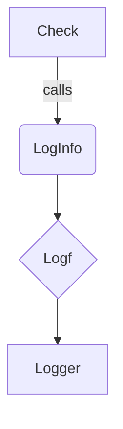

Check.LogInfo`

```go
func (c Check) LogInfo(msg string, args ...any) ()
```

### Purpose
`LogInfo` is a convenience wrapper that logs an informational message for the check instance `c`.  
It formats the supplied message with optional arguments and prefixes it with the check’s name. The resulting log entry is written to the standard logger used by the package (`logf`).

### Inputs

| Parameter | Type   | Description |
|-----------|--------|-------------|
| `msg`     | `string` | A format string (compatible with `fmt.Sprintf`) that describes the event or state being logged. |
| `args…`   | `...any` | Optional values to interpolate into `msg`. |

### Output
The function does **not** return a value; its signature is `func()`.  
All side effects are performed through logging – the message is emitted via the package’s logger.

### Key Dependencies

* **`Check` struct** – Provides the check name (`c.Name`) used as a prefix.
* **`Logf` function** – The actual implementation that writes the formatted string to the logger.  
  `LogInfo` simply calls `Logf("%s: %s", c.Name, fmt.Sprintf(msg, args...))`.

No other global state or external packages are modified.

### Side‑Effects

* Emits a log line at **INFO** level (or whatever level `Logf` uses).
* Does not alter the check instance or any shared data structures.
* Thread‑safe because it only reads from the receiver and calls a stateless logger.

### Package Context
Within the `checksdb` package, checks are executed against a set of certificates.  
Each `Check` may produce output at various verbosity levels:

| Level | Typical Use |
|-------|-------------|
| `LogInfo`  | General information about progress or decisions made by the check. |
| `LogWarning` / `LogError` | Errors or warnings specific to the check logic. |

`LogInfo` is therefore part of the public API that allows consumers (e.g., command‑line tools, web UIs) to capture detailed execution traces without polluting the result set. It complements other logging helpers such as `LogWarning`, `LogError`, and `LogResult`.

---

#### Suggested Mermaid Diagram



This diagram illustrates that a `Check` delegates to the package logger via `LogInfo`.
