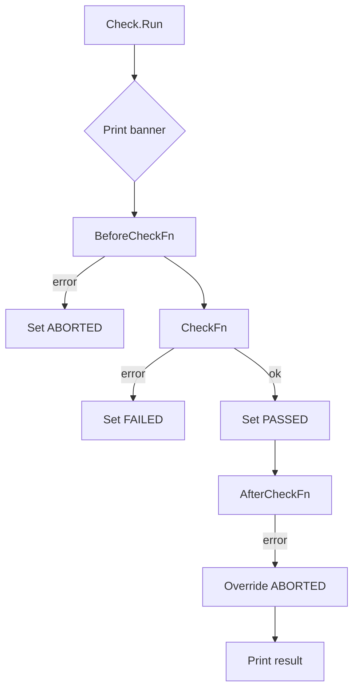

Check.Run` – Execute a single test

```go
func (c Check) Run() error
```

## Purpose

`Run` is the public entry point that executes a single **check** (test case) defined in the checks database.

A *check* consists of:
- optional **before** and **after** callbacks (`BeforeCheckFn`, `AfterCheckFn`);
- an actual test function (`CheckFn`);
- a name, description, severity level, etc.

`Run` orchestrates the whole lifecycle:

1. Prints a “running” banner with `PrintCheckRunning`.
2. Calls the *before* hook.
3. Executes the core test logic.
4. Handles any error returned by the hooks or the test itself.
5. Calls the *after* hook.
6. Records the result (passed / failed / aborted / skipped).
7. Prints a concise summary via `printCheckResult`.

The function returns an `error` only if something went wrong **outside** the normal test outcome (e.g., panics in hooks). A test that fails or is skipped will not cause `Run` to return an error; instead, its status is stored in the check’s `Result` field.

## Inputs & Outputs

| Parameter | Type | Description |
|-----------|------|-------------|
| `c` (receiver) | `Check` | The concrete test case being executed. All of its fields (`Name`, `BeforeCheckFn`, `CheckFn`, etc.) are read during execution. |

| Return | Type | Meaning |
|--------|------|---------|
| `error` | `error` | `nil` if the check ran to completion (even if it failed or was skipped). Non‑nil indicates a critical problem that prevented the check from running at all. |

## Key Dependencies

- **Logging & formatting**  
  - `PrintCheckRunning`: prints a banner with the check name and start time.
  - `LogInfo`: logs informational messages, e.g., about skipping.

- **Timing**  
  - `Now()`: records timestamps before and after the check for duration calculation.

- **Hooks**  
  - `BeforeCheckFn`, `AfterCheckFn`: optional callbacks that run immediately before/after `CheckFn`. They can abort or alter execution flow. Errors from these hooks are handled separately (see error handling below).

- **Test function**  
  - `CheckFn`: the core test logic. It returns an `error` if the check fails.

- **Result formatting**  
  - `printCheckResult`: prints a short line summarizing the outcome (PASS / FAIL / SKIP / ABORTED) along with duration and any error message.

## Execution Flow & Error Handling

```text
┌─────────────────────┐
│ Print banner         │
├─────────────────────┤
│ Call BeforeCheckFn   │
│  - if it returns err │
│    → set Result = ABORTED, store err, skip rest │
├─────────────────────┤
│ Execute CheckFn      │
│  - if err != nil     │
│    → set Result = FAILED, store err                │
│  - else              │
│    → set Result = PASSED                               │
├─────────────────────┤
│ Call AfterCheckFn    │
│  - if err != nil     │
│    → override Result to ABORTED and store err          │
├─────────────────────┤
│ Print result         │
└─────────────────────┘
```

- **Aborted**: Any error returned by `BeforeCheckFn` or `AfterCheckFn` is treated as an *abortion* of the test. The check’s status becomes `CheckResultAborted`.
- **Failed**: Only errors from `CheckFn` mark a failure.
- **Skipped**: If the check was marked to be skipped (via `skipMode` logic elsewhere), `Run` will not execute hooks or `CheckFn`; it sets `Result = CheckResultSkipped`.  
  *Note*: The skipping decision is made before calling `Run`, so this function assumes the check is either to run or already marked as skipped.

The final call to `printCheckResult` writes a single line that includes:
- Result status (e.g., `[PASS]`)
- Check name
- Duration (`Now() - start`)
- Error message, if any

## How It Fits the Package

Within **`pkg/checksdb`**, `Run` is the only public method on the `Check` struct that actually executes a test. All other package functions are for:
- Registering checks (`RegisterChecks`, `registerChecksFromFile`),
- Managing groups (`GetGroup`, `AddGroup`),
- Filtering/skipping logic.

Thus, `Run` is the bridge between the static check definitions and their dynamic execution during a CertSuite run.

---

### Suggested Mermaid diagram



This diagram visualises the decision points and state transitions inside `Run`.
