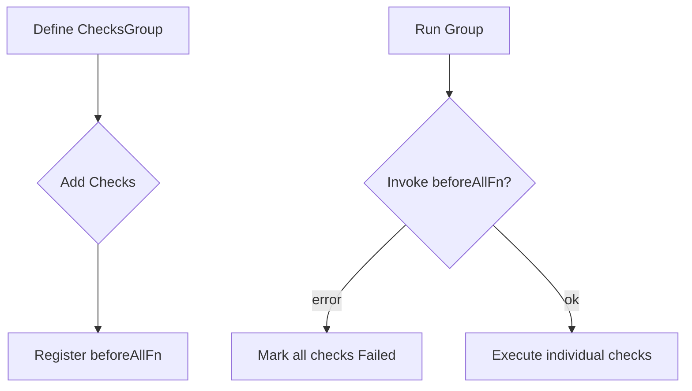

ChecksGroup.WithBeforeAllFn`

> **Package**: `github.com/redhat-best-practices-for-k8s/certsuite/pkg/checksdb`  
> **Type**: method on `*ChecksGroup`  
> **Signature**:
> ```go
> func (cg *ChecksGroup) WithBeforeAllFn(fn func(checks []*Check) error) *ChecksGroup
> ```

## Purpose

`WithBeforeAllFn` registers a callback that will be executed once, **before any check in the group is run**.  
The function receives the full slice of checks belonging to the group and may perform preparatory work (e.g., initializing shared resources, validating pre‑conditions, or populating context). If the callback returns an error, the entire group will fail immediately.

## Inputs

| Parameter | Type | Description |
|-----------|------|-------------|
| `fn` | `func(checks []*Check) error` | A function that accepts the slice of checks in this group and returns an `error`. The callback is stored inside the `ChecksGroup` instance. |

> **Note**: The slice passed to `fn` contains *all* checks registered for the group, regardless of their current state.

## Outputs

| Return value | Type | Description |
|--------------|------|-------------|
| `*ChecksGroup` | pointer to the same `ChecksGroup` on which it was called | Enables method chaining (`cg.WithBeforeAllFn(...).WithAfterAllFn(...)`, etc.). |

No other values are returned.

## Key Dependencies

- **`Check` struct**: The callback receives a slice of pointers to this type.  
- **`ChecksGroup` internal fields**: The method sets the `beforeAllFn` field (not shown in the snippet but part of the group’s state).  
- No external global variables are read or modified.

## Side Effects

1. **State mutation** – The `ChecksGroup.beforeAllFn` field is updated to point at the supplied function.
2. **No immediate execution** – The callback is *not* run when calling `WithBeforeAllFn`; it will be invoked later by the group runner before any check starts.

## Usage Context

- **Registration Phase**: Call this method during the configuration of a checks group (typically in an init or factory function).  
- **Execution Phase**: When the test harness executes the group, it will automatically invoke the stored `beforeAllFn`. If that function returns an error, all subsequent checks in the group are marked as failed and no further execution occurs.

## Typical Pattern

```go
group := NewChecksGroup("my-group").
    WithBeforeAllFn(func(checks []*Check) error {
        // e.g., set up a shared Kubernetes client
        return nil
    }).
    Add(Check{Name: "check1", ...})
```

This pattern allows you to centralize expensive setup logic once per group instead of repeating it for each check.

## Diagram (optional)



---

**Summary**: `WithBeforeAllFn` is a declarative helper that attaches a single “before‑all” hook to a `ChecksGroup`. It stores the supplied function for later execution, enabling shared setup logic across all checks in the group.
