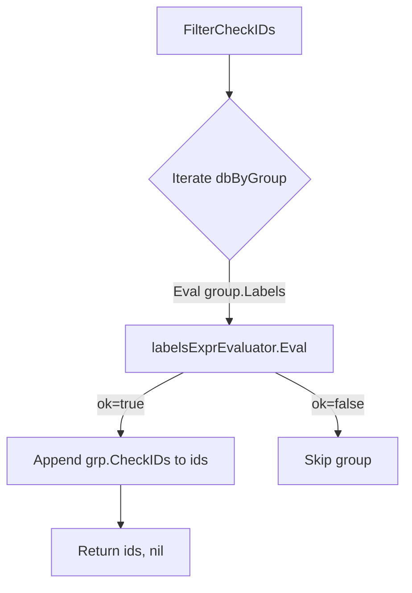

FilterCheckIDs` – Package Overview

**Package**  
`github.com/redhat-best-practices-for-k8s/certsuite/pkg/checksdb`

The *checksdb* package holds the in‑memory database of certificate checks, organised by group and indexed by label expressions.  
`FilterCheckIDs` is a public helper that returns the identifiers of all checks that satisfy the global label filter configured for the database.

---

## Function Signature

```go
func FilterCheckIDs() ([]string, error)
```

| Parameter | Type   | Description |
|-----------|--------|-------------|
| *none*    | –      | No input arguments. The function relies on package‑level state (`dbByGroup`, `labelsExprEvaluator`). |

| Return | Type  | Description |
|--------|-------|-------------|
| ids    | []string | Slice of check IDs that pass the current label filter. Order is unspecified and may change if the underlying map changes. |
| err    | error   | Non‑nil if evaluating any group’s label expression fails. |

---

## Purpose

`FilterCheckIDs` provides a convenient way for callers to ask *which* checks will actually run under the current configuration:

1. **Label filtering** – The database can be configured with a label expression (e.g., `"k8s_version>=1.20 && !openshift"`).  
2. **Resulting set** – Only checks whose labels satisfy that expression are considered *eligible* for execution.

This function is typically called by the test harness before launching a run, to give the user a preview of which checks will be evaluated.

---

## Dependencies & Side‑Effects

| Dependency | Why it’s used |
|------------|---------------|
| `dbByGroup` (map[string]*ChecksGroup) | Contains all check groups; each group knows its own label expression and the checks it holds. |
| `labelsExprEvaluator` (`labels.LabelsExprEvaluator`) | Evaluates a label expression string against a map of labels. |
| `Eval()` method | Invoked on each group’s label expression to determine if that group's checks are eligible. |

**Side‑effects**

* The function **does not modify** any global state.  
* It only reads from the package variables and returns data.

---

## Key Logic

```go
func FilterCheckIDs() ([]string, error) {
    var ids []string

    // Iterate over all groups in the DB.
    for _, grp := range dbByGroup {
        // Evaluate this group's label expression.
        ok, err := labelsExprEvaluator.Eval(grp.Labels)
        if err != nil {
            return nil, err
        }
        if !ok { // group is filtered out → skip its checks
            continue
        }

        // Append all check IDs from the group to the result slice.
        ids = append(ids, grp.CheckIDs...)
    }
    return ids, nil
}
```

* Each `ChecksGroup` exposes a `Labels` field (the expression string) and a `CheckIDs` slice.  
* The evaluator returns a boolean indicating whether the current configuration matches the group’s labels.

---

## How It Fits Into the Package

| Flow | Where it belongs |
|------|------------------|
| **Initialisation** – During database construction, each check is added to its group and label expressions are stored. |
| **Filtering** – Before a test run, `FilterCheckIDs` is called to decide which checks will be executed. |
| **Execution** – The runner iterates over the returned IDs, fetching the actual check definitions from `resultsDB`. |

> **Why expose this function?**  
> It keeps the filtering logic encapsulated while giving external callers (CLI tools, UI dashboards) a quick way to preview or audit the active checks.

---

## Mermaid Diagram (Optional)



---
