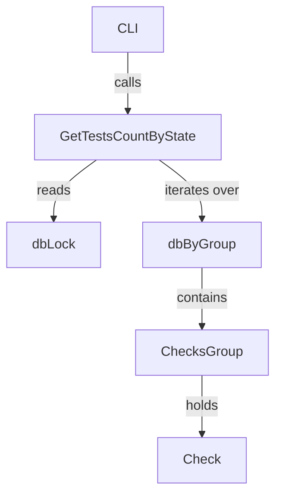

GetTestsCountByState`

| Aspect | Detail |
|--------|--------|
| **Signature** | `func GetTestsCountByState(state string) int` |
| **Exported** | ✅ |
| **Package** | `github.com/redhat-best-practices-for-k8s/certsuite/pkg/checksdb` |

### Purpose
`GetTestsCountByState` returns the number of test checks that are currently in a specific state. The function is used by reporting and CLI utilities to provide quick statistics such as how many tests passed, failed, were skipped, or aborted.

### Parameters
| Name | Type | Description |
|------|------|-------------|
| `state` | `string` | One of the canonical state strings: `"passed"`, `"failed"`, `"skipped"`, `"aborted"`. The comparison is case‑insensitive. |

> **Note** – The function accepts any string, but only these four values are meaningful; other inputs will result in a count of `0`.

### Return Value
| Type | Description |
|------|-------------|
| `int` | Number of checks whose current state matches the supplied `state`. If no checks match or if an unknown state is supplied, the function returns `0`. |

### Implementation Details

```go
func GetTestsCountByState(state string) int {
    dbLock.Lock()
    defer dbLock.Unlock()

    // Iterate over all groups in the database.
    for _, group := range dbByGroup {
        // For each check within the group, compare its state.
        for _, test := range group.Checks {
            if strings.EqualFold(test.State, state) {
                count++
            }
        }
    }
    return count
}
```

* **Thread‑Safety** – The function acquires `dbLock` (a global `sync.Mutex`) before reading the shared `dbByGroup` map to avoid race conditions.
* **No side effects** – It only reads data; it does not modify any state or persist results.

### Dependencies & Related Types

| Dependency | Role |
|------------|------|
| `dbByGroup` (`map[string]*ChecksGroup`) | Holds all registered check groups. The function iterates over this map to access each group's checks. |
| `dbLock` (`sync.Mutex`) | Synchronizes concurrent reads of the database. |
| `CheckResult*` constants (`PASSED`, `FAILED`, `SKIPPED`, `CHECK_RESULT_ABORTED`) | These string constants are used elsewhere in the package as canonical state values; callers typically use them when invoking this function. |

### Usage Context

The function is part of the *checks database* layer, which tracks test definitions and their execution results. Other parts of the application (e.g., command‑line flags `--summary`, web UI dashboards) call `GetTestsCountByState` to display real‑time statistics without pulling raw data from the underlying storage.

### Example

```go
passed := GetTestsCountByState("passed")
failed := GetTestsCountByState("failed")

fmt.Printf("%d tests passed, %d failed\n", passed, failed)
```

This would output something like:

```
42 tests passed, 3 failed
```

---

#### Mermaid diagram (optional)



This diagram shows the call path and the shared data structures involved.
