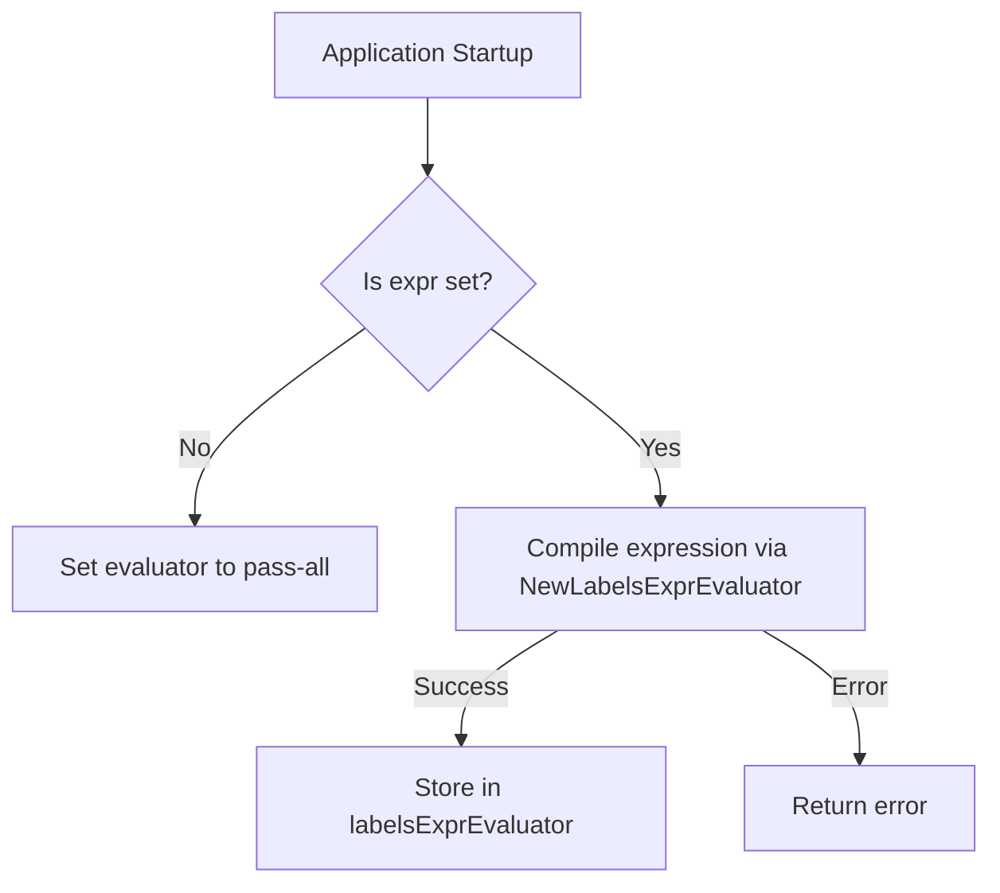

InitLabelsExprEvaluator`

### Purpose
`InitLabelsExprEvaluator` is a package‑level initializer that prepares the *label expression evaluator* used by the checks database.  
The evaluator parses and evaluates label expressions (e.g., “environment=prod && tier=frontend”) which are attached to checks and groups in **checksdb**.

> The function is part of `github.com/redhat-best-practices-for-k8s/certsuite/pkg/checksdb`.  
> It must be called once during application startup, before any check execution that relies on label filtering.

---

### Signature
```go
func InitLabelsExprEvaluator(expr string) error
```

| Parameter | Type   | Description |
|-----------|--------|-------------|
| `expr`    | `string` | The raw expression to be compiled into an evaluator.  An empty string disables label evaluation (all checks are considered applicable). |

### Return Value
- **`nil`** – the evaluator was successfully created and stored in the package variable `labelsExprEvaluator`.  
- **`error`** – if parsing fails or the expression is invalid, a descriptive error is returned. The global evaluator remains unchanged.

---

### Key Steps & Dependencies

1. **Lock Guard**  
   The function uses `dbLock` (a `sync.Mutex`) to guard concurrent writes to `labelsExprEvaluator`.  
   ```go
   dbLock.Lock()
   defer dbLock.Unlock()
   ```

2. **Empty Expression Handling**  
   If `expr == ""`, the evaluator is set to a no‑op implementation that always returns `true` (everything passes).  
   This is done by calling `NewLabelsExprEvaluator("")`.

3. **Compilation**  
   For non‑empty expressions, it calls:
   ```go
   eval, err := NewLabelsExprEvaluator(expr)
   ```
   - `NewLabelsExprEvaluator` comes from the local package `labels`.  
   - It returns an object that implements the interface `labels.LabelsExprEvaluator`.

4. **Error Propagation**  
   If compilation fails (`err != nil`), the function returns:
   ```go
   return fmt.Errorf("failed to init labels expr evaluator: %w", err)
   ```

5. **Assignment**  
   On success, it assigns the compiled evaluator to the package‑wide variable `labelsExprEvaluator`.

---

### Side Effects

- **Global State Mutation** – The only side effect is updating the `labelsExprEvaluator` global variable.
- **Concurrency Safety** – The function uses a mutex to ensure that no two goroutines reinitialize the evaluator simultaneously.

---

### Integration in the Package

| Component | How it interacts with `InitLabelsExprEvaluator` |
|-----------|-----------------------------------------------|
| `dbByGroup` | Not directly used; the evaluator is stored globally and accessed by other functions when filtering checks. |
| Check execution flow | When a check or group is about to run, its label expression is evaluated against the current context using `labelsExprEvaluator`. |
| Tests / CLI | Typically invoked in an init routine (e.g., during `main` startup) before running any tests or commands that depend on label filtering. |

---

### Suggested Mermaid Diagram



---

### Example Usage

```go
// In main.go or an init function
if err := checksdb.InitLabelsExprEvaluator(os.Getenv("CHECK_LABELS_EXPR")); err != nil {
    log.Fatalf("label evaluator init failed: %v", err)
}
```

This ensures that subsequent check runs respect the supplied label expression.
