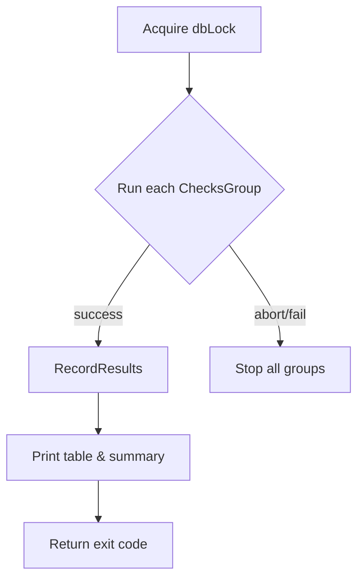

RunChecks` – Execute the entire checks database

### Purpose
`RunChecks` is the public entry point for executing all registered checks in the **checksdb** package.  
It orchestrates:

1. **Locking** the global database to avoid concurrent modification.
2. Running each check group (which may contain multiple individual checks) with a timeout.
3. Recording results, handling aborts or failures, and printing a summary table.
4. Returning an exit‑code‑style integer (`0` for success, `1` for failure/abort) together with any error that prevented the run from completing.

### Signature
```go
func RunChecks(timeout time.Duration) (int, error)
```
* **timeout** – maximum duration each check group may take.  
  A zero value means “no timeout”.
* **return values**
  * `int` – a conventional exit code: `0` if all checks passed, `1` otherwise.
  * `error` – non‑nil only when the function could not start or finish the run (e.g., database lock failure).

### Key Dependencies & Side Effects
| Dependency | Role |
|------------|------|
| `dbLock.Lock/Unlock` | Serialises access to `dbByGroup`. |
| `After`, `Notify`, `Stop`, `OnAbort` | Control flow of each check group; allow early termination or signalling. |
| `RecordChecksResults` | Persists individual check outcomes in the results database (`resultsDB`). |
| `PrintResultsTable` | Pretty‑prints a tabular summary to stdout. |
| `getResultsSummary`, `printFailedChecksLog` | Compute and output aggregate statistics and failure details. |
| Logging helpers (`Debug`, `Warn`) | Emit diagnostic messages during execution. |

The function **mutates** the global `resultsDB` with the outcome of each check, but otherwise treats all data structures as read‑only.

### How It Fits the Package

```
checksdb
├── dbByGroup      // map[groupName]*ChecksGroup  (global)
├── RunChecks()    // orchestrator – public API
└── Helpers…
```

`RunChecks` is called by higher‑level tools that need to evaluate a suite of checks, such as the command line interface or CI pipelines. It hides all the complexity of group scheduling, timeout handling, and result aggregation behind a single call.

---

### Minimal Mermaid Flow (optional)



> **Note**: The actual implementation contains several nested loops and error checks, but the above diagram captures the high‑level control flow.
