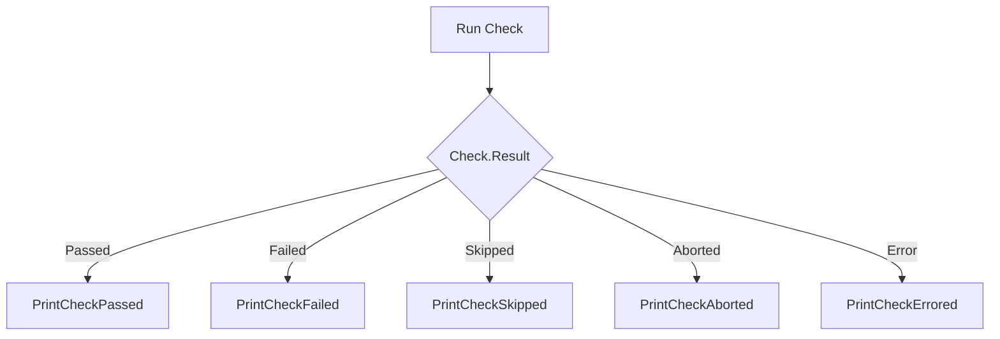

printCheckResult`

| Aspect | Detail |
|--------|--------|
| **Package** | `checksdb` (`github.com/redhat-best-practices-for-k8s/certsuite/pkg/checksdb`) |
| **Signature** | `func (c *Check) printCheckResult()` |
| **Visibility** | unexported – used only inside the package to format a single check’s outcome. |

### Purpose
`printCheckResult` is a helper that renders a human‑readable summary of a single test (`Check`) after it has finished executing.  
It chooses one of five printing functions based on the `Result` field of the `Check`:

| Result | Printed by |
|--------|------------|
| `CheckResultPassed`  | `PrintCheckPassed` |
| `CheckResultFailed`  | `PrintCheckFailed` |
| `CheckResultSkipped` | `PrintCheckSkipped` |
| `CheckResultAborted` | `PrintCheckAborted` |
| `CheckResultError`   | `PrintCheckErrored` |

Each of those functions is defined elsewhere in the package and outputs a formatted line (often with ANSI color codes) to stdout or a logger.

### Inputs
- The method receives its receiver, a pointer to a `Check` instance (`c *Check`).  
  The `Check` struct contains at least:
  - `Name`, `Description`: identifiers for the test.
  - `Result`: one of the constants (`CheckResultPassed`, etc.).
  - `Err`: an error value if the check aborted or failed.

### Outputs / Side effects
- **Console output**: a single line describing the result, colorized according to the outcome.  
- No return value; side‑effects are limited to printing.
- The function does not modify the `Check` object itself.

### Dependencies
The function relies on the following package‑level helpers (imported implicitly by being in the same file):

| Helper | Role |
|--------|------|
| `PrintCheckPassed`, `PrintCheckFailed`, `PrintCheckSkipped`, `PrintCheckAborted`, `PrintCheckErrored` | Formatting functions that accept a `*Check` and write the result. |

No global variables are accessed directly; it operates solely on its receiver.

### Usage within the package
`printCheckResult` is called by higher‑level execution logic (e.g., after running a check or when aggregating results). It centralizes all formatting decisions so that changes to output style need only be made in one place.

---

#### Mermaid Flow Diagram

This diagram shows the decision path taken by `printCheckResult`.
