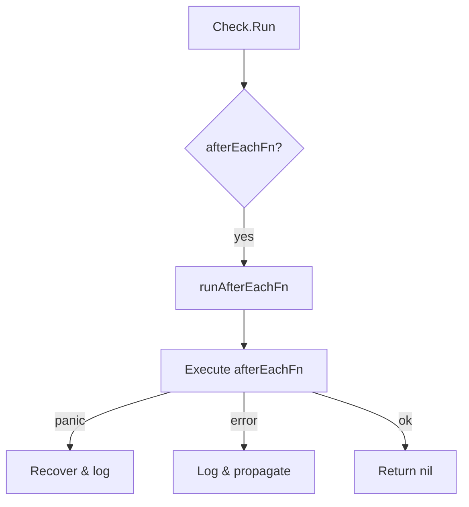

runAfterEachFn`

`runAfterEachFn` is an internal helper that executes a check’s *after‑each* callback and handles any panic that occurs during the call.  
It is part of the **checksdb** package, which manages collections of checks (`ChecksGroup`) and their execution results.

### Signature

```go
func runAfterEachFn(group *ChecksGroup, chk *Check, pending []*Check) error
```

| Parameter | Type            | Purpose |
|-----------|-----------------|---------|
| `group`   | `*ChecksGroup`  | The group that owns the check.  Used only for logging/debugging. |
| `chk`     | `*Check`        | The check whose after‑each function is being run. |
| `pending` | `[]*Check`      | A slice of checks that were still pending when this callback was invoked (may be empty). |

The function returns an `error`.  A non‑nil error indicates that the after‑each callback panicked or returned a failure status.

### Behaviour

1. **Logging**  
   The function starts by emitting a debug message:  
   ```go
   Debug("Run afterEachFn for check %s", chk.Name)
   ```
2. **Recover from panic**  
   It wraps the call in `defer recover()` so that if `afterEachFn` panics, the panic is captured and converted into an error.
3. **Execution**  
   The actual callback is invoked:  
   ```go
   err := chk.afterEachFn(group, pending)
   ```
4. **Error handling**  
   * If a panic occurs:  
     - A stack trace is logged (`Stack(err)`).
     - An `Error` object is returned containing the panic value and stack trace.
   * If the callback returns an error:
     - The error is logged.
     - It may be transformed into a failure status via `onFailure`.
   * Any other errors are propagated unchanged.

5. **Return**  
   The function finally returns the error (or `nil` if everything succeeded).

### Dependencies & Side‑Effects

| Called function | Purpose |
|-----------------|---------|
| `Debug`, `Error`, `Sprint`, `string`, `Stack` | Logging utilities from the same package or standard library. |
| `recover`       | Captures panics from `afterEachFn`. |
| `onFailure`     | Converts an error into a standardized failure status (used by callers). |
| `afterEachFn`   | The user‑supplied callback defined on the `Check` struct. |

No global state is modified; the only side effect is logging and potential error propagation.

### How it fits in the package

- **ChecksGroup** holds a list of checks and orchestrates their execution.
- Each `Check` can define an optional *after‑each* function that runs after its own run or when the group finishes.
- `runAfterEachFn` is called by the group runner whenever such a callback needs to be executed.  
  It guarantees that panics are safely handled and that failures are reported consistently, keeping the rest of the execution flow stable.

---

#### Mermaid diagram (suggestion)



This helper is a small but crucial piece that ensures robust execution of check groups.
