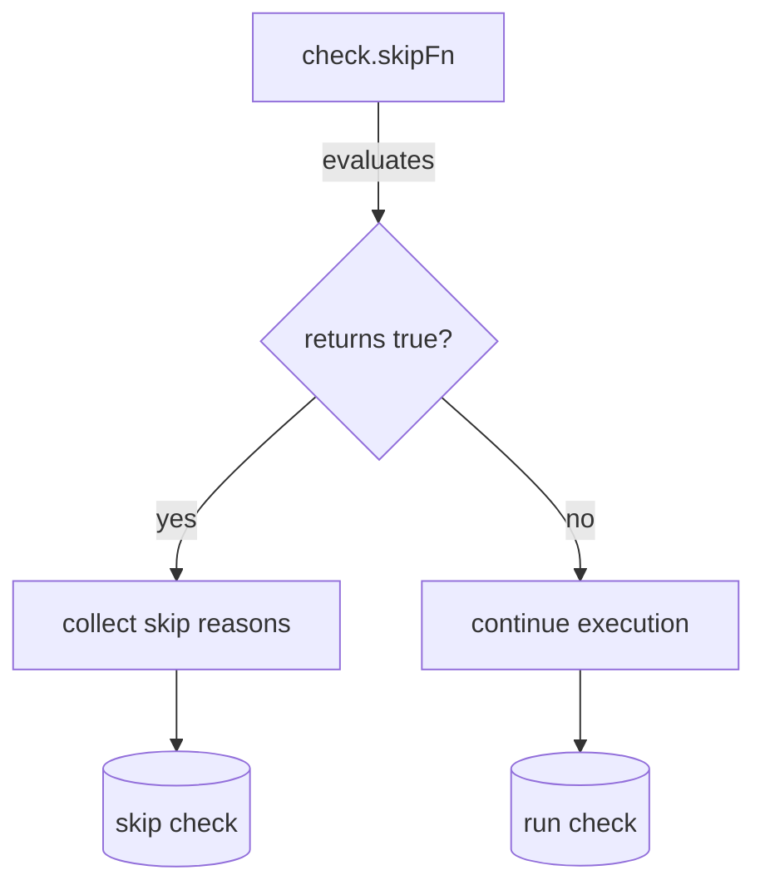

shouldSkipCheck`

| Aspect | Detail |
|--------|--------|
| **Location** | `pkg/checksdb/checksgroup.go:206` |
| **Export status** | Unexported (internal helper) |
| **Signature** | `func(*Check) (bool, []string)` |

### Purpose
`shouldSkipCheck` determines whether a particular check should be skipped for the current run and, if so, why.  
It evaluates any *skip* function attached to the check (`check.skipFn`) against the runtime context (`check.context`). The return values are:

| Return | Meaning |
|--------|---------|
| `bool` | `true` if the check is to be skipped; `false` otherwise. |
| `[]string` | Human‑readable reasons for skipping (if any). These strings may contain placeholders that get interpolated by `Sprintf`. |

The function is invoked internally by the checks execution engine when iterating over a `ChecksGroup`.

### Inputs

* `check *Check`
  * The check under consideration.  
  * Expected fields used:
    * `skipFn` – a function of type `func(*Context) bool` (or similar) that decides whether to skip.
    * `context` – the runtime context passed to `skipFn`.
    * `id` – the unique identifier, used only for logging.

### Key Dependencies

| Dependency | Role |
|------------|------|
| `check.skipFn` | The predicate that actually performs the skip logic. If nil, no skipping occurs. |
| `LogError`, `Sprint`, `Sprintf`, `Stack` | Logging utilities used to record panics or evaluation errors from `skipFn`. |
| `recover()` | Catches panics inside `skipFn` so they don’t abort the entire test run. |
| `labelsExprEvaluator` (global) | Not directly referenced; may be indirectly involved if `skipFn` uses label expressions. |

### Execution Flow

1. **Early exit**  
   If `check.skipFn` is nil, the function immediately returns `(false, nil)`.

2. **Prepare skip reasons slice**  
   A local slice `var skipReasons []string` is created to collect human‑readable explanations.

3. **Panic guard**  
   A deferred recover block captures any panic from executing `skipFn`. If a panic occurs:
   * The stack trace and error message are logged via `LogError`.
   * The function returns `(true, skipReasons)` – the check is skipped because of the failure to evaluate.

4. **Call the skip predicate**  
   `shouldSkipCheck` invokes `check.skipFn(check.context)`.  
   * If it returns `false`, the function returns `(false, nil)` – no skipping.
   * If it returns `true`, the check should be skipped.

5. **Collect reasons**  
   For each entry in `check.skipReasons` (a slice of format strings):
   * The format string is interpolated with `Sprintf` using the current context values (`string(check.context)`).
   * Each resulting message is appended to `skipReasons`.

6. **Return**  
   The function returns `(true, skipReasons)`, indicating that the check will be omitted from execution and providing the reasons.

### Side Effects

* No global state is modified.
* Errors during evaluation are logged via `LogError`.
* Panics inside `skipFn` are recovered to prevent test suite crashes.

### How it Fits in the Package

The `checksdb` package manages a database of checks grouped by categories.  
During execution, each `ChecksGroup` iterates over its checks and calls `shouldSkipCheck`.  
If skipping is indicated, the group records the check as “skipped” (using constants like `SKIPPED`) and continues with the next check.  

Thus, `shouldSkipCheck` acts as a gatekeeper that guarantees:

* Robust handling of user‑supplied skip logic.
* Clear logging when skip logic fails.
* Consistent reporting of skipped checks across the entire suite.

---

#### Suggested Mermaid Diagram

This diagram illustrates the decision path taken by `shouldSkipCheck`.
