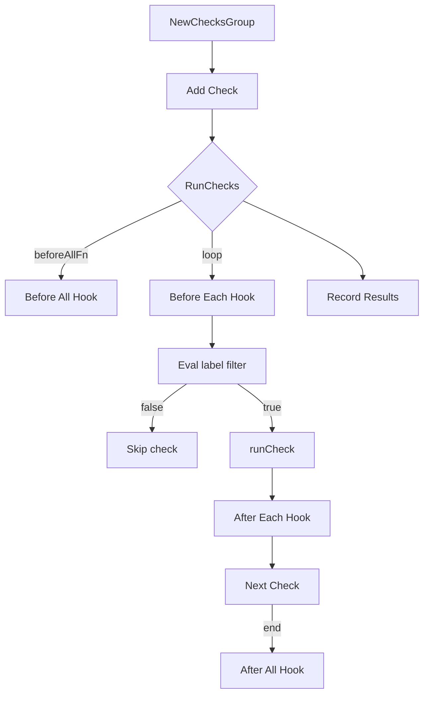

ChecksGroup` – A lightweight test harness for CNF certification checks  

| Field | Type | Purpose |
|-------|------|---------|
| `name string` | Identifier for the group (used in logs & reporting). |
| `checks []*Check` | Ordered list of tests that belong to this group. |
| `beforeAllFn func([]*Check) error` | Hook executed once before any check runs. Receives all checks; may set up shared state. |
| `afterAllFn func([]*Check) error` | Hook executed after the last check completes, regardless of success or failure. |
| `beforeEachFn func(*Check) error` | Hook executed before each individual check. Useful for per‑check setup. |
| `afterEachFn func(*Check) error` | Hook executed after each check finishes. |
| `currentRunningCheckIdx int` | Index of the currently executing check; used by abort logic and reporting. |

> **Note** – All hook fields default to `nil`. The struct exposes fluent setters (`With…`) that wrap the hooks in a new `ChecksGroup`, enabling method chaining.

### Core behaviour

| Method | Signature | Primary role |
|--------|-----------|--------------|
| `NewChecksGroup(name string) *ChecksGroup` | Creates an empty group with the given name. |
| `Add(*Check)` | Appends a check to the end of the list, protecting the slice with an internal lock. |
| `WithBeforeAllFn(f func([]*Check) error) *ChecksGroup` | Returns a copy that will call `f` before any checks run. |
| `WithAfterAllFn(f func([]*Check) error) *ChecksGroup` | Returns a copy that will call `f` after all checks finish. |
| `WithBeforeEachFn(f func(*Check) error) *ChecksGroup` | Same for per‑check pre‑execution. |
| `WithAfterEachFn(f func(*Check) error) *ChecksGroup` | Same for post‑execution. |
| `RunChecks(stop <-chan bool, abortChan chan string) ([]error, int)` | **The engine** – runs the group’s checks sequentially while honoring label filters, abort signals and hook callbacks. Returns a slice of errors (one per check that failed or panicked) and an integer count of *successful* checks. |
| `OnAbort(reason string) error` | Invoked when an external abort is requested via `abortChan`. Marks the current running check as aborted and skips remaining checks. |
| `RecordChecksResults() func()` | Returns a function that, when called (typically after all hooks), records each check’s result to the global results database (`recordCheckResult`). |

### Execution flow of `RunChecks`

1. **Before‑all**  
   *Call* `beforeAllFn` with all checks. If it panics or returns an error, mark the first check as failed and immediately run `afterAllFn`.

2. **Per‑check loop**  
   For each check `c`:
   - Run `beforeEachFn(c)`. Failure → skip the check and record the error.
   - Evaluate label expression (`Eval`). If it returns `false`, mark the check as *skipped*.
   - Call `runCheck(c)` – which executes `c.Run()`, recovers from panics, logs failures, and sets result status.  
     Any panic → mark check as *panicked*.
   - Run `afterEachFn(c)`. Failure → record error but continue.

3. **After‑all**  
   After the loop (or after an early abort), call `afterAllFn` with all checks. Recover from panics here too.

4. **Abort handling**  
   While running, the goroutine listens on `stop <-chan bool`. When a value arrives, it triggers `OnAbort`, which sets the current check’s result to *aborted*, prints a message and stops further execution.

5. **Result aggregation**  
   The method returns:
   - `[]error`: one element per failed or panicked check (skipped checks contribute no error).
   - `int`: number of checks that succeeded (`passed` + `skipped`).

### Side‑effects & dependencies

| Function | Dependencies | Side‑effects |
|----------|--------------|-------------|
| `Add` | None beyond the group’s own lock. | Appends to `checks`. |
| `OnAbort` | Uses `Printf`, `Eval`, `SetResultSkipped/Aborted`, and a helper `printCheckResult`. | Logs abort message, updates check status, prints result. |
| `RecordChecksResults` | Calls global `recordCheckResult`. | Persists each check’s final state. |
| `RunChecks` | Relies on `beforeAllFn`, `afterAllFn`, `beforeEachFn`, `afterEachFn`, `skipCheck`, `runBefore*Fn`, `runCheck`, and `runAfter*Fn`. Uses standard library (`Printf`, `Join`, etc.). | Runs checks, updates internal state, records errors, handles aborts. |
| Hook setters (`With…`) | None. | Return a new `ChecksGroup` with the specified hook set; they do not mutate the original. |

### How it fits in `checksdb`

- **Purpose**: Encapsulates a batch of CNF certification checks that can be executed atomically, with lifecycle hooks and abort support.
- **Integration points**:
  - `Check` objects (defined elsewhere) are added to a group; each check knows how to execute its specific test logic.
  - Results are stored via the global `recordCheckResult` mechanism after the group finishes.
  - The package’s API is used by higher‑level orchestrators that assemble groups, configure hooks, and trigger execution based on command‑line flags or CI pipelines.

### Suggested Mermaid diagram

This diagram highlights the sequential nature of the group execution and the places where hooks intervene.
