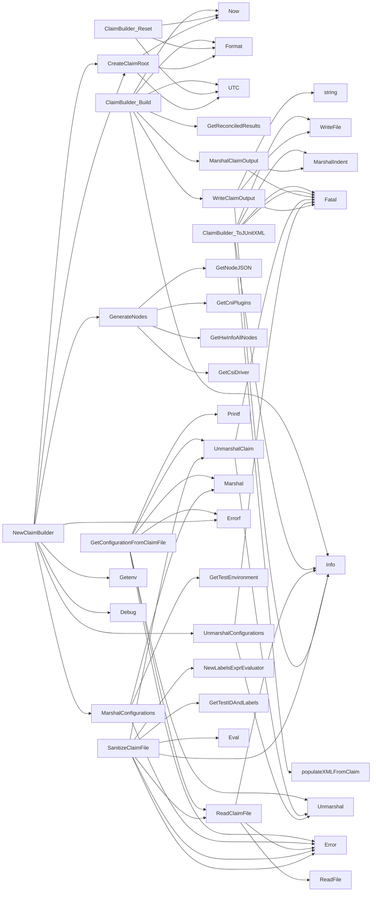

## Package claimhelper (github.com/redhat-best-practices-for-k8s/certsuite/pkg/claimhelper)

### Structs

- **ClaimBuilder** (exported) — 1 fields, 3 methods
- **FailureMessage** (exported) — 3 fields, 0 methods
- **SkippedMessage** (exported) — 2 fields, 0 methods
- **TestCase** (exported) — 8 fields, 0 methods
- **TestSuitesXML** (exported) — 8 fields, 0 methods
- **Testsuite** (exported) — 12 fields, 0 methods

### Functions

- **ClaimBuilder.Build** — func(string)()
- **ClaimBuilder.Reset** — func()()
- **ClaimBuilder.ToJUnitXML** — func(string, time.Time, time.Time)()
- **CreateClaimRoot** — func()(*claim.Root)
- **GenerateNodes** — func()(map[string]interface{})
- **GetConfigurationFromClaimFile** — func(string)(*provider.TestEnvironment, error)
- **MarshalClaimOutput** — func(*claim.Root)([]byte)
- **MarshalConfigurations** — func(*provider.TestEnvironment)([]byte, error)
- **NewClaimBuilder** — func(*provider.TestEnvironment)(*ClaimBuilder, error)
- **ReadClaimFile** — func(string)([]byte, error)
- **SanitizeClaimFile** — func(string, string)(string, error)
- **UnmarshalClaim** — func([]byte, *claim.Root)()
- **UnmarshalConfigurations** — func([]byte, map[string]interface{})()
- **WriteClaimOutput** — func(string, []byte)()

### Call graph (exported symbols, partial)

### Symbol docs

- [struct ClaimBuilder](symbols/struct_ClaimBuilder.md)
- [struct FailureMessage](symbols/struct_FailureMessage.md)
- [struct SkippedMessage](symbols/struct_SkippedMessage.md)
- [struct TestCase](symbols/struct_TestCase.md)
- [struct TestSuitesXML](symbols/struct_TestSuitesXML.md)
- [struct Testsuite](symbols/struct_Testsuite.md)
- [function ClaimBuilder.Build](symbols/function_ClaimBuilder_Build.md)
- [function ClaimBuilder.Reset](symbols/function_ClaimBuilder_Reset.md)
- [function ClaimBuilder.ToJUnitXML](symbols/function_ClaimBuilder_ToJUnitXML.md)
- [function CreateClaimRoot](symbols/function_CreateClaimRoot.md)
- [function GenerateNodes](symbols/function_GenerateNodes.md)
- [function GetConfigurationFromClaimFile](symbols/function_GetConfigurationFromClaimFile.md)
- [function MarshalClaimOutput](symbols/function_MarshalClaimOutput.md)
- [function MarshalConfigurations](symbols/function_MarshalConfigurations.md)
- [function NewClaimBuilder](symbols/function_NewClaimBuilder.md)
- [function ReadClaimFile](symbols/function_ReadClaimFile.md)
- [function SanitizeClaimFile](symbols/function_SanitizeClaimFile.md)
- [function UnmarshalClaim](symbols/function_UnmarshalClaim.md)
- [function UnmarshalConfigurations](symbols/function_UnmarshalConfigurations.md)
- [function WriteClaimOutput](symbols/function_WriteClaimOutput.md)
