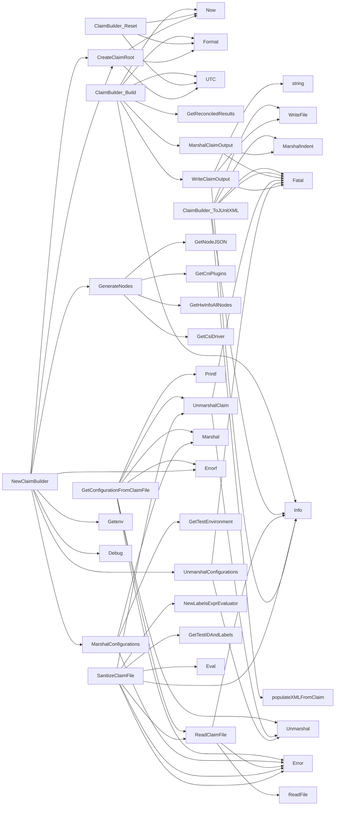

## Package claimhelper (github.com/redhat-best-practices-for-k8s/certsuite/pkg/claimhelper)

# ClaimHelper – a quick‑look guide

`pkg/claimhelper` is the glue that turns raw test results into **claims** (the JSON format used by CertSuite) and also produces JUnit XML for external tools.  
The package contains one exported type, several helper functions, and a small set of data structures that mirror the Claim model.

---

## 1. Core data structures

| Struct | Purpose | Key fields |
|--------|---------|------------|
| **`ClaimBuilder`** | Holds a `*claim.Root` while it is being populated. | `claimRoot *claim.Root` – the claim under construction. |
| **`FailureMessage`** | JUnit‑style failure data. | `Message`, `Text`, `Type`. |
| **`SkippedMessage`** | JUnit‑style skip data. | `Messages`, `Text`. |
| **`TestCase`** | One test case in a JUnit XML file. | `Classname, Name, Status, Time`; optional `Failure *FailureMessage`, `Skipped *SkippedMessage`. |
| **`Testsuite`** | One suite of tests (a Kubernetes resource or similar). | `Name, Package, Tests, Failures, Skipped, Testcase []TestCase`, and a nested `Properties` block that carries Claim metadata. |
| **`TestSuitesXML`** | Top‑level XML element for JUnit output. | Holds one `Testsuite` plus summary counters (`Disabled, Errors, Failures, Tests`). |

The structs are *not* used directly in the Claim model – they’re only a convenient way to serialise claim data into standard JUnit XML.

---

## 2. Global constants

| Const | Meaning |
|-------|---------|
| `CNFFeatureValidationJunitXMLFileName` | Default filename for the JUnit report (`validation_report.xml`). |
| `CNFFeatureValidationReportKey` | Key used in claim properties to refer to the JUnit file name. |
| `DateTimeFormatDirective` | Format string for timestamps (`2006-01-02T15:04:05Z07:00`). |
| `TestStateFailed`, `TestStateSkipped` | Status strings that are inserted into XML test cases. |
| `claimFilePermissions` (unexported) | File mode for claim files (`0644`). |

---

## 3. Building a claim

1. **Create a root**  
   ```go
   func CreateClaimRoot() *claim.Root {
       now := time.Now().UTC()
       return &claim.Root{
           ClaimVersion: "1",
           Timestamp:    now.Format(DateTimeFormatDirective),
           // ... other fields filled with defaults …
       }
   }
   ```

2. **Instantiate a builder**  
   ```go
   cb, err := NewClaimBuilder(env)
   ```
   * `NewClaimBuilder` loads environment config (e.g., `GetVersionOcClient`, `GenerateNodes`) and sets the initial claim root.

3. **Populate results** – `Build()` writes the final JSON to a file:
   ```go
   func (cb ClaimBuilder) Build(file string) {
       now := time.Now().UTC()
       cb.claimRoot.Timestamp = now.Format(DateTimeFormatDirective)
       payload := MarshalClaimOutput(cb.claimRoot)
       WriteClaimOutput(file, payload)
   }
   ```

4. **Reset** – `Reset()` re‑initialises the claim root for a new run.

5. **Export to JUnit XML** – `ToJUnitXML` creates a temporary JUnit file that mirrors the claim data:
   ```go
   func (cb ClaimBuilder) ToJUnitXML(file string, start, end time.Time) {
       xml := populateXMLFromClaim(cb.claimRoot.Claims[0], start, end)
       out, _ := json.MarshalIndent(xml, "", "  ")
       os.WriteFile(file, out, 0644)
   }
   ```

---

## 4. Helper utilities

| Function | Role |
|----------|------|
| `MarshalClaimOutput` | JSON‑pretty prints a claim; fails fatally on error. |
| `WriteClaimOutput` | Writes the byte slice to disk with permissions set by `claimFilePermissions`. |
| `ReadClaimFile` | Reads a previously written claim file into memory. |
| `UnmarshalClaim` / `UnmarshalConfigurations` | Parse JSON into Go structs or maps. |
| `SanitizeClaimFile` | Strips out environment‑specific labels from an existing claim and writes the cleaned version back to disk. |
| `GenerateNodes` | Gathers node information (CNI plugins, CSI drivers, hardware) for inclusion in a claim. |
| `populateXMLFromClaim` | Internal routine that translates a Claim into a JUnit XML structure. It walks through every test result, maps status codes (`TestStateFailed`, etc.) to the appropriate XML fields, and collects metadata into `<properties>`. |

---

## 5. Flow diagram (textual)

```
+-----------------+
| NewClaimBuilder |
+--------+--------+
         | creates claimRoot
         v
   +---------------+
   | ClaimBuilder  |
   +-------+-------+
           | Build()
           v
   +-------------------+
   | MarshalClaimOutput|
   +--------+----------+
            | writes JSON
            v
      claim.json (file)

   ToJUnitXML()  ----> populateXMLFromClaim() ----> JUnit XML file
```

---

## 6. Key points for contributors

- **Immutability** – The package never mutates global state; all data flows through the `ClaimBuilder` instance.
- **Error handling** – Most helpers use `log.Fatal()` on serialization errors, ensuring a test run stops if claim creation fails.
- **Extensibility** – Adding new Claim fields only requires updating `CreateClaimRoot` and `populateXMLFromClaim`; existing functions remain unchanged.

This overview should give you a solid mental model of how the *claimhelper* package turns raw test data into consumable claims and JUnit reports.

### Structs

- **ClaimBuilder** (exported) — 1 fields, 3 methods
- **FailureMessage** (exported) — 3 fields, 0 methods
- **SkippedMessage** (exported) — 2 fields, 0 methods
- **TestCase** (exported) — 8 fields, 0 methods
- **TestSuitesXML** (exported) — 8 fields, 0 methods
- **Testsuite** (exported) — 12 fields, 0 methods

### Functions

- **ClaimBuilder.Build** — func(string)()
- **ClaimBuilder.Reset** — func()()
- **ClaimBuilder.ToJUnitXML** — func(string, time.Time, time.Time)()
- **CreateClaimRoot** — func()(*claim.Root)
- **GenerateNodes** — func()(map[string]interface{})
- **GetConfigurationFromClaimFile** — func(string)(*provider.TestEnvironment, error)
- **MarshalClaimOutput** — func(*claim.Root)([]byte)
- **MarshalConfigurations** — func(*provider.TestEnvironment)([]byte, error)
- **NewClaimBuilder** — func(*provider.TestEnvironment)(*ClaimBuilder, error)
- **ReadClaimFile** — func(string)([]byte, error)
- **SanitizeClaimFile** — func(string, string)(string, error)
- **UnmarshalClaim** — func([]byte, *claim.Root)()
- **UnmarshalConfigurations** — func([]byte, map[string]interface{})()
- **WriteClaimOutput** — func(string, []byte)()

### Call graph (exported symbols, partial)



### Symbol docs

- [struct ClaimBuilder](symbols/struct_ClaimBuilder.md)
- [struct FailureMessage](symbols/struct_FailureMessage.md)
- [struct SkippedMessage](symbols/struct_SkippedMessage.md)
- [struct TestCase](symbols/struct_TestCase.md)
- [struct TestSuitesXML](symbols/struct_TestSuitesXML.md)
- [struct Testsuite](symbols/struct_Testsuite.md)
- [function ClaimBuilder.Build](symbols/function_ClaimBuilder_Build.md)
- [function ClaimBuilder.Reset](symbols/function_ClaimBuilder_Reset.md)
- [function ClaimBuilder.ToJUnitXML](symbols/function_ClaimBuilder_ToJUnitXML.md)
- [function CreateClaimRoot](symbols/function_CreateClaimRoot.md)
- [function GenerateNodes](symbols/function_GenerateNodes.md)
- [function GetConfigurationFromClaimFile](symbols/function_GetConfigurationFromClaimFile.md)
- [function MarshalClaimOutput](symbols/function_MarshalClaimOutput.md)
- [function MarshalConfigurations](symbols/function_MarshalConfigurations.md)
- [function NewClaimBuilder](symbols/function_NewClaimBuilder.md)
- [function ReadClaimFile](symbols/function_ReadClaimFile.md)
- [function SanitizeClaimFile](symbols/function_SanitizeClaimFile.md)
- [function UnmarshalClaim](symbols/function_UnmarshalClaim.md)
- [function UnmarshalConfigurations](symbols/function_UnmarshalConfigurations.md)
- [function WriteClaimOutput](symbols/function_WriteClaimOutput.md)
