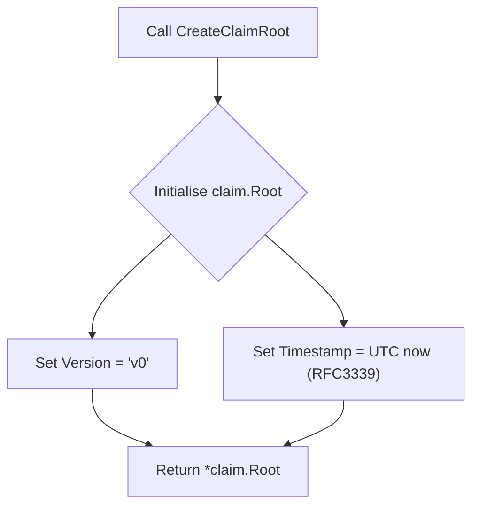

CreateClaimRoot` – Overview

| Feature | Details |
|---------|---------|
| **Package** | `github.com/redhat-best-practices-for-k8s/certsuite/pkg/claimhelper` |
| **Exported?** | ✅ |
| **Signature** | `func CreateClaimRoot() *claim.Root` |
| **Purpose** | Builds a new claim root object that represents the state of a CertSuite run. The returned structure is ready to be serialized (e.g., to JSON) and persisted as a claim file. |

---

### What it does

1. **Initialises a `claim.Root` struct** – the top‑level container used by CertSuite to describe a claim.
2. **Fills metadata fields**  
   * `Version` – set to `"v0"` (hard‑coded in the function).  
   * `Timestamp` – current UTC time formatted with RFC3339 (`time.Now().UTC().Format(time.RFC3339)`).
3. **Returns a pointer** to this freshly populated struct.

The claim file produced by CertSuite contains information such as test results, environment details, and any validation reports. `CreateClaimRoot` is the first step in that chain; subsequent functions (e.g., `PopulateClaimsFromResults`) will add more detailed data to the returned root.

---

### Inputs & Outputs

| Parameter | Type | Description |
|-----------|------|-------------|
| *none* | — | The function does not accept any arguments. |

| Return Value | Type | Description |
|--------------|------|-------------|
| `*claim.Root` | Pointer to a `claim.Root` struct | The claim root populated with version and timestamp. |

---

### Key dependencies

- **`time.Now()`** – obtains the current wall‑clock time.
- **`.UTC()`** – converts that time to UTC for consistency across deployments.
- **`.Format(time.RFC3339)`** – serialises the time into a machine‑readable string (`YYYY-MM-DDTHH:MM:SSZ`).

The function does not touch any global variables or external state; it is pure aside from reading the current system clock.

---

### Side effects

None.  
The function merely creates an in‑memory object; no files are written, no network calls are made.

---

### How it fits into the package

| Package | Relationship |
|---------|--------------|
| `claimhelper` | Provides utility functions to build and manipulate claim objects. |
| `CreateClaimRoot` | Acts as the base constructor for all claims. All other helper functions (e.g., populating test results, adding validation reports) expect a pre‑initialised root from this function. |

---

### Suggested Mermaid diagram

---

**TL;DR:**  
`CreateClaimRoot` is a tiny, pure constructor that returns a fresh claim root with version `"v0"` and the current UTC timestamp. It’s the entry point for building a complete CertSuite claim file.
