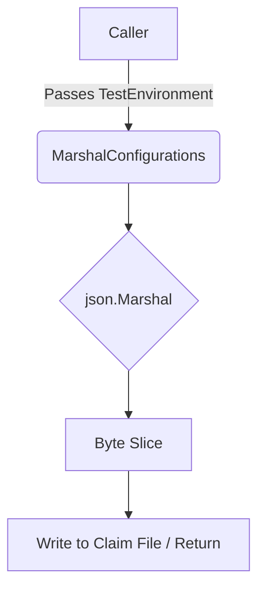

MarshalConfigurations`

| Item | Details |
|------|---------|
| **Signature** | `func MarshalConfigurations(env *provider.TestEnvironment) ([]byte, error)` |
| **Package** | `github.com/redhat-best-practices-for-k8s/certsuite/pkg/claimhelper` |
| **Exported** | Yes |

### Purpose
Serialises a test environment configuration (`*provider.TestEnvironment`) into JSON.  
The resulting byte slice is intended to be written to the claim file that will later be processed by other parts of Certsuite (e.g., for audit or reporting).

### Inputs & Outputs
| Parameter | Type | Description |
|-----------|------|-------------|
| `env` | `*provider.TestEnvironment` | The configuration object to serialise. It contains all settings, test suites, and results that need to be persisted. |

| Return | Type | Description |
|--------|------|-------------|
| `[]byte` | Byte slice of the marshalled JSON representation. |
| `error` | If marshalling fails, an error describing the problem is returned. |

> **Note**: The documentation comment says “this method fatally fails” but the implementation actually returns an error; callers are expected to handle or log it.

### Key Dependencies
1. **`provider.GetTestEnvironment()`** – Used internally by callers to obtain a populated `*provider.TestEnvironment`.  
2. **`encoding/json.Marshal`** – Performs the actual JSON encoding of the struct.
3. **`log.Error` (or similar)** – Errors are logged via the package’s error handling mechanism before being returned.

### Side‑Effects
- No global state is modified; the function is pure aside from possible logging.
- The returned data can be written to disk or sent over a network, but that responsibility lies with the caller.

### How It Fits the Package
`claimhelper` focuses on preparing and interpreting claim files that represent test results.  
`MarshalConfigurations` is the bridge between an in‑memory representation of a test run (`TestEnvironment`) and the JSON format required by the claim file specification.  
Other functions in the package read such JSON (via `UnmarshalConfigurations` or similar) to rebuild the environment for auditing, reporting, or replaying tests.

---

#### Suggested Mermaid Diagram

This diagram highlights the flow from a populated test environment to the final JSON byte stream.
