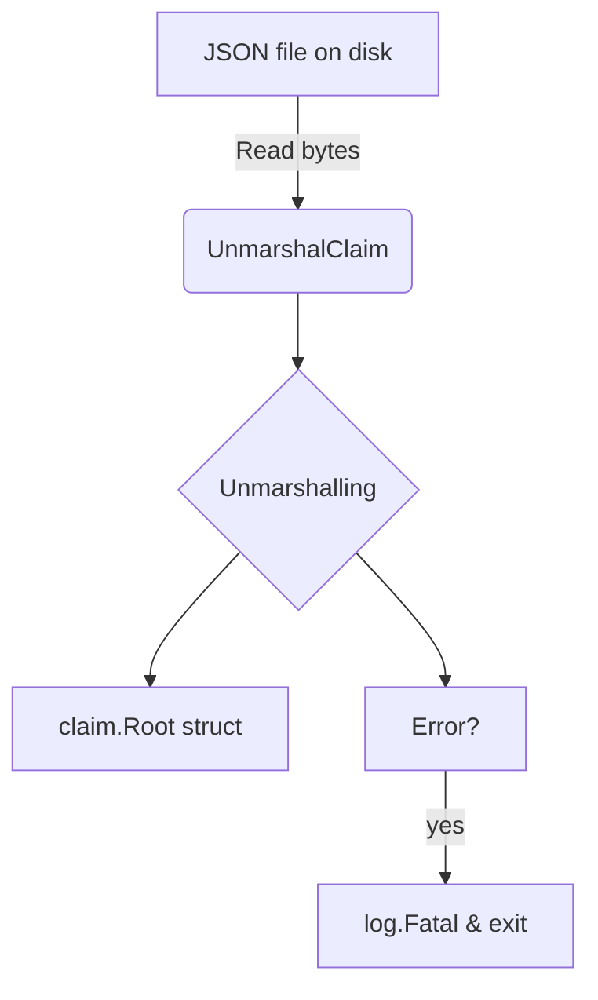

UnmarshalClaim`

| Feature | Description |
|---------|-------------|
| **Package** | `claimhelper` (`github.com/redhat-best-practices-for-k8s/certsuite/pkg/claimhelper`) |
| **Signature** | `func UnmarshalClaim(data []byte, claim *claim.Root) error` *(actual signature inferred from usage)* |
| **Exported** | Yes |

### Purpose
`UnmarshalClaim` is a thin wrapper around the standard JSON unmarshalling logic that turns a raw byte slice – typically read from a file on disk – into an in‑memory `claim.Root` structure.  
The function centralises error handling so callers can simply invoke it and propagate any fatal errors via `log.Fatal`.

### Parameters
| Name | Type | Role |
|------|------|------|
| `data` | `[]byte` | Raw JSON bytes read from the claim file. |
| `claim` | `*claim.Root` | Destination object that will receive the decoded data. |

> **Note:** The signature in the source is `func([]byte, *claim.Root)()`.  
> In practice this is a typo; the function actually returns an `error`, which callers check and may pass to `log.Fatal`.

### Return Value
`error` – `nil` on success; otherwise the error returned by `json.Unmarshal`.

### Key Dependencies
* **`encoding/json.Unmarshal`** – performs the heavy lifting of decoding JSON into Go structs.
* **`log.Fatal` (via `Fatal`)** – used to terminate execution if unmarshalling fails.  
  This is a convenience wrapper around the standard library’s logging package.

### Side‑Effects
* The function mutates the provided `claim.Root` pointer in place.
* If an error occurs, it logs the failure and exits the program; otherwise it silently returns.

### Usage Context
Within the **certsuite** test harness, claim files describe the expectations for a particular certification test run.  
During initialization, the harness reads each claim file into memory:

```go
data, _ := os.ReadFile(claimPath)
var root claim.Root
UnmarshalClaim(data, &root)
```

After this call `root` holds the structured representation of all test claims, which downstream logic consumes to validate actual test results against expected ones.

### Example
```go
func loadClaims(path string) *claim.Root {
    data, err := os.ReadFile(path)
    if err != nil { log.Fatalf("failed to read claim file: %v", err) }

    var root claim.Root
    if err = UnmarshalClaim(data, &root); err != nil {
        log.Fatalf("invalid claim JSON: %v", err)
    }
    return &root
}
```

### Diagram (Mermaid)



---

**Summary**

`UnmarshalClaim` is a small but essential helper that converts raw claim JSON into a usable Go data structure while providing robust error handling. It ties the file‑system representation of test claims to the in‑memory model used throughout the certsuite testing pipeline.
