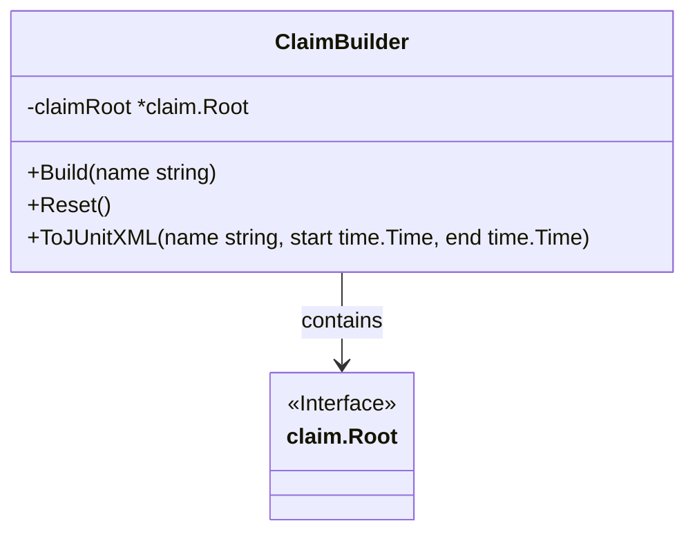

ClaimBuilder` – A High‑Level Claim Construction Utility

## Overview
`ClaimBuilder` is a thin wrapper around the low‑level claim tree (`*claim.Root`).  
It provides an ergonomic API for creating, resetting, and exporting test claims in a
single place, hiding the intricacies of claim generation and serialization.

| Field | Type | Purpose |
|-------|------|---------|
| `claimRoot` | `*claim.Root` | Holds the current claim tree that is being built. |

> **Note**: The struct has no exported fields; all interaction occurs through its methods.

## Methods

| Method | Signature | Description | Side‑Effects / Dependencies |
|--------|-----------|-------------|----------------------------|
| `Build(name string) func()` | `func(string)() {}` | Finalises the current claim tree, populates timestamps and metadata, writes the output to disk (or a buffer), logs progress, and returns an *empty* function. The returned function is a no‑op – it exists only for API symmetry with other builders in the codebase. | - Calls `Now`, `Format`, `UTC` for timestamps.<br>- Retrieves reconciled results via `GetReconciledResults`. <br>- Serialises the claim with `MarshalClaimOutput` and persists it using `WriteClaimOutput`. <br>- Emits log entries (`Info`). |
| `Reset()` | `func() {}` | Clears the current claim tree, resetting timestamps to a fresh start. Useful when re‑using a builder for multiple test runs. | - Reinitialises `claimRoot` with a new root node.<br>- Updates internal timestamps using `Now`, `Format`, and `UTC`. |
| `ToJUnitXML(name string, start time.Time, end time.Time) func()` | `func(string, time.Time, time.Time)() {}` | Converts the claim tree to JUnit‑style XML and writes it to a file. The function returned is a no‑op placeholder for consistency with other builder patterns. | - Calls helper `populateXMLFromClaim` to fill XML structs.<br>- Serialises XML via `MarshalIndent`. <br>- Persists using `WriteFile`. <br>- Logs success (`Info`) and errors (`Fatal`). |

## Construction

```go
cb, err := NewClaimBuilder(env *provider.TestEnvironment)
```

`NewClaimBuilder` initialises a fresh `ClaimBuilder` by:

1. Reading environment variables (e.g., claim directory).
2. Creating the root claim node with `CreateClaimRoot`.
3. Loading and merging configuration data (`MarshalConfigurations`, `UnmarshalConfigurations`).
4. Generating test nodes via `GenerateNodes`.
5. Fetching version information for various clients (`GetVersionOcClient`, `GetVersionOcp`, `GetVersionK8s`).

If any step fails, an error is returned.

## Usage Pattern

```go
cb, _ := NewClaimBuilder(env)
cb.Build("my-test")          // writes claim output
cb.Reset()                   // ready for next test
cb.ToJUnitXML("report.xml", start, end) // optional XML export
```

The builder encapsulates the lifecycle of a claim:
- **Create** → **Build** → **Reset** (for reuse) → **Export**.

## Dependencies

- `claim.Root` – core data structure representing a claim tree.
- Logging helpers (`Info`, `Debug`, `Errorf`, `Fatal`).
- File I/O utilities (`WriteClaimOutput`, `WriteFile`).
- Time helpers (`Now`, `Format`, `UTC`).

All functions called by the methods are defined elsewhere in the same package or imported packages; they provide the low‑level operations needed to populate, serialise, and persist claims.

## Diagram (Suggested Mermaid)



This visualises the `ClaimBuilder` as a container for a `claim.Root`, exposing high‑level APIs that orchestrate claim generation and export.
