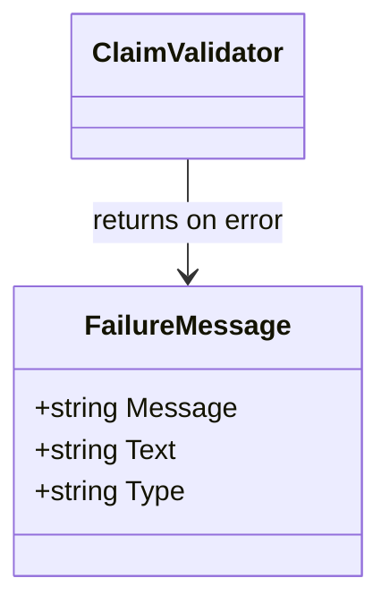

FailureMessage` (pkg/claimhelper)

| Element | Description |
|---------|-------------|
| **Purpose** | Encapsulates a single failure condition that may be returned by the claim helper utilities when validating or processing a certificate‑related claim. It is designed to carry both a human‑readable message and an optional raw text payload, together with a type identifier that indicates the category of failure (e.g., `"validation"`, `"resource"`). |
| **Fields** | - `Message string` – A concise description suitable for logging or user display. - `Text string` – Optional detailed text; may contain JSON, YAML, or stack‑trace snippets useful for debugging. - `Type string` – Classifies the failure (used by callers to group or filter errors). |
| **Typical usage** | 1. A helper function (e.g., `ValidateClaim`) detects an error condition. 2. It creates a `FailureMessage{Message: "...", Text: "...", Type: "validation"}` and returns it (often wrapped in a slice of such messages). 3. The caller aggregates the failures, logs them or presents them to the user via the CLI or API. |
| **Dependencies** | None – purely a data container. It is referenced by other types/functions within `claimhelper` that return error slices or maps containing `FailureMessage`. |
| **Side effects** | No side effects; simply holds values. |
| **Relation to package** | The `claimhelper` package provides utilities for generating, validating, and managing claims for certificates. `FailureMessage` is the standard way these utilities communicate problems back to callers, ensuring a consistent error format across the package. |

### Mermaid diagram (suggested)

This struct plays a central role in normalizing error reporting across the claim helper utilities.
