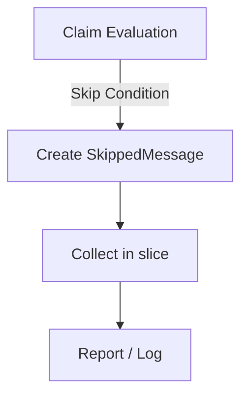

SkippedMessage` – A lightweight message wrapper

The **`SkippedMessage`** struct is a small, exported data holder used by the *claimhelper* package to convey information about claims that were intentionally omitted during processing.  
It lives in `pkg/claimhelper/claimhelper.go` and appears only in this file.

```go
type SkippedMessage struct {
    Messages string // human‑readable summary of the skipped claim(s)
    Text    string // raw, unformatted representation (often a JSON or YAML snippet)
}
```

## Purpose

* **Signal skipping** – When the claim helper encounters a claim that cannot be evaluated (e.g., missing data, unsupported schema, or intentional exclusion), it creates a `SkippedMessage` to record what was skipped and why.
* **Audit trail** – The struct is serialised into logs or output reports so users can later review which claims were omitted and the reason.

## Fields

| Field | Type   | Typical content | Notes |
|-------|--------|-----------------|-------|
| `Messages` | `string` | Concise, user‑friendly description (e.g., `"Claim X was skipped because of missing cert data"`) | Used in console output or higher‑level summaries. |
| `Text` | `string` | Raw payload that triggered the skip (often a snippet of YAML/JSON) | Useful for debugging; may contain sensitive info, so callers should handle it cautiously. |

## Usage Flow

1. **Detection** – A helper routine (e.g., `processClaim`) evaluates a claim.
2. **Skip Decision** – If conditions dictate skipping, the routine constructs:

   ```go
   msg := SkippedMessage{
       Messages: fmt.Sprintf("Skipping claim %s due to ...", claimID),
       Text:     rawClaim,
   }
   ```

3. **Propagation** – The `SkippedMessage` is returned up the call chain or appended to a slice of skipped messages.
4. **Reporting** – At the end of a run, callers iterate over all `SkippedMessage`s and output them (via logging, JSON export, etc.).

## Dependencies & Side‑Effects

* **No external imports** – The struct itself has no dependencies; it only holds strings.
* **Side‑effects are limited to data collection** – Creating an instance does not modify global state. All effects arise when the struct is used by other functions (e.g., logging or report generation).
* **Serialization** – Because the fields are plain strings, standard libraries (`encoding/json`, `fmt`) can marshal/unmarshal without special handling.

## Placement in the Package

`claimhelper` provides helper utilities for evaluating and manipulating *claims* in CertSuite.  
The package likely contains functions such as:

```go
func EvaluateClaims(claims []Claim) ([]Result, []SkippedMessage, error)
```

where `SkippedMessage` serves as a return value alongside successful results. This separation keeps success and failure paths distinct while still giving users visibility into why certain claims were not processed.

---

### Suggested Mermaid diagram (if visualising the flow)



This struct is intentionally lightweight; its only job is to carry a brief description and the raw text of any claim that was omitted during processing.
