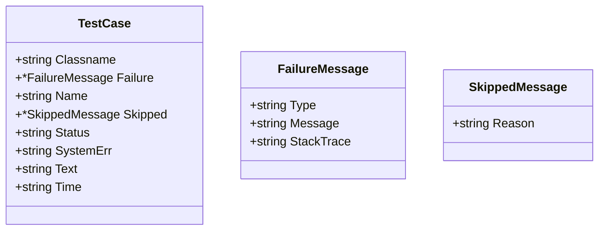

TestCase` – A Lightweight Representation of a Single Test

```go
// TestCase is exported from the claimhelper package.
// It lives in pkg/claimhelper/claimhelper.go at line 63.
type TestCase struct {
    Classname   string          // The test class or suite name (e.g., “org.junit.Test”).
    Failure     *FailureMessage // Populated when the test fails; nil otherwise.
    Name        string          // Human‑readable test name, e.g. “TestConnectivity”.
    Skipped     *SkippedMessage // Populated if the test was skipped; nil otherwise.
    Status      string          // One of “passed”, “failed”, or “skipped”.
    SystemErr   string          // stderr output captured during execution (optional).
    Text        string          // stdout output captured during execution (optional).
    Time        string          // Duration in seconds as a string, e.g. “0.023”.
}
```

## Purpose

`TestCase` is the *canonical data model* that `claimhelper` uses to serialise test results into an OpenShift‑compatible claim format (JSON/YAML).  
It encapsulates everything needed for downstream consumers – CI pipelines, dashboards, or audit tools – to:

1. **Identify** which test was run (`Name`, `Classname`).  
2. **Understand** the outcome (`Status` plus optional failure/skip details).  
3. **Reproduce** or debug failures (`SystemErr`, `Text`).  
4. **Measure performance** (`Time`).

The struct is intentionally *flat*; all nested information lives in the two pointer fields:

- `FailureMessage`: holds a message, type and stack trace when a test fails.
- `SkippedMessage`: holds a reason when a test is skipped.

Both are defined elsewhere in the same package (see the file `claimhelper.go` for their exact structure).

## Inputs & Outputs

| Field | Input Type | Typical Source | Output / Effect |
|-------|------------|----------------|-----------------|
| `Classname` | string | Test framework metadata (JUnit, Go test tags) | Used as a grouping key in reports. |
| `Failure` | *FailureMessage | Populated by the parser when `<failure>` elements are seen | Enables detailed failure reporting; nil otherwise. |
| `Skipped` | *SkippedMessage | Populated when `<skipped>` is parsed | Indicates intentional omission of a test. |
| `Name` | string | Test function or method name | Human‑friendly identifier in UI. |
| `Status` | string | Derived from presence of `Failure` / `Skipped` | Determines overall pass/fail state. |
| `SystemErr` | string | Captured stderr stream | Useful for debugging I/O errors. |
| `Text` | string | Captured stdout stream | Allows inspection of test output. |
| `Time` | string | Execution time from framework | Enables performance analysis. |

## Key Dependencies

- **FailureMessage** – a struct that holds failure type, message and stack trace.  
- **SkippedMessage** – a struct holding the skip reason.

These types are defined in the same file; they do not reference external packages beyond standard library string handling.

## Side‑Effects & Constraints

* The struct is *pure data*: assigning to fields does not trigger any I/O or state changes elsewhere.  
* When marshalled to JSON/YAML, nil pointer fields (`Failure`, `Skipped`) are omitted automatically by the standard encoding libraries if you use the default options.  
* The `Time` field is a string; callers must parse it into a numeric type if they need arithmetic.

## How It Fits the Package

`claimhelper` serves as a thin adapter that:

1. **Parses** raw test result files (JUnit XML, Go test JSON, etc.).  
2. **Maps** them into `TestCase` instances.  
3. **Serialises** those instances into a claim‑ready format for consumption by the CertSuite engine.

Thus, `TestCase` is the *core unit* of that mapping step: every parsed test becomes one instance, and every claim aggregates many such instances. The rest of the package contains helper functions like `ParseJUnit`, `GenerateClaim`, etc., all of which build on this struct.

---

### Suggested Mermaid Diagram



This diagram visualises the relationship between `TestCase` and its nested message types, highlighting that each test can have *zero or one* failure or skip detail.
