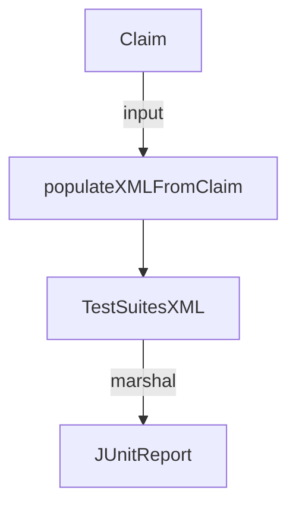

TestSuitesXML` – A lightweight JUnit‑style test suite container

The `claimhelper` package builds a minimal XML representation that can be written out as
JUnit test reports.  
`TestSuitesXML` is the top‑level struct that aggregates all information required by
the *Junit* format.

| Field | Type   | Purpose |
|-------|--------|---------|
| `XMLName`  | `xml.Name` | Explicit XML element name (`<testsuites>`) used when marshaling. |
| `Tests`    | `string`   | Total number of test cases generated from a claim. |
| `Failures` | `string`   | Number of failing tests (those that did not pass all checks). |
| `Errors`   | `string`   | Number of tests that crashed or returned an error. |
| `Disabled` | `string`   | Tests disabled via claim flags. |
| `Time`     | `string`   | Total duration (in seconds) for the entire suite, formatted as a float string. |
| `Text`     | `string`   | Optional human‑readable summary inserted into `<testsuites>` body. |
| `Testsuite` | `Testsuite` | Nested struct holding the actual test case list and suite attributes. |

> **Note**: All numeric fields are stored as strings because the JUnit schema
> expects text content (e.g., `"5"`), not integers.

## Relationship with the rest of the package

* The only place that creates a `TestSuitesXML` is `populateXMLFromClaim`, which
  accepts a `claim.Claim` and two timestamps (`startTime` & `endTime`).  
* `populateXMLFromClaim` extracts data from the claim (e.g., number of tests,
  failures, errors) and fills in the fields above. It also calculates elapsed time
  between the timestamps and formats it with up to six decimal places.
* After building the struct, callers typically marshal it to XML via
  `encoding/xml.MarshalIndent` and write the result to a file or stdout.

## Usage diagram



* `Claim`: domain model containing test metadata.  
* `populateXMLFromClaim`: builds the XML structure from that metadata.  
* `TestSuitesXML`: final representation ready for marshaling.  

## Side effects & dependencies

* **Side effects** – None; it only constructs a struct and returns it.
* **External packages** – Relies on `encoding/xml` (for `xml.Name`) and
  standard library functions (`strconv.Itoa`, `time.Sub`, etc.) to format values.
* **Dependencies within the package** – The nested `Testsuite` type (not shown
  here) is defined in the same file and contains individual test case data.

---

### Quick reference

```go
// Create a report from a claim:
ts := populateXMLFromClaim(claim, start, end)

// Marshal to XML for JUnit:
data, _ := xml.MarshalIndent(ts, "", "  ")
```

`TestSuitesXML` is the glue that turns runtime test metadata into a compliant
JUnit file.
