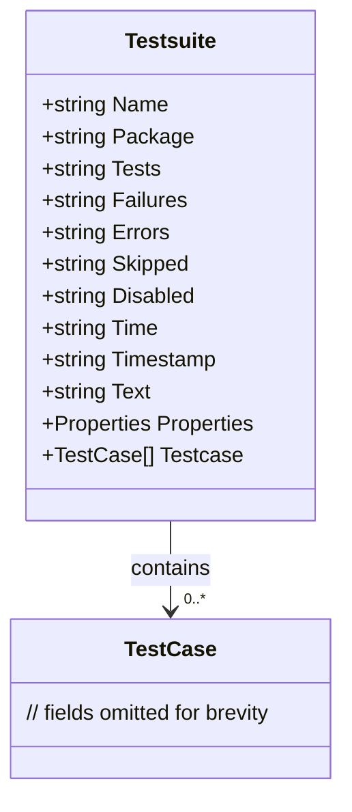

Testsuite`

| Field | Type | Description |
|-------|------|-------------|
| **Name** | `string` | The identifier of the test suite (e.g., `"MySuite"`). |
| **Package** | `string` | The Go package that owns the tests, usually matching the directory name. |
| **Tests** | `string` | Total number of test cases in this suite (as a string). |
| **Failures** | `string` | Number of failed test cases (string). |
| **Errors** | `string` | Number of errors that occurred during execution. |
| **Skipped** | `string` | Count of tests that were skipped. |
| **Disabled** | `string` | Count of tests explicitly disabled. |
| **Time** | `string` | Total elapsed time for the suite, in seconds (as a string). |
| **Timestamp** | `string` | ISO‑8601 timestamp marking when the suite was run. |
| **Text** | `string` | Human‑readable description of the test run; often empty in machine‑generated XML. |
| **Properties** | struct {<br>  Text string<br>  Property []struct{Text, Name, Value string}<br>} | Arbitrary key/value metadata attached to the suite (e.g., build info). |
| **Testcase** | `[]TestCase` | Slice of individual test cases that belong to this suite. |

### Purpose
`Testsuite` represents a single `<testsuite>` element in JUnit‑style XML. It aggregates information about all test cases run for a particular package, including counts, timings, and metadata. The struct is used by the `claimhelper` package to marshal test results into the standard JUnit format that CI systems (Jenkins, GitHub Actions, etc.) consume.

### Inputs / Outputs
- **Inputs**:  
  - A collection of `TestCase` objects created during a run.  
  - Runtime counters (`tests`, `failures`, `errors`, …) maintained by the test harness.
- **Outputs**:  
  - An XML element `<testsuite>` when marshalled via `encoding/xml`.  
  - The struct may be serialized to JSON or stored for later inspection.

### Key Dependencies
| Dependency | Role |
|------------|------|
| `TestCase` (in the same package) | Each element of `Testcase`; holds per‑test details. |
| `encoding/xml` | Used elsewhere in the package to marshal/unmarshal this struct. |
| `time.Time` | Typically converted to string for `Timestamp`. |

### Side Effects
- The struct is **pure data**; no methods modify global state.  
- When marshalled, field names map directly to XML tags (e.g., `Name` → `<name>`).  
- Values are strings even when they represent numeric counts or durations; this matches the JUnit spec and simplifies XML generation.

### Package Context
The `claimhelper` package is responsible for translating Kubernetes claim test results into a format suitable for CI dashboards. `Testsuite` sits at the top of that translation hierarchy:

```
TestRun (collection of packages)
   └─ Testsuite (per package)
        ├─ TestCase
        └─ Properties
```

When a test run completes, each package’s results are wrapped in a `Testsuite`, then all suites are collected into a `<testsuites>` container for final output.

---

**Mermaid diagram suggestion**



This diagram visualises the one‑to‑many relationship between a test suite and its constituent test cases.
