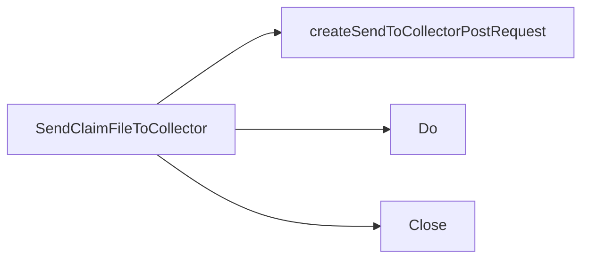

## Package collector (github.com/redhat-best-practices-for-k8s/certsuite/pkg/collector)

### Functions

- **SendClaimFileToCollector** — func(string, string, string, string, string)(error)

### Call graph (exported symbols, partial)

### Symbol docs

- [function SendClaimFileToCollector](symbols/function_SendClaimFileToCollector.md)
