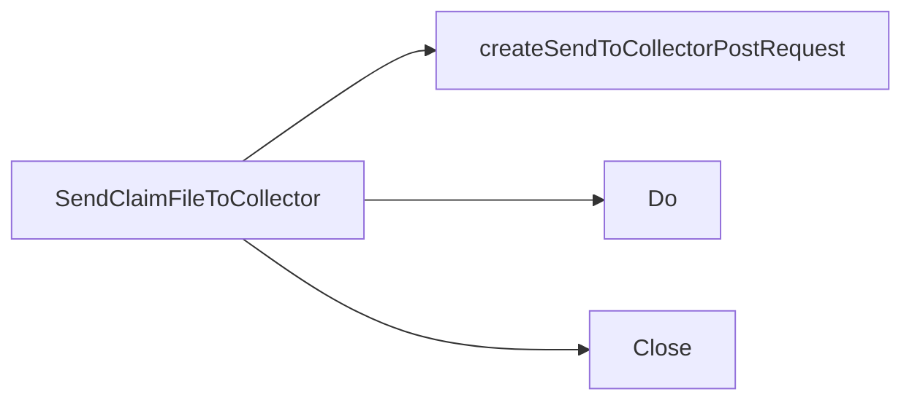

## Package collector (github.com/redhat-best-practices-for-k8s/certsuite/pkg/collector)

## `collector` Package Overview  
*(located at `github.com/redhat-best-practices-for-k8s/certsuite/pkg/collector`)*
  
The package implements a thin HTTP client that packages a *claim file* together with a few metadata fields and posts it to an external “collector” service.  
All logic is contained in a single source file (`collector.go`), so the public API consists of only one exported function: `SendClaimFileToCollector`.

---

### Public Interface  

| Function | Signature | Purpose |
|----------|-----------|---------|
| **`SendClaimFileToCollector`** | `func (filePath, collectorURL, clusterID, namespace, claimName string) error` | Builds a multipart POST request containing the claim file and metadata, then sends it to the collector URL. It returns an error if any step fails. |

> **Why only one exported function?**  
> The package is used as a helper for test harnesses that need to upload a claim file after a run. Exposing just `SendClaimFileToCollector` keeps the API surface minimal and prevents callers from manipulating request internals.

---

### Internal Workflow

Below is a step‑by‑step explanation of how the exported function works, followed by a concise Mermaid diagram illustrating the call chain.

1. **Request Construction**  
   `SendClaimFileToCollector` calls the private helper  
   `createSendToCollectorPostRequest`.  
   This helper:
   * Creates an in‑memory buffer (`bytes.Buffer`) and a multipart writer over it.
   * Calls two small helpers to populate that writer:
     - `addClaimFileToPostRequest`: attaches the claim file as a form field named `"claim"`.
     - `addVarFieldsToPostRequest`: adds three textual fields – `"clusterID"`, `"namespace"`, and `"claimName"` – each written into separate form parts.
   * Finalizes the multipart body (`writer.Close()`).
   * Builds an `http.Request` with method `POST`, target URL, and the buffer as its body.
   * Sets the `Content-Type` header to the appropriate multipart boundary string.

2. **Sending**  
   Back in `SendClaimFileToCollector`, the prepared request is sent using the standard library’s `http.Client.Do`.  
   The response body is ignored (it is only closed).  
   Any error from building or sending the request propagates back to the caller.

3. **Error Handling**  
   All file I/O (`os.Open`), multipart operations, and network calls are checked for errors; on failure, the function returns that error immediately.

---

### Key Internal Functions

| Function | Signature | Role |
|----------|-----------|------|
| `createSendToCollectorPostRequest` | `func (collectorURL, filePath, clusterID, namespace, claimName string) (*http.Request, error)` | Orchestrates request creation: builds multipart body and sets headers. |
| `addClaimFileToPostRequest` | `func (w *multipart.Writer, filePath string) error` | Adds the actual claim file as a form field named `"claim"`. |
| `addVarFieldsToPostRequest` | `func (w *multipart.Writer, clusterID, namespace, claimName string) error` | Adds three textual fields to the multipart body. |

These helpers are deliberately small; they each perform only one specific task so that unit tests can target them if needed.

---

### Data Flow Diagram (Mermaid)

```mermaid
flowchart TD
    A[SendClaimFileToCollector] -->|calls| B[createSendToCollectorPostRequest]
    B --> C[NewWriter -> multipart.Writer]
    C --> D[addClaimFileToPostRequest]
    D --> E[os.Open(filePath)]
    E --> F[CreateFormFile("claim")]
    F --> G[io.Copy(writer, file)]
    D --> H[addVarFieldsToPostRequest]
    H --> I[CreateFormField("clusterID") + Write(clusterID)]
    H --> J[CreateFormField("namespace") + Write(namespace)]
    H --> K[CreateFormField("claimName") + Write(claimName)]
    C --> L[writer.Close()]
    B --> M[http.NewRequest("POST", collectorURL, buffer)]
    M --> N[Set Content-Type header]
    A --> O[client.Do(request)]
```

---

### How It Is Used

Typical usage in a test harness:

```go
err := collector.SendClaimFileToCollector(
    "/tmp/claim.yaml",
    "https://collector.example.com/api/v1/claims",
    "cluster-123",
    "default",
    "my-cluster-claim",
)
if err != nil {
    log.Fatalf("failed to send claim: %v", err)
}
```

The function abstracts away multipart form handling, allowing callers to focus on the higher‑level test logic.

---

### Summary

* **Single responsibility** – only uploads a claim file with metadata.  
* **Clean separation** – request construction is split into tiny helpers for readability and potential unit testing.  
* **No global state** – everything is passed through parameters; no package‑wide variables or constants are defined.  

This design keeps the collector client lightweight, easy to test, and straightforward to integrate into larger workflows.

### Functions

- **SendClaimFileToCollector** — func(string, string, string, string, string)(error)

### Call graph (exported symbols, partial)



### Symbol docs

- [function SendClaimFileToCollector](symbols/function_SendClaimFileToCollector.md)
