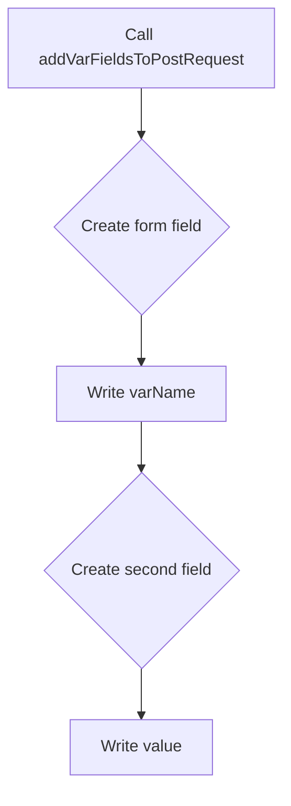

addVarFieldsToPostRequest`

```go
func addVarFieldsToPostRequest(writer *multipart.Writer,
                               fieldName string,
                               varName  string,
                               value    string) error
```

### Purpose
`addVarFieldsToPostRequest` is a helper that adds **two** form fields to an HTTP multipart body:

1. A *field name* field – e.g. `"var_name"`.
2. The corresponding *value* field – e.g. `"my_value"`.

These fields are used by the Collector package when constructing a POST request to send variable data (e.g., configuration or test parameters) to an external service.

### Parameters
| Name      | Type                | Description |
|-----------|---------------------|-------------|
| `writer`  | `*multipart.Writer` | The multipart writer that will receive the new fields. It must already be in a valid state for writing (e.g., created via `multipart.NewWriter`). |
| `fieldName` | `string` | The name of the form field that holds the variable key. |
| `varName`   | `string` | The actual variable key/value pair to send. This will be written as the value of a second form field whose name is derived from `fieldName`. |
| `value`     | `string` | The textual content of the variable value. |

### Return Value
* **`error`** – Returns any error encountered while creating or writing the form fields. A `nil` error indicates success.

### Implementation Details
The function performs three sequential steps, each involving a call to `multipart.Writer.CreateFormField` followed by `io.WriteString` (represented as `Write` in the calls list):

1. **Create the first field** with name `fieldName`.  
2. **Write the variable key (`varName`)** into that field.
3. **Create the second field** whose name is typically derived from `fieldName` (e.g., `fieldName+"_value"`).
4. **Write the variable value (`value`)** into this second field.

All writes are performed directly on the underlying multipart stream; no buffering occurs outside of the writer’s internal buffers.

### Dependencies
- **Standard Library**  
  - `mime/multipart` – provides `Writer`, `CreateFormField`.  
  - `io` (via `Write`) – used to write string data into each field.

No other package-level variables or functions are referenced; the function is entirely self‑contained.

### Side Effects
- Modifies the state of the provided `multipart.Writer`: new parts are appended to its internal buffer.
- Does **not** close the writer; caller must invoke `writer.Close()` when finished building the request body.

### Role in the Package
`collector` builds HTTP POST requests that send test results and metadata.  
This helper abstracts away the repetitive task of adding key/value pairs as multipart form fields, keeping the main request‑building logic cleaner and less error‑prone. It is used internally wherever variable data needs to be transmitted (e.g., environment variables, configuration snippets).

---

#### Suggested Mermaid Diagram


---
