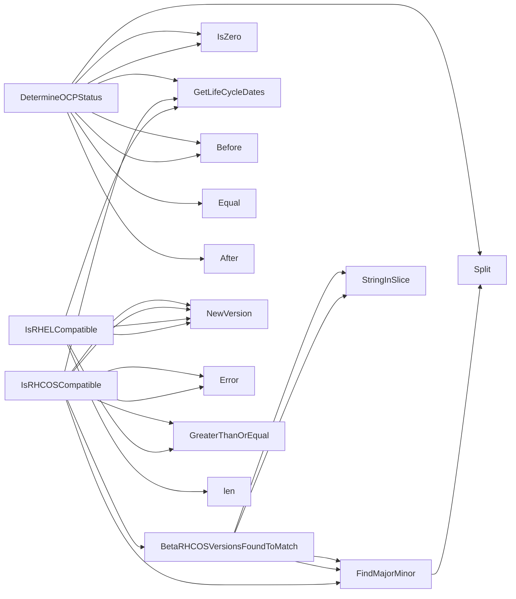

## Package compatibility (github.com/redhat-best-practices-for-k8s/certsuite/pkg/compatibility)

### Structs

- **VersionInfo** (exported) — 5 fields, 0 methods

### Functions

- **BetaRHCOSVersionsFoundToMatch** — func(string, string)(bool)
- **DetermineOCPStatus** — func(string, time.Time)(string)
- **FindMajorMinor** — func(string)(string)
- **GetLifeCycleDates** — func()(map[string]VersionInfo)
- **IsRHCOSCompatible** — func(string, string)(bool)
- **IsRHELCompatible** — func(string, string)(bool)

### Globals

### Call graph (exported symbols, partial)

### Symbol docs

- [struct VersionInfo](symbols/struct_VersionInfo.md)
- [function BetaRHCOSVersionsFoundToMatch](symbols/function_BetaRHCOSVersionsFoundToMatch.md)
- [function DetermineOCPStatus](symbols/function_DetermineOCPStatus.md)
- [function FindMajorMinor](symbols/function_FindMajorMinor.md)
- [function GetLifeCycleDates](symbols/function_GetLifeCycleDates.md)
- [function IsRHCOSCompatible](symbols/function_IsRHCOSCompatible.md)
- [function IsRHELCompatible](symbols/function_IsRHELCompatible.md)
