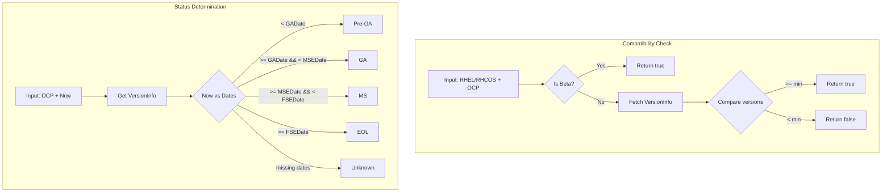
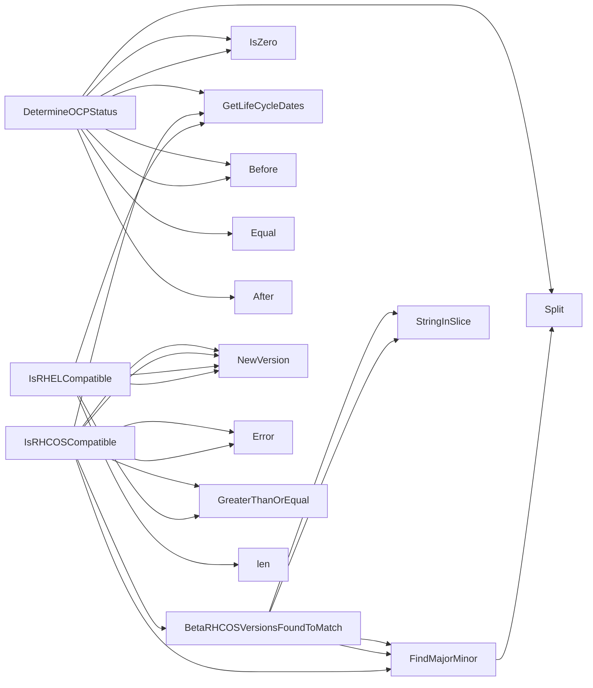

## Package compatibility (github.com/redhat-best-practices-for-k8s/certsuite/pkg/compatibility)

# `github.com/redhat-best-practices-for-k8s/certsuite/pkg/compatibility`

The **compatibility** package is a lightweight runtime checker that validates whether a given Red Hat Enterprise Linux (RHEL) or RHCOS version is supported by the current OpenShift Container Platform (OCP) release.  
It is used by Certsuite’s validation routines to ensure clusters are running on an officially supported OS.

---

## Core Data Structures

| Type | Purpose | Key Fields |
|------|---------|------------|
| **`VersionInfo`** *(exported)* | Holds lifecycle dates for a specific OCP release. | `FSEDate`, `GADate`, `MSEDate`: `time.Time`  <br> `MinRHCOSVersion`: minimum RHCOS that can run on the release <br> `RHELVersionsAccepted`: list of compatible RHEL minor releases |

*The struct is populated by a static map (`ocpLifeCycleDates`) keyed by OCP version strings (e.g. `"4.12"`).*

---

## Global Constants

| Constant | Meaning |
|----------|---------|
| `OCPStatusGA` | GA – General Availability |
| `OCPStatusMS` | MS – Maintenance Support |
| `OCPStatusEOL` | EOL – End‑of‑Life |
| `OCPStatusPreGA` | Pre‑GA – pre‑General Availability (beta) |
| `OCPStatusUnknown` | Status could not be determined |

These are returned by **`DetermineOCPStatus`**.

---

## Global Variables

| Variable | Type | Notes |
|----------|------|-------|
| `ocpBetaVersions` | `[]string` | List of OCP beta releases (e.g. `"4.13"`). Used to decide if a cluster is running in beta mode. |
| `ocpLifeCycleDates` | `map[string]VersionInfo` | Maps each OCP release to its lifecycle dates and minimum OS versions. This map is built once at init time from the hard‑coded data in `compatibility.go`. |

---

## Key Functions & Their Flow

```mermaid
flowchart TD
    A[IsRHELCompatible(rhel, ocp)] --> B{Check life cycle}
    B -->|valid| C[Compare rhel >= minRHEL]
    B -->|invalid| D[return false]

    E[IsRHCOSCompatible(rhcos, ocp)] --> F{Beta check}
    F -->|beta match| G[use beta rules]
    F -->|no beta| H{Min RHCOS comparison}
    H --> I[rhcos >= minRHCOS ? true : false]

    J[DetermineOCPStatus(ocp, now)] --> K{Life cycle dates}
    K --> L[compare now with GADate / MSEDate / FSEDate]
```

### 1. `IsRHELCompatible(rhel string, ocp string) bool`
* **Purpose** – Decide if the supplied RHEL version is allowed on the given OCP release.
* Steps:
  1. Retrieve `VersionInfo` for `ocp` via `GetLifeCycleDates`.
  2. Convert both strings to semantic versions (`go-version.NewVersion`).
  3. If the RHEL major/minor is **greater than or equal** to the minimum required, return `true`; otherwise `false`.

### 2. `IsRHCOSCompatible(rhcos string, ocp string) bool`
* **Purpose** – Similar to the RHEL check but for RHCOS.
* Steps:
  1. Check if the given RHCOS matches any beta version for the OCP release (`BetaRHCOSVersionsFoundToMatch`).  
     *If a match is found, the cluster is considered compatible immediately.*
  2. If not in beta, load `VersionInfo`, compare major/minor with `MinRHCOSVersion` using semantic‑version comparison.
  3. Return result.

### 3. `DetermineOCPStatus(ocp string, now time.Time) string`
* **Purpose** – Tell whether an OCP release is GA, MS, EOL, Pre‑GA or Unknown based on the current date.
* Steps:
  1. Split `ocp` into major/minor (`FindMajorMinor`) and fetch its `VersionInfo`.
  2. Use `now` to compare against the three dates in `VersionInfo`:  
     * GA – after `GADate` but before `MSEDate`.  
     * MS – after `MSEDate` but before `FSEDate`.  
     * EOL – after `FSEDate`.  
     * Pre‑GA – before `GADate`.  
  3. Return the matching constant; if dates are zero or missing, return `OCPStatusUnknown`.

### 4. Helper Functions

| Function | Role |
|----------|------|
| `FindMajorMinor(version string) string` | Extracts `"X.Y"` from a full version string (e.g., `"4.12.34"` → `"4.12"`). |
| `BetaRHCOSVersionsFoundToMatch(beta, ocp string) bool` | Determines if the beta RHCOS version matches the OCP release by comparing major/minor components and checking against the list of accepted RHEL versions for that OCP. |
| `GetLifeCycleDates() map[string]VersionInfo` | Returns the static lifecycle map (`ocpLifeCycleDates`). It is called by compatibility checks to obtain dates and minimum OS requirements. |

---

## How Everything Connects

1. **Initialisation** – At package load time, `ocpLifeCycleDates` is populated from a hard‑coded slice of structs (not shown in the JSON).  
2. **Compatibility Checks** – When Certsuite validates a cluster, it calls either `IsRHELCompatible` or `IsRHCOSCompatible`. These functions rely on `GetLifeCycleDates` to fetch release metadata and use semantic‑version comparisons.
3. **Status Reporting** – For diagnostics or policy enforcement, `DetermineOCPStatus` is called with the current date; this tells whether a given OCP version is still supported.

---

## Suggested Mermaid Diagram



---

**Bottom line:**  
The `compatibility` package provides a small, deterministic API to verify OS‑to‑OCP compatibility and to expose the lifecycle status of an OpenShift release. All logic is based on static data structures and semantic version comparisons, making it fast and side‑effect free.

### Structs

- **VersionInfo** (exported) — 5 fields, 0 methods

### Functions

- **BetaRHCOSVersionsFoundToMatch** — func(string, string)(bool)
- **DetermineOCPStatus** — func(string, time.Time)(string)
- **FindMajorMinor** — func(string)(string)
- **GetLifeCycleDates** — func()(map[string]VersionInfo)
- **IsRHCOSCompatible** — func(string, string)(bool)
- **IsRHELCompatible** — func(string, string)(bool)

### Globals


### Call graph (exported symbols, partial)



### Symbol docs

- [struct VersionInfo](symbols/struct_VersionInfo.md)
- [function BetaRHCOSVersionsFoundToMatch](symbols/function_BetaRHCOSVersionsFoundToMatch.md)
- [function DetermineOCPStatus](symbols/function_DetermineOCPStatus.md)
- [function FindMajorMinor](symbols/function_FindMajorMinor.md)
- [function GetLifeCycleDates](symbols/function_GetLifeCycleDates.md)
- [function IsRHCOSCompatible](symbols/function_IsRHCOSCompatible.md)
- [function IsRHELCompatible](symbols/function_IsRHELCompatible.md)
