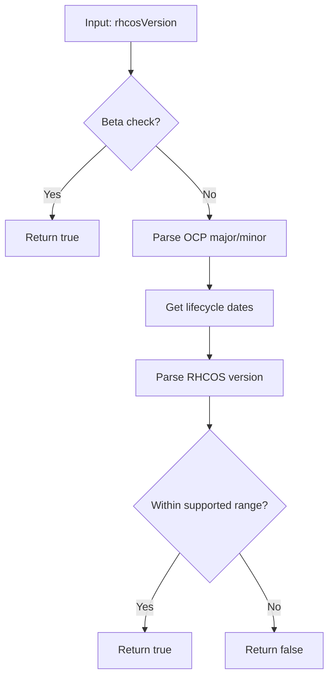

IsRHCOSCompatible`

### Overview
`IsRHCOSCompatible` determines whether a Red Hat CoreOS (RHCOS) image can run on an OpenShift cluster of a given version.  
It is part of the **compatibility** package, which exposes utilities for matching container‑image versions to supported Kubernetes/OpenShift releases.

---

### Signature
```go
func IsRHCOSCompatible(rhcosVersion string, ocpVersion string) bool
```

| Parameter | Type   | Description |
|-----------|--------|-------------|
| `rhcosVersion` | `string` | Semantic‑style RHCOS version (e.g., `"4.14.0"`). |
| `ocpVersion`   | `string` | OpenShift Cluster Manager (OCP) release string (e.g., `"4.14.3"`). |

| Return | Type  | Description |
|--------|-------|-------------|
| `bool` | Indicates whether the supplied RHCOS version is supported on the specified OCP release. |

---

### Key Dependencies & Flow

1. **Beta Version Check**  
   - Calls `BetaRHCOSVersionsFoundToMatch(rhcosVersion, ocpVersion)`.  
   - If a matching beta‑release pair exists, compatibility is *immediately* confirmed.

2. **OCP Major/Minor Extraction**  
   - Uses `FindMajorMinor(ocpVersion)` to parse the OCP release into its major/minor components (e.g., `"4.14"`).

3. **Lifecycle Dates Retrieval**  
   - Calls `GetLifeCycleDates(majorMinor string)`.  
   - Returns a map of lifecycle dates (`OCPStatusGA`, `OCPStatusMS`, etc.) and the first/last supported RHCOS major/minor values.

4. **RHCOS Version Parsing**  
   - Creates a `Version` object from the supplied RHCOS string via `NewVersion(rhcosVersion)`.  
   - If parsing fails, returns `false`.

5. **Boundary Checks**  
   - Validates that the parsed RHCOS major/minor are *within* the supported range returned by `GetLifeCycleDates`.  
   - Uses `GreaterThanOrEqual` to compare versions.

6. **Error Handling**  
   - Any parsing error or missing lifecycle data results in a logged `Error` and a `false` outcome.

---

### Side Effects

- The function performs read‑only lookups against the package’s internal maps (`ocpBetaVersions`, `ocpLifeCycleDates`).  
- It logs errors via the package's `Error` helper but otherwise has no external state changes.

---

### How it Fits the Package

The **compatibility** package centralises logic for determining whether a given image (RHCOS, RHCS, etc.) can run on an OpenShift cluster.  
`IsRHCOSCompatible` is the public API that other modules call when they need to verify RHCOS support before proceeding with workload scheduling or admission control.  
It relies on shared lifecycle data and helper functions defined elsewhere in the package, ensuring a single source of truth for compatibility rules.

---

### Suggested Mermaid Diagram



This diagram captures the decision path taken by `IsRHCOSCompatible`.
