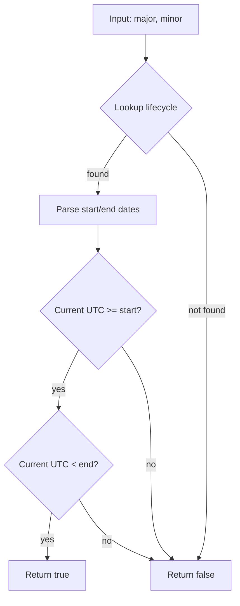

IsRHELCompatible`

```go
func IsRHELCompatible(major, minor string) bool
```

### Purpose
`IsRHELCompatible` determines whether a given Red Hat Enterprise Linux (RHEL) version is supported by the current Cert‑Suite release.  
The function takes two strings – the major and minor version numbers of RHEL – and returns `true` if that exact combination is considered *compatible*.

### Inputs

| Parameter | Type   | Description |
|-----------|--------|-------------|
| `major`   | `string` | Major component of a RHEL release (e.g. `"8"`). |
| `minor`   | `string` | Minor component of the same release (e.g. `"4"`). |

Both parameters are expected to be numeric strings; non‑numeric values will cause the internal version parser to return an error, which is treated as *not compatible*.

### Output

- `bool` –  
  *`true`* if the supplied RHEL major/minor pair is present in the compatibility table and its lifecycle dates allow it.  
  *`false`* otherwise (including parsing failures or unsupported releases).

### Key Dependencies & Flow

1. **Lifecycle Dates Retrieval**  
   The function calls `GetLifeCycleDates(major, minor)` to fetch the start and end dates for that RHEL release from the internal `ocpLifeCycleDates` map.

2. **Version Parsing**  
   It constructs two `Version` objects using the helper `NewVersion`.  
   * `startDate` – the earliest supported date.  
   * `endDate` – the latest supported date (may be empty if still in support).

3. **Current Time Check**  
   Using `GreaterThanOrEqual`, it verifies that the current UTC time is:
   - on or after the start date, and
   - before the end date (if an end date exists).

4. **Result**  
   If both checks succeed, the release is considered compatible.

### Side‑Effects & Assumptions

- No mutable state is altered; the function only reads from `ocpLifeCycleDates` and system time.
- It relies on `GetLifeCycleDates`, which returns an empty string for unknown releases—this causes a parsing error that yields `false`.
- The helper `GreaterThanOrEqual` compares two `Version` values chronologically.

### Package Context

`IsRHELCompatible` is part of the **compatibility** package, which maps supported RHEL and OpenShift versions to their lifecycle windows.  
It is used by higher‑level components (e.g., policy evaluation or cluster detection) that need to know whether a target node’s OS version meets Cert‑Suite requirements.

---

#### Suggested Mermaid diagram



This visualizes the decision tree that `IsRHELCompatible` follows.
