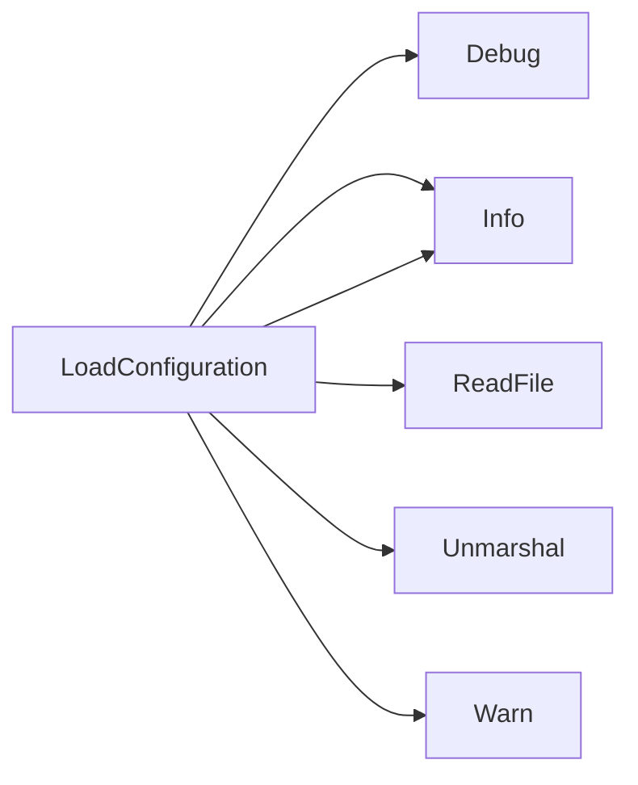

## Package configuration (github.com/redhat-best-practices-for-k8s/certsuite/pkg/configuration)

# Overview – `github.com/redhat-best-practices-for-k8s/certsuite/pkg/configuration`

The **configuration** package is the central place where CertSuite reads and exposes its runtime configuration and command‑line parameters.

| Item | Role |
|------|------|
| **`TestParameters`** | Holds all CLI options (e.g. image repos, log level, timeouts). These are populated once by `GetTestParameters`. |
| **`TestConfiguration`** | Describes the test environment – namespaces, operators, filters, skip lists, etc. Loaded from a YAML file via `LoadConfiguration`. |
| **Globals (`configuration`, `parameters`, `confLoaded`)** | Cache the parsed configuration/parameters so they are read only once per process. |
| **Functions** | `GetTestParameters` (singleton CLI parser) and `LoadConfiguration` (lazy YAML loader). |

---

## Data Structures

```go
type TestParameters struct {
    AllowPreflightInsecure          bool          // allow insecure pre‑flight checks
    CertSuiteImageRepo              string        // image repo for certsuite images
    CertSuiteProbeImage             string        // probe image name
    ConfigFile                      string        // path to YAML config
    ConnectAPIBaseURL               string
    ConnectAPIKey                   string
    ConnectAPIProxyPort             string
    ConnectAPIProxyURL              string
    ConnectProjectID                string
    DaemonsetCPULim                 string
    DaemonsetCPUReq                 string
    DaemonsetMemLim                 string
    DaemonsetMemReq                 string
    EnableDataCollection            bool          // collect telemetry
    EnableXMLCreation               bool
    IncludeWebFilesInOutputFolder   bool
    Intrusive                       bool
    Kubeconfig                      string
    LabelsFilter                    string
    LogLevel                        string
    OfflineDB                       string
    OmitArtifactsZipFile            bool
    OutputDir                       string
    PfltDockerconfig                string
    SanitizeClaim                   bool
    ServerMode                      bool
    Timeout                         time.Duration
}
```

```go
type TestConfiguration struct {
    AcceptedKernelTaints          []AcceptedKernelTaintsInfo
    CollectorAppEndpoint          string
    CollectorAppPassword          string
    ConnectAPIConfig              ConnectAPIConfig
    CrdFilters                    []CrdFilter
    ExecutedBy                    string
    ManagedDeployments            []ManagedDeploymentsStatefulsets
    ManagedStatefulsets           []ManagedDeploymentsStatefulsets
    OperatorsUnderTestLabels      []string
    PartnerName                   string
    PodsUnderTestLabels           []string
    ProbeDaemonSetNamespace       string
    ServicesIgnoreList            []string
    SkipHelmChartList             []SkipHelmChartList
    SkipScalingTestDeployments    []SkipScalingTestDeploymentsInfo
    SkipScalingTestStatefulSets   []SkipScalingTestStatefulSetsInfo
    TargetNameSpaces              []Namespace
    ValidProtocolNames            []string
}
```

### Supporting Types

| Type | Purpose |
|------|---------|
| `AcceptedKernelTaintsInfo` | Holds a kernel module that can be tainted during tests. |
| `ConnectAPIConfig` | Credentials and endpoints for the Red Hat Connect API. |
| `CrdFilter` | Controls which CustomResourceDefinitions are processed (name suffix + whether they’re scalable). |
| `ManagedDeploymentsStatefulsets` | Names of statefulset deployments that are managed by CertSuite. |
| `Namespace` | Simple namespace descriptor (`Name`). |
| `SkipHelmChartList`, `SkipScalingTestDeploymentsInfo`, `SkipScalingTestStatefulSetsInfo` | Lists of resources to skip during scaling or Helm‑chart tests, with optional namespace info. |

---

## Globals

```go
var (
    configuration TestConfiguration // cached YAML config
    parameters     TestParameters     // cached CLI params
    confLoaded     bool               // ensures LoadConfiguration runs once
)
```

These are package‑private and mutated only by `LoadConfiguration`/`GetTestParameters`.  
Because they’re not exported, callers use the accessor functions to read values.

---

## Key Functions

### `GetTestParameters() *TestParameters`
* Parses command‑line flags (using a flag library – details hidden in this file).  
* Populates the global `parameters` on first call and returns it.  
* Subsequent calls simply return the cached value.

> **Usage**: `params := configuration.GetTestParameters()`  

### `LoadConfiguration(file string) (TestConfiguration, error)`
1. Logs an info message (`Info`) about loading the file.  
2. Reads the YAML file (`ReadFile`).  
3. Unmarshals into a temporary struct (`Unmarshal`).  
4. If errors occur, logs a warning (`Warn`).  
5. Caches the result in the global `configuration` and sets `confLoaded`.  
6. Subsequent calls skip re‑reading (return cached value).  

> **Usage**: `cfg, err := configuration.LoadConfiguration(params.ConfigFile)`  

---

## How They Connect

```
+-------------------+
|  CLI args         |   <-- GetTestParameters()
+-------------------+
        |
        v
+-------------------+    +---------------------+
| parameters (global)|<-- | LoadConfiguration()|
+-------------------+    +---------------------+
        |
        v
+-------------------+
| configuration     |   <-- Loaded once from YAML
+-------------------+
```

* `GetTestParameters` supplies runtime options that include the path to the config file.  
* `LoadConfiguration` reads that file, parses it into a `TestConfiguration`, and stores it in the global cache.  
* Tests and other packages call these two functions (or read from the globals indirectly) to access settings.

---

## Mermaid Diagram Suggestion

```mermaid
flowchart LR
    CLI[CLI Arguments] -->|parse| Params[TestParameters]
    Params -->|ConfigFile| LoadCfg[LoadConfiguration(file)]
    LoadCfg -->|yaml file| Conf[TestConfiguration]
```

Use this diagram in documentation to illustrate the single‑flight loading pattern.

---

### Summary

* **`TestParameters`** – command‑line options, parsed once.  
* **`TestConfiguration`** – YAML‑driven test environment, loaded lazily and cached.  
* Global vars keep these values alive; no mutation after initial load.  
* The two public functions provide a clean API for the rest of CertSuite to obtain configuration data.

### Structs

- **AcceptedKernelTaintsInfo** (exported) — 1 fields, 0 methods
- **ConnectAPIConfig** (exported) — 5 fields, 0 methods
- **CrdFilter** (exported) — 2 fields, 0 methods
- **ManagedDeploymentsStatefulsets** (exported) — 1 fields, 0 methods
- **Namespace** (exported) — 1 fields, 0 methods
- **SkipHelmChartList** (exported) — 1 fields, 0 methods
- **SkipScalingTestDeploymentsInfo** (exported) — 2 fields, 0 methods
- **SkipScalingTestStatefulSetsInfo** (exported) — 2 fields, 0 methods
- **TestConfiguration** (exported) — 18 fields, 0 methods
- **TestParameters** (exported) — 27 fields, 0 methods

### Functions

- **GetTestParameters** — func()(*TestParameters)
- **LoadConfiguration** — func(string)(TestConfiguration, error)

### Globals


### Call graph (exported symbols, partial)



### Symbol docs

- [struct AcceptedKernelTaintsInfo](symbols/struct_AcceptedKernelTaintsInfo.md)
- [struct ConnectAPIConfig](symbols/struct_ConnectAPIConfig.md)
- [struct CrdFilter](symbols/struct_CrdFilter.md)
- [struct ManagedDeploymentsStatefulsets](symbols/struct_ManagedDeploymentsStatefulsets.md)
- [struct Namespace](symbols/struct_Namespace.md)
- [struct SkipHelmChartList](symbols/struct_SkipHelmChartList.md)
- [struct SkipScalingTestDeploymentsInfo](symbols/struct_SkipScalingTestDeploymentsInfo.md)
- [struct SkipScalingTestStatefulSetsInfo](symbols/struct_SkipScalingTestStatefulSetsInfo.md)
- [struct TestConfiguration](symbols/struct_TestConfiguration.md)
- [struct TestParameters](symbols/struct_TestParameters.md)
- [function GetTestParameters](symbols/function_GetTestParameters.md)
- [function LoadConfiguration](symbols/function_LoadConfiguration.md)
