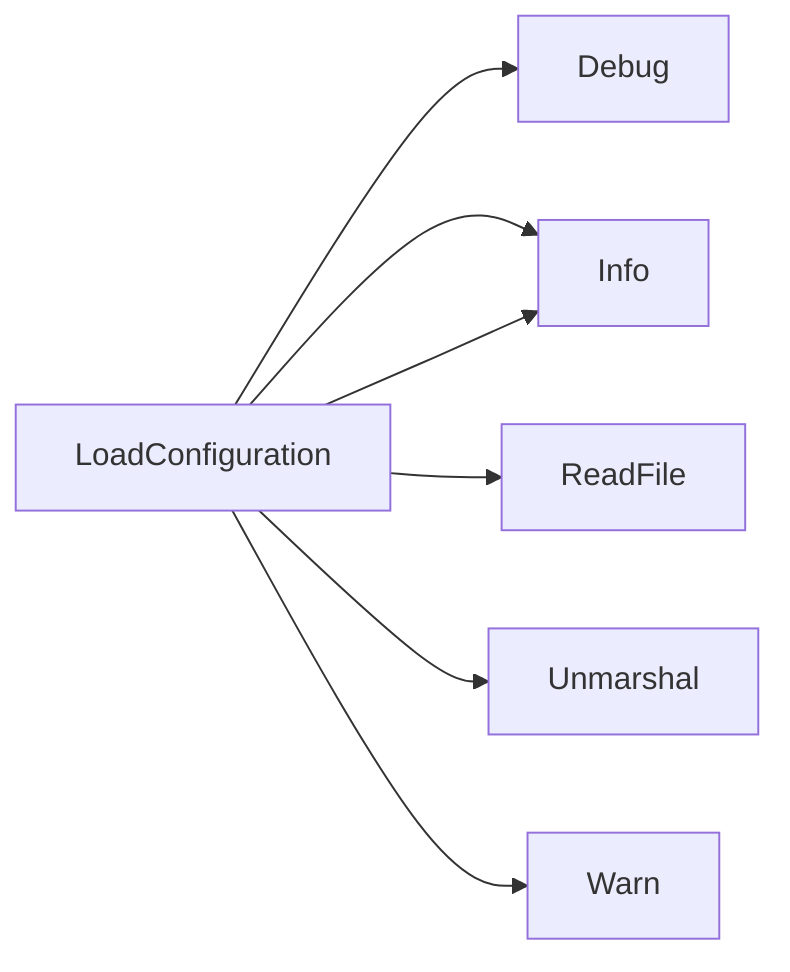

## Package configuration (github.com/redhat-best-practices-for-k8s/certsuite/pkg/configuration)

### Structs

- **AcceptedKernelTaintsInfo** (exported) — 1 fields, 0 methods
- **ConnectAPIConfig** (exported) — 5 fields, 0 methods
- **CrdFilter** (exported) — 2 fields, 0 methods
- **ManagedDeploymentsStatefulsets** (exported) — 1 fields, 0 methods
- **Namespace** (exported) — 1 fields, 0 methods
- **SkipHelmChartList** (exported) — 1 fields, 0 methods
- **SkipScalingTestDeploymentsInfo** (exported) — 2 fields, 0 methods
- **SkipScalingTestStatefulSetsInfo** (exported) — 2 fields, 0 methods
- **TestConfiguration** (exported) — 18 fields, 0 methods
- **TestParameters** (exported) — 27 fields, 0 methods

### Functions

- **GetTestParameters** — func()(*TestParameters)
- **LoadConfiguration** — func(string)(TestConfiguration, error)

### Globals

### Call graph (exported symbols, partial)

### Symbol docs

- [struct AcceptedKernelTaintsInfo](symbols/struct_AcceptedKernelTaintsInfo.md)
- [struct ConnectAPIConfig](symbols/struct_ConnectAPIConfig.md)
- [struct CrdFilter](symbols/struct_CrdFilter.md)
- [struct ManagedDeploymentsStatefulsets](symbols/struct_ManagedDeploymentsStatefulsets.md)
- [struct Namespace](symbols/struct_Namespace.md)
- [struct SkipHelmChartList](symbols/struct_SkipHelmChartList.md)
- [struct SkipScalingTestDeploymentsInfo](symbols/struct_SkipScalingTestDeploymentsInfo.md)
- [struct SkipScalingTestStatefulSetsInfo](symbols/struct_SkipScalingTestStatefulSetsInfo.md)
- [struct TestConfiguration](symbols/struct_TestConfiguration.md)
- [struct TestParameters](symbols/struct_TestParameters.md)
- [function GetTestParameters](symbols/function_GetTestParameters.md)
- [function LoadConfiguration](symbols/function_LoadConfiguration.md)
