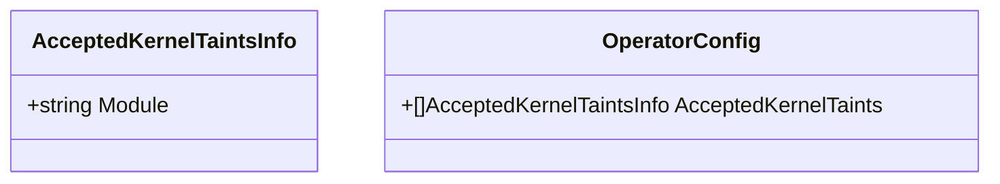

AcceptedKernelTaintsInfo`

| Item | Details |
|------|---------|
| **Package** | `github.com/redhat-best-practices-for-k8s/certsuite/pkg/configuration` |
| **File** | `configuration.go` (line 31) |
| **Exported?** | ✅ |
| **Doc comment** | *“AcceptedKernelTaintsInfo contains all certified operator request info”* |

### Purpose
`AcceptedKernelTaintsInfo` is a lightweight data holder used by the configuration subsystem to record which kernel‑level taints are permitted for a particular certified operator. In Kubernetes, taints prevent workloads from being scheduled onto nodes that do not meet certain conditions; operators often need to declare the taints they *accept* so that Certsuite can verify node compliance.

### Fields
| Field | Type | Description |
|-------|------|-------------|
| `Module` | `string` | The name of the kernel module (or generic identifier) that the operator is willing to run on. In practice this string typically matches a taint key or a known module name used in the certification test matrix.

> **Note**: No other fields exist; the struct is intentionally minimal because all required information for the certification tests can be derived from `Module` alone.

### Usage Context
* The configuration package aggregates data that describes certified operators.  
* During initialization, Certsuite reads a YAML/JSON manifest where each operator entry contains an array of `AcceptedKernelTaintsInfo`.  
* The test harness iterates over this list to determine which nodes should be considered compliant for a given operator.

```go
// Example (pseudo‑code)
config := LoadOperatorConfig("operator.yaml")
for _, taint := range config.AcceptedKernelTaints {
    // taint.Module holds the kernel module name
}
```

### Dependencies & Interactions
| Dependency | How it’s used |
|------------|---------------|
| `configuration` package itself | Provides the struct definition and is imported wherever operator configurations are parsed. |
| No external packages | The struct contains only a primitive string; no imports beyond the standard library. |

### Side Effects
None.  
The type has no methods, so creating or manipulating an instance cannot alter program state outside of the variable scope.

### Placement in the Package
`AcceptedKernelTaintsInfo` sits near the top of `configuration.go`, grouped with other configuration structs (`OperatorConfig`, `TestSuiteConfig`, etc.). It acts as a building block for higher‑level types that represent full operator certification data. Because it is simple, it can be embedded or referenced without adding unnecessary complexity to the rest of the package.

---

#### Suggested Mermaid Diagram (for internal documentation)



This diagram illustrates that `OperatorConfig` contains a slice of `AcceptedKernelTaintsInfo`, showing the relationship between operator metadata and kernel taint acceptance.
