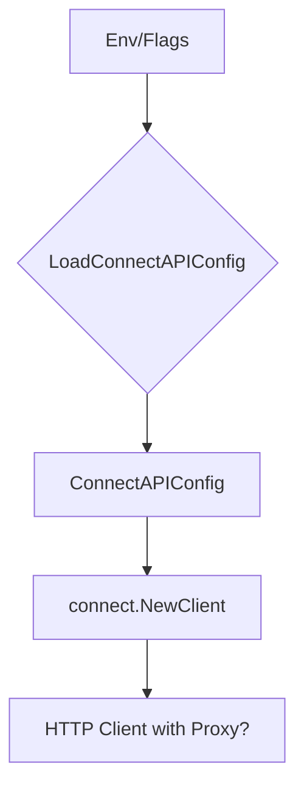

ConnectAPIConfig`

| Feature | Details |
|---------|---------|
| **Package** | `github.com/redhat-best-practices-for-k8s/certsuite/pkg/configuration` |
| **File/Line** | `configuration.go:68` |
| **Exported?** | ✅ |

### Purpose
`ConnectAPIConfig` holds the runtime configuration needed for a client to communicate with the Red Hat Connect API.  
It is typically populated from environment variables, command‑line flags or a YAML/JSON config file and then passed to any component that needs to talk to the API (e.g., certificate issuance, status polling, or metrics collection).

### Fields

| Field | Type | Typical Value | Role |
|-------|------|---------------|------|
| `APIKey` | `string` | `"abcd1234"` | Authentication token for the Connect service. |
| `BaseURL` | `string` | `"https://api.connect.redhat.com"` | Root endpoint of the API; all request paths are appended to this base. |
| `ProjectID` | `string` | `"my‑project-42"` | Identifier for the project or tenant that owns the certificates being managed. |
| `ProxyPort` | `string` | `"3128"` | Port on which an HTTP proxy is listening (if required). |
| `ProxyURL` | `string` | `"http://proxy.example.com:8080"` | Full URL of the proxy server; used when `ProxyPort` is set. |

> **Note**  
> The proxy fields are optional – if either is empty, no HTTP proxy will be configured for outbound requests.

### Dependencies & Usage

- **Configuration Loading**  
  The struct is typically instantiated by a helper in this package (e.g., `LoadConnectAPIConfig()`) that reads from environment variables such as `CONNECT_API_KEY`, `CONNECT_BASE_URL`, etc. No other code directly modifies the fields after construction.
  
- **HTTP Client Construction**  
  A component like `connect.NewClient(cfg *ConnectAPIConfig)` would build an `http.Client` that:
  - Adds the `Authorization: Bearer <APIKey>` header to every request.
  - Sets `cfg.BaseURL` as the base for all API calls.
  - Configures a proxy dialer if both `ProxyURL` and `ProxyPort` are non‑empty.

- **Error Handling**  
  If required fields (`APIKey`, `BaseURL`, `ProjectID`) are empty, client construction should return an error; this struct itself does not enforce validation.

### Side Effects
The struct is a plain data holder – creating or modifying it has no side effects beyond the values stored. All interactions with external systems (HTTP calls, proxy configuration) happen in functions that consume this config, not inside the struct definition.

### Placement in Package

Within `configuration`, `ConnectAPIConfig` sits alongside other structs that expose runtime settings (e.g., `KubeClientConfig`). It acts as a bridge between static configuration sources and dynamic API clients. The rest of the package focuses on loading these configs and providing typed accessors; `ConnectAPIConfig` is the central representation for Connect‑specific parameters.

---

#### Mermaid diagram suggestion

This visual shows the flow from external configuration sources into the `ConnectAPIConfig` struct and onward to the client that actually performs API calls.
