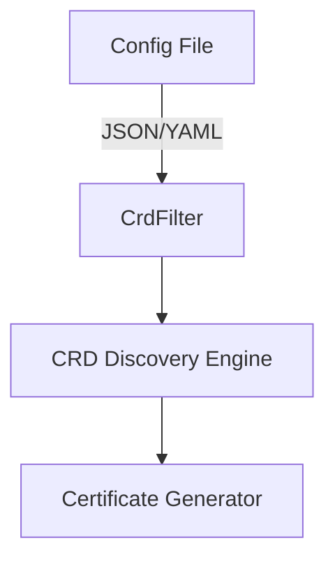

CrdFilter` – Custom Resource Definition filter

| Section | Detail |
|---------|--------|
| **Package** | `github.com/redhat-best-practices-for-k8s/certsuite/pkg/configuration` |
| **File** | `configuration.go` (line 59) |

### Purpose
`CrdFilter` is a lightweight configuration struct used by Certsuite to selectively include or exclude Kubernetes CustomResourceDefinitions (CRDs) during certificate discovery and generation. By specifying suffixes and scalability flags, the tool can narrow its focus to relevant CRDs without hard‑coding names.

### Fields

| Field | Type | Meaning |
|-------|------|---------|
| `NameSuffix` | `string` | A suffix that must appear at the end of a CRD name for it to be considered. If empty, no suffix filtering is applied. |
| `Scalable`   | `bool`   | Indicates whether the CRD represents a scalable resource (e.g., has a `scale` subresource). When true, only scalable CRDs are matched; when false, all CRDs regardless of scalability are considered. |

### How it’s used
1. **Configuration loading** – The package reads YAML/JSON configuration files into a slice of `CrdFilter` structs.
2. **CRD filtering** – During runtime, the tool iterates over discovered CRDs and checks each against all filters:
   * A CRD passes if its name ends with any filter’s `NameSuffix`.
   * If `Scalable` is set, the CRD must expose a scale subresource; otherwise it is rejected.
3. **Certificate generation** – Only CRDs that satisfy at least one filter are processed for certificate creation or renewal.

### Dependencies & Side‑Effects
- **Dependencies:** None beyond standard library types. It relies on external code that loads the configuration and performs the filtering logic (e.g., `pkg/configuration/configuration.go`).
- **Side‑effects:** The struct itself has no side‑effects; it is purely a data holder.

### Fit within the package
The `configuration` package centralises all runtime settings for Certsuite. `CrdFilter` sits at the core of that configuration, enabling users to tailor which CRDs are targeted without modifying source code. It is referenced by higher‑level functions responsible for certificate discovery and lifecycle management.

---

#### Mermaid diagram suggestion

This illustrates the flow from configuration to filtering CRDs and finally to certificate generation.
